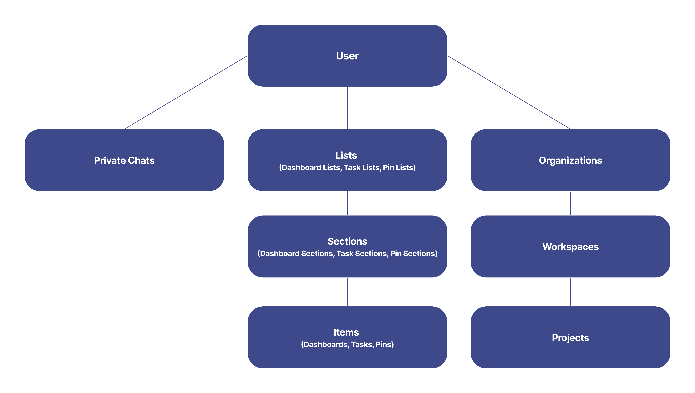
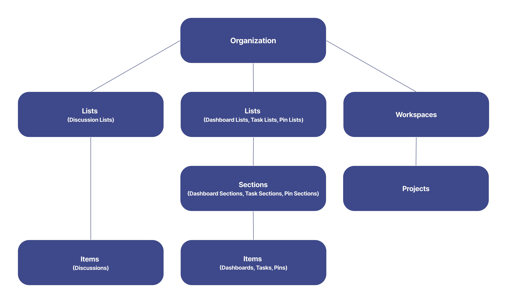
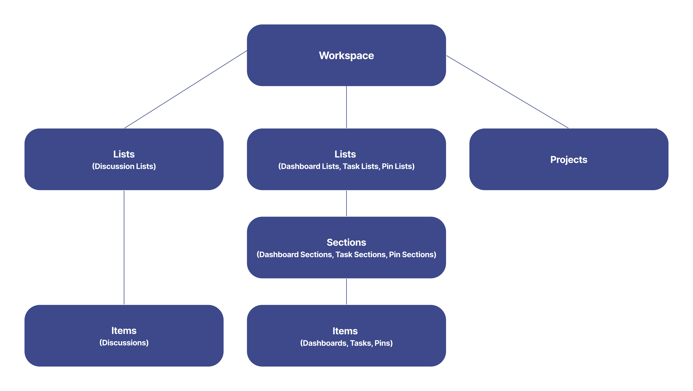
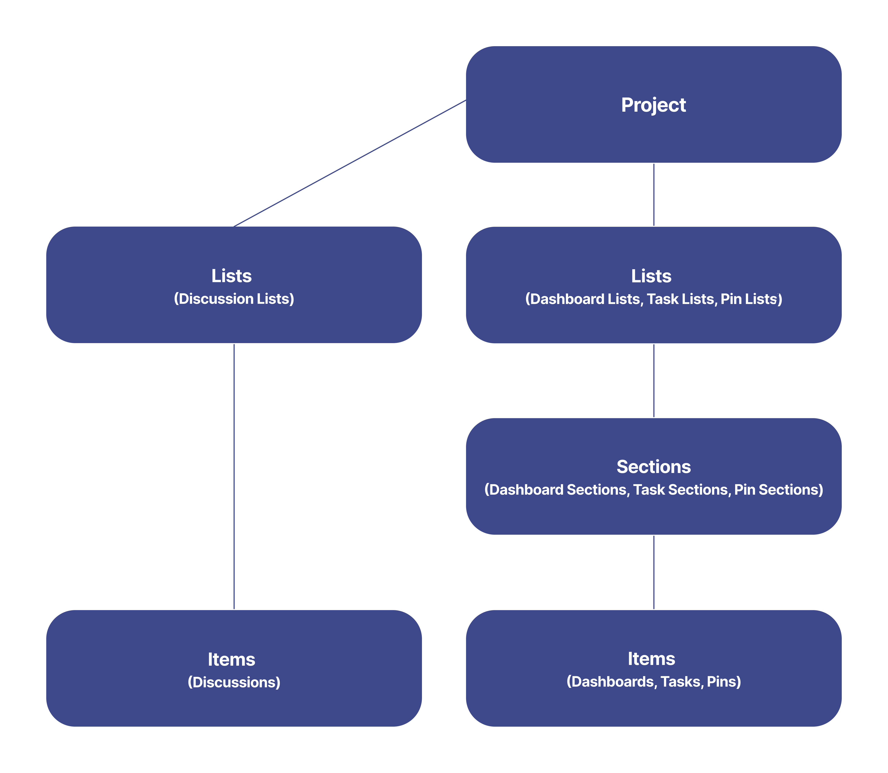

# オブジェクト モデルを調べる

Slingshot を使用すると、さまざまなダッシュボード、ワークスペース、プロジェクト タスク、ピン固定、ブックマークを使用して作業を整理できます。これに加えて、チャットやディスカッションを介してチーム メンバーと通信することもできます。 

Slingshot を使用する方法の詳細については、以下をご覧ください。

### ユーザー
オブジェクト モデルでは、*users* (ユーザー) オブジェクトは Slingshot のアカウントを表します。すべてのユーザーは、資格情報、プロファイル情報、設定、コンテンツなどの自分の情報を、自分のアカウントで見つけることができます。 

- [ユーザー](./rest-api/user.md)

### 組織

組織はワークスペースであり、あなたとあなたの同僚が会社/職場によってアップロードされた情報を見つけることができます。 

- [組織](./rest-api/organizations.md)

### ワークスペース
ワークスペースは、デジタル ワークプレイスと見なすことができます。1 つのワークスペースに複数のプロジェクトを含めることができます。ワークスペースを使用すると、他のユーザーとの共同作業、仕事の優先順位付け、さまざまな種類のコンテンツの共有をすべて 1 か所で行うことができます。 

- [ワークスペース](./rest-api/workspace.md)

### プロジェクト
さまざまな目的とプロセスの概要をよりよく把握したい場合は、プロジェクトを作成できます。

- [プロジェクト](./rest-api/project.md)

### タスク
作業をより適切に整理するために、タスクを使用できます。見やすくするために、それらをさまざまなリストやセクションに整理できます。

- [タスク リスト](./rest-api/task-list.md)

- [タスク セクション](./rest-api/task-section.md)

- [タスク](./rest-api/task.md) 

### ピン固定 
ピン固定は、共有またはアクセスできるさまざまな種類のリソースへの単純なリンクです。それらをさまざまなリストやセクションに整理できます。

- [リストのピン固定](./rest-api/pin-list.md)

- [セクションのピン固定](./rest-api/pin-section.md)

- [ピン固定](./rest-api/pin.md) 

### ダッシュボード
ダッシュボードを使用すると、美しい視覚化を利用して情報を表示できます。たとえば、ビジネスのパフォーマンスを示すために使用できます。それらをセクションとリストで整理できます。

- [ダッシュボード リスト](./rest-api/dashboard-list.md)

- [ダッシュボード セクション](./rest-api/dashboard-section.md)

- [ダッシュボード](./rest-api/dashboard.md) 

### プライベート チャット
他のユーザーと通信するために、プライベート チャットを使用できます。ユーザーはワークスペースやプロジェクトに依存しないため、ユーザーは組織の一員である必要はありません。

- [プライベート チャット](./rest-api/private-chat.md)

### ディスカッション
ディスカッションは、プロジェクトとワークスペースで作成できます。ディスカッションはワークスペースとプロジェクトに個別に含まれるものであるため、Slingshot のすべてのディスカッションにアクセスできるわけではありません。さまざまなリストで整理できます。

- [ディスカッション リスト](./rest-api/discussion-list.md)

- [ディスカッション](./rest-api/discussion.md) 

