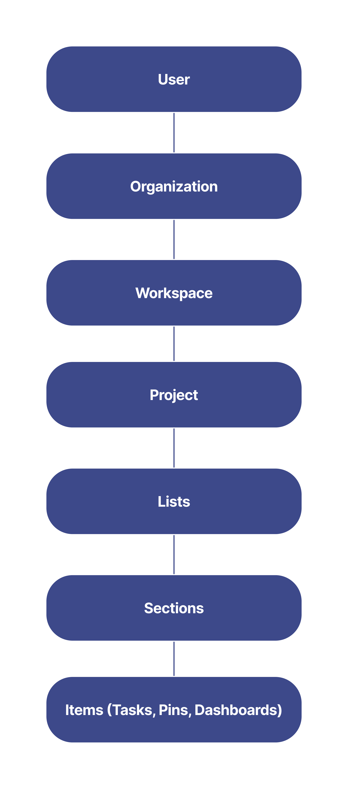

# 概要

タスク リストなど、別のアプリから Slingshot データにアクセスするには、Slingshot とそのアプリの間の接続を確立する必要があります。この接続は、Slingshot の API を使用して構築できます。

Slingshot の API は [REST](https://developer.mozilla.org/ja/docs/Glossary/REST) 原則を使用します。HTTP リクエストを送信すると、情報が [JSON](https://www.json.org/json-ja.html) 形式で返されます。

リクエストとレスポンスがサポートする文字エンコーディングは [UTF-8](https://developer.mozilla.org/ja/docs/Glossary/UTF-8) の 1 種類のみであることに注意してください。

API の使用を開始するには、まず自分自身を認証する必要があります。認証プロセスの詳細については、[こちら](authentication.md)を参照してください。

>[!NOTE] 以下に、Slingshot の一般的なオブジェクト モデルを示します。

各レベルの特定の階層オプションの詳細については、[こちら](https://www.slingshotapp.io/ja/help/docs/slingshot-api/explore-object-model)にアクセスしてください。

