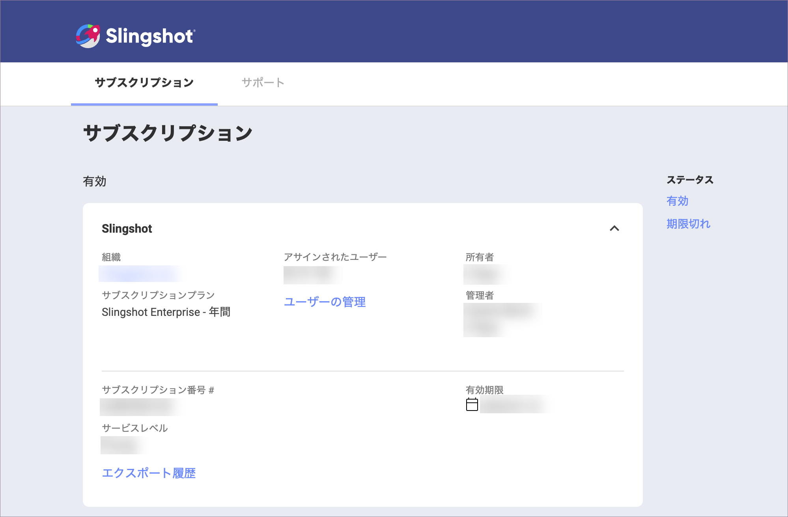
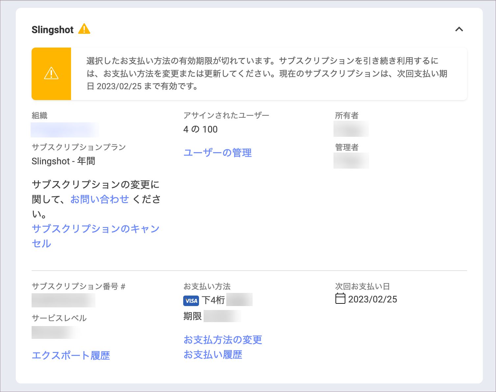
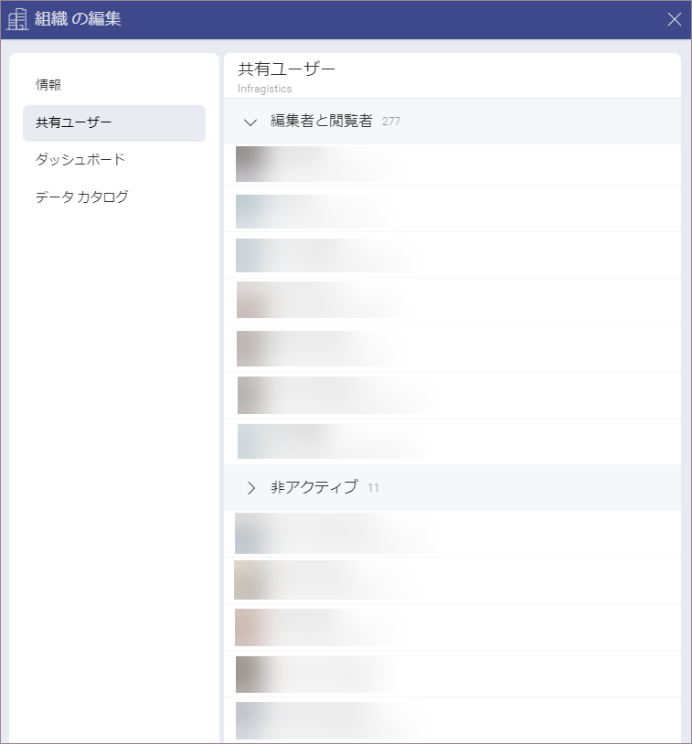

# Slingshot エンタープライズ サブスクリプション

Slingshot には、**無料**、**Slingshot**、および **Slingshot Enterprise** (Slingshot エンタープライズ) の 3 つの異なるレベルがあります。*Slingshot Enterprise* サブスクリプションを有効にして使用する方法の詳細については、以下をご覧ください。

## Slingshot Enterprise サブスクリプションを使用している間、どのようなロールを担うことができますか?

| アクセス許可 | サブスクリプション管理者 | 組織管理者 | ユーザー          |
| ------------------------------------ | ------------------ | ------------------ | ----------------- |
| サブスクリプションを管理 (エンタープライズ サブスクリプションのアクティブ化および / またはキャンセル、組織へのユーザーの招待、組織からのユーザーの削除) |:white_check_mark:                                 | :x:  | :x:                |
| アプリケーション内の機能を有効にする | :x:  | :white_check_mark: | :x:                |
|Slingshot アプリを使用 (組織管理者は、アプリを使用するために新しいアカウントを作成する必要がある)。                                |  :x:   | :white_check_mark:            | :white_check_mark:               |

>[!NOTE] ユーザーが *Slingshot* または *Slingshot Enterprise* サブスクリプションを持っている場合、複数のロールを割り当てることができます。

## Slingshot Enterprise サブスクリプションを有効にするにはどうすればよいですか?

次の手順で Slingshot Enterprise サブスクリプションをアクティブ化できます:

1.	*Slingshot* アカウントにログインします。
2.	プロファイル設定に移動し、**[サブスクリプション]** を選択します。
3.	**[アップグレード]** をクリックまたはタップすると、料金ページが表示されます。
4.	**[購入]** をクリックまたはタップしてユーザー数を選択し、購入を完了します。

>[!NOTE] 購入を完了するには、会社名を入力する必要があります。この名前は、後でアカウントの組織の名前として表示されます。

## ユーザーを組織に招待し、ライセンスを提供するにはどうすればよいですか?

**サブスクリプション管理者**は、組織の招待をユーザーに送信できます。そのためには、以下の手順を試しください:

1.	カスタマー ポータルに移動し、**[サブスクリプション]** をクリックします。
2.	**[ユーザーの管理]** を選択します。

 

3.	**[ユーザーの追加]** ボタンをクリックしてユーザーを招待できるダイアログが表示されます。
 
 

招待を受け入れると、サインアウトして再度サインインするよう求められます。サインインすると、組織のワークスペースが表示され、エンタープライズ サブスクリプション機能を表示できるようになります。 

**[拒否する]** を選択すると、**サブスクリプション管理者**にメール アドレスが送信され、ユーザーが招待を拒否したこと、およびユーザーを削除する必要があることが通知されます。

>[!NOTE] 以前に Slingshot を使用したことがないユーザーにサブスクリプションを割り当てると、そのユーザーが Slingshot アカウントを作成すると、自動的に組織に追加されます。 

## ユーザーのアカウントをある組織から別の組織に移動するにはどうすればよいですか?

**[お問い合わせ]** をクリックしてサポート チームに連絡するか、新しいサポート リクエストを送信してください。チームは、ユーザーのアカウントを別の組織に移動するのに役立ちます。

 

## ユーザーの Slingshot Enterprise サブスクリプションをキャンセルするにはどうすればよいですか?

 **サブスクリプション管理者**は、ユーザーからライセンスを削除する必要があります。 

## Slingshot Enterprise サブスクリプションをキャンセルするにはどうすればよいですか?

 サブスクリプションの管理者は、Slingshot ポータルから Slingshot Enterprise サブスクリプションをキャンセルできます。

 

## ユーザーがアプリ内の組織から削除された場合、ユーザーのアカウントはどうなりますか?

 ユーザーのアカウントは非アクティブ化されますが、データは組織のために保持されます。**組織管理者**は、**[組織の編集]** ダイアログの **[自分と共有済み]** セクションから非アクティブ化されたすべてのユーザーを含むリストを管理できます。

## ユーザーは別の Slingshot Enterprise サブスクリプションに参加できますか?

いいえ、ユーザーは 1 つの Slingshot Enterprise サブスクリプションにのみ参加できます。

利用可能なサブスクリプション プランの違いについて詳しくは、[こちら](https://www.slingshotapp.io/ja/pricing)をご覧ください。