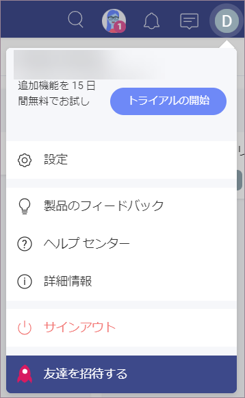
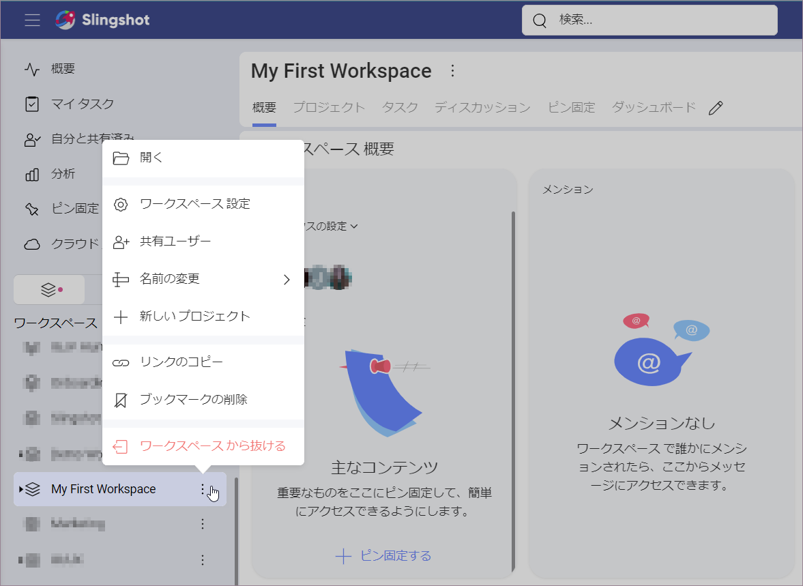
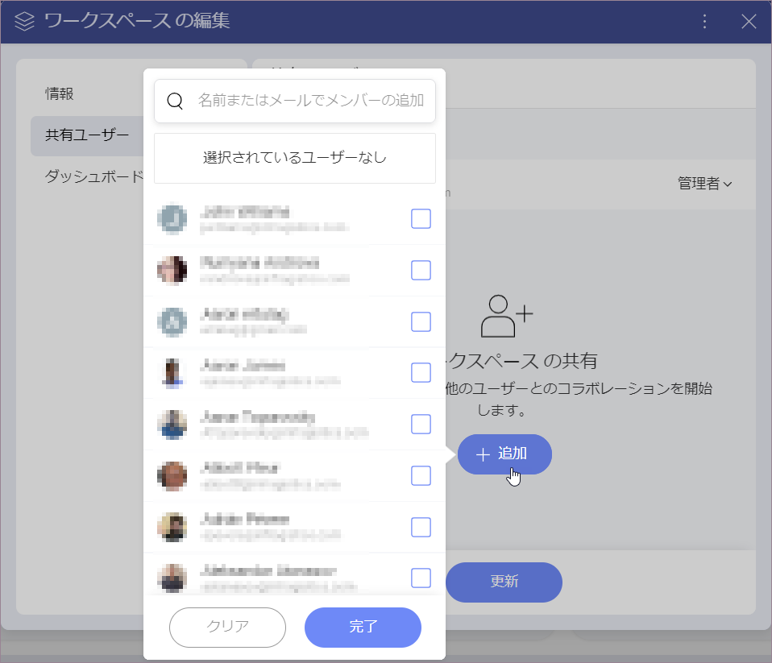
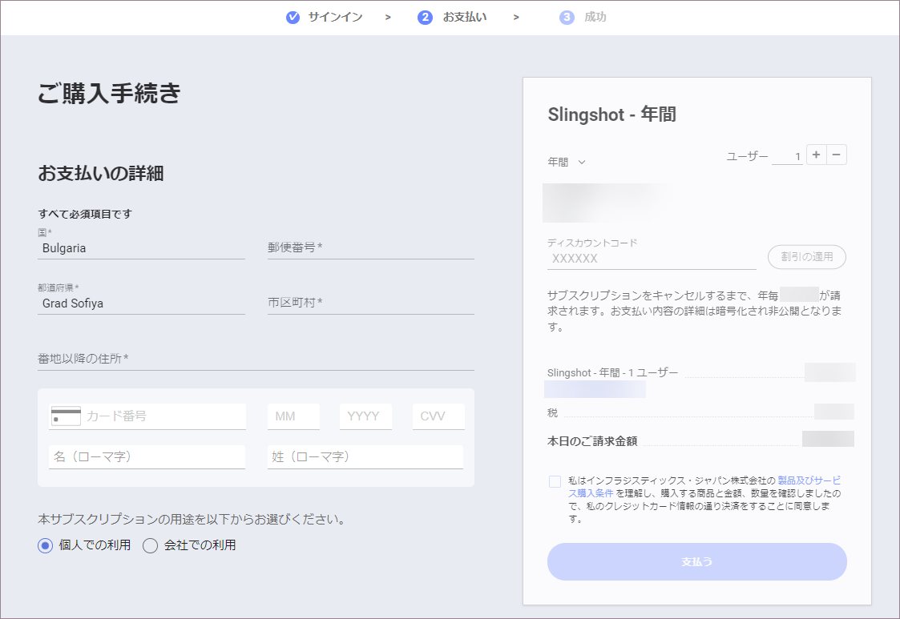

# Slingshot のサブスクリプション

Slingshot には、**無料**、**Slingshot**、および **Slingshot Enterprise** (Slingshot エンタープライズ) の 3 つの異なるレベルがあります。 

新規ユーザーは、アカウントが無料利用枠に設定され、2 つのワークスペースと 1 つのプロジェクトにアクセスできます。
*Slingshot* サブスクリプションでは、ワークスペースとプロジェクトを制限なしに作成して使用できます。 

Slingshot サブスクリプションを有効にして使用する方法の詳細については、以下をご覧ください。

## Slingshot サブスクリプションのトライアル版を有効にするにはどうすればよいですか?

以前に Slingshot サブスクリプションを有効にしたことがない場合は、15 日間のトライアル版を利用できます。次の手順で有効化できます:
1.	*Slingshot* アカウントにログインします。
2.	プロフィール設定を開きます。
3.	**[トライアルの開始]** をクリックまたはタップします。

## ユーザーをワークスペースに招待するにはどうすればよいですか?

ワークスペースの横にあるオーバーフロー メニューをクリックして、**[共有ユーザー]** を選択します。

ダイアログが表示されるので、**[+ 追加]** ボタンをクリックまたはタップして、名前またはメール アドレスでメンバーを追加します。

## ワークスペースに何人のユーザーを招待できますか?

ワークスペースに招待できるユーザー数に制限はありません。

## トライアル期間が終了すると、アカウントはどうなりますか?

トライアル期間が終了すると、アカウントは無料版の Slingshot に戻ります。完全なアクセス権を持つ 2 つのワークスペースを選択できます。参加している他のすべてのワークスペースは読み取り専用になります。

## トライアル期間が終了した後、Slingshot サブスクリプションを有効にするにはどうすればよいですか?

次の手順でサブスクリプションを有効化できます:

1.	*Slingshot* アカウントにログインします。
2.	プロファイル設定を開き、**[設定]** をクリックまたはタップして、アプリの設定を開きます。
3.	**[サブスクリプション]**、**[アップグレード]** の順にクリックまたはタップします。
4.	 次に、*Slingshot* ライセンスと *Slingshot Enterprise* ライセンスのどちらかを選択するよう求められます。
5.	*Slingshot* サブスクリプションを選択すると、購入を完了することができる *Slingshot ポータル*に移動します。

## Slingshot のサブスクリプションをキャンセルするにはどうすればよいですか? 

サブスクリプションをキャンセルするには、[こちら](https://customer.infragistics.com/subscriptions?theme=slingshot)に進み、**[Cancel Subscription]** (サブスクリプションのキャンセル) をクリックします。次回の請求日までにキャンセルした場合、請求は行われません。キャンセルすると、Slingshot の**無料**版に戻ります。

## 参加しなくなったワークスペースのディスカッションを引き続き見ることはできますか?

はい。ただし、読み取り専用になります。

## 参加しなくなったワークスペースにあるタスクには引き続きアクセスできますか?

はい。ただし、読み取り専用になります。

## 参加しなくなったワークスペースのダッシュボードには引き続きアクセスできますか?

はい。ただし、読み取り専用になります。

## 返金できますか? 

何らかの理由で購入後 30 日以内に Slingshot にご満足いただけない場合は、当社にご連絡ください。全額返金いたします。 

毎月のサブスクリプションを購入していて、更新が完了する前にサブスクリプションをキャンセルしたい場合は、その月の料金を返金します。

利用可能なサブスクリプション プランの違いについて詳しくは、[こちら](https://www.slingshotapp.io/ja/pricing)をご覧ください。

