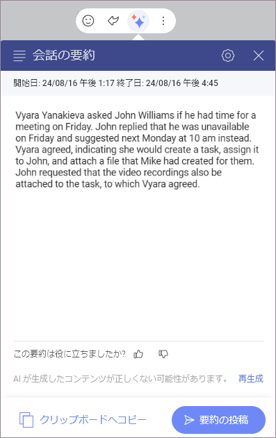
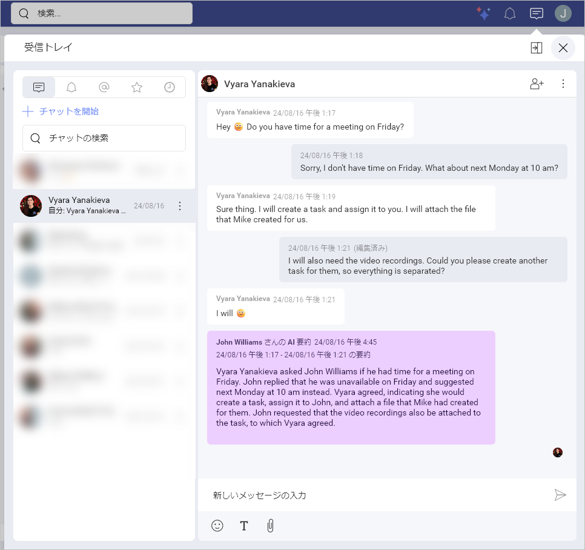

# 要約機能

Slingshot には多くの AI 機能が搭載されており、その一つがディスカッションやチャット内のテキストの要約機能です。これにより、テキストから重要な情報を迅速に抽出し、ディスカッションの概要を即座に把握することができます。 

この機能の主な利点は以下の通りです: 

- **時間の節約** – 数秒でディスカッションやチャットの要約を取得 

- **コラボレーションの向上** – 全員が同じ認識を持つことを確実に 

- **意思決定の強化** – 必要な情報に迅速にアクセスし、情報に基づいた意思決定を行う 

すべての Slingshot AI 機能と同様に、これは有料機能であり、*Slingshot* および *Slingshot Enterprise* サブスクリプションで利用できます。ライセンスのアップグレードに関する詳細については、[こちら](https://www.slingshotapp.io/ja/pricing)をご覧ください。 

## Slingshot AI の要約機能を使用する方法 

Slingshot AI の要約機能は簡単に使用でき、見逃していた内容を数秒で把握するのに役立ちます。この機能は、選択したメッセージを起点にして、その後の会話を要約します。 

要約したいディスカッションまたはチャットに移動します。  

1. チャット、ディスカッション、タスク内のメッセージにカーソルを合わせるか、モバイル デバイスの場合は長押しします。 

2. メッセージに絵文字で反応したり、直接返信したりするなど、さまざまなオプションが表示されます。会話で利用できる Slingshot AI 機能のリストを表示するには、3 つ星の AI ボタンをクリックまたはタップします。  

3. Slingshot AI 機能のリストが表示されます。このウォークスルーでは、**[ここから要約]** を選択します。つまり、開いたメッセージがテキスト要約の開始点として使用されます。 

4. ここから、要約されたテキストを含むダイアログ ボックスがポップアップ表示されます。 

 

ここから、さらに多くのオプションを実行できます: 

- 要約テキストの新しいバージョンを**生成します**。これにより、会話を最もよく表すバージョンを選択できます。

- 要約を**クリップボードにコピーして**再利用できます。 

- **フィードバックを送信します。**当社はユーザーのアプリ体験を重視しており、常に改善に努めています。

- 要約をチャット、ディスカッション、またはタスクに**投稿します**。これにより、メッセージを閲覧できる全員が要約を確認できます。投稿前にテキストを編集することも可能です。投稿された要約テキストは紫色で表示されます。

 

>[!Note] Slingshot AI の要約機能は、生成されていないメッセージに対してのみ使用できます。つまり、すでに要約されているメッセージを要約することはできません。  

## トラブルシューティング 

会話が長すぎる場合は、別の開始点を選択する必要があることを通知するエラー メッセージが表示されます。  

会話から有用な情報が抽出できない場合は、要約するメッセージの数を減らすように指示されます。 

## Slingshot AI の要約機能を無効にする方法 

Slingshot AI はデフォルトでオンになっていますが、組織に所属している場合は、組織の管理者が全体のために無効にしていることがあります。  

Slingshot AI をオフにするには: 

1. 2 つのシナリオで設定パネルにアクセスできます: 

   a. 右上のアバターに移動します。  

   b. 要約テキスト ウィンドウから直接、右上隅にある設定アイコンに移動します。 

2. 設定パネルから **AI** を選択します。 

3. **[一般的な AI 機能]** をオフに切り替えます。 

 

