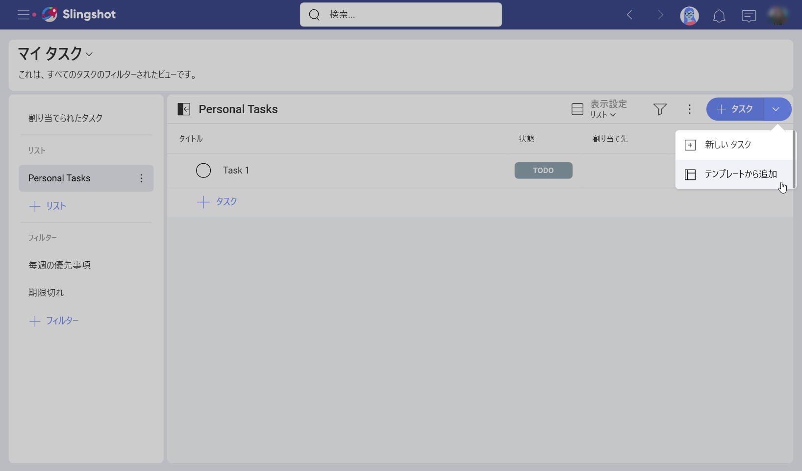
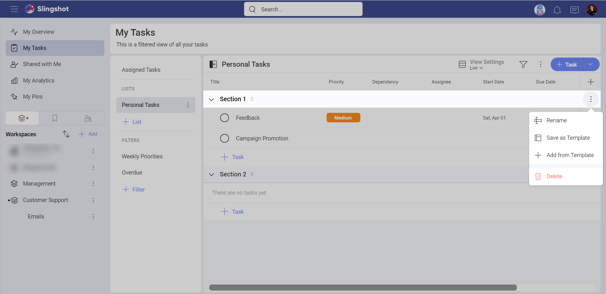
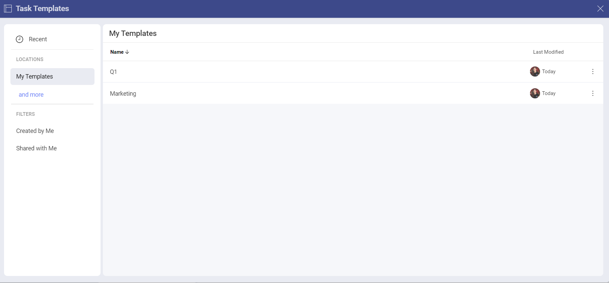
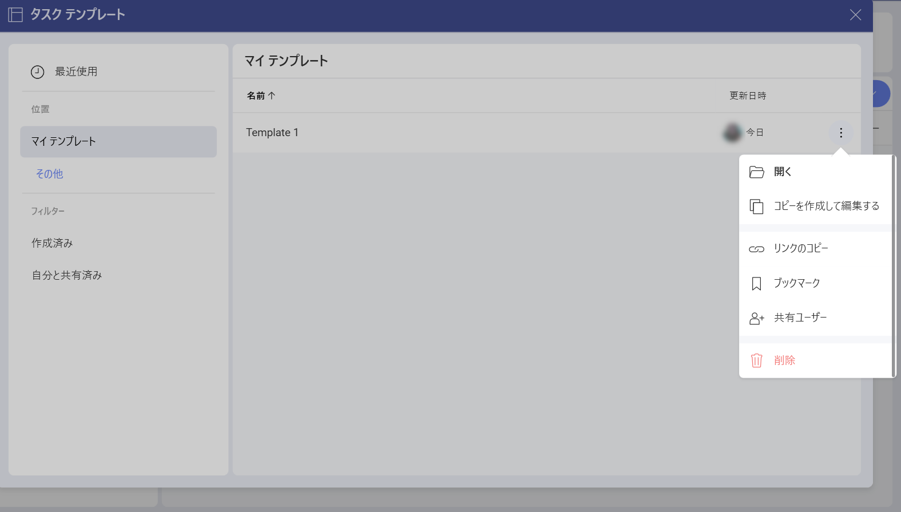

# タスク テンプレート

タスク テンプレートを使用すると、作成済みのタスク テンプレートを再利用することで、時間を節約し、生産性を向上させることができます。特定のタスク テンプレートにすべての情報を保持するか、チームのニーズに合わせて調整するかを選択するオプションを使用して、以前に作成したタスク テンプレートを簡単に再利用できます。

## タスク テンプレートを作成する方法

タスク テンプレートは、さまざまなプロジェクト、ワークスペース、または **[マイ タスク]** セクションで作成できます。タスク テンプレートを作成するオプションにアクセスするには、次のことを行う必要があります:

1.	特定のタスク (以下を参照)、タスク リスト、またはタスク セクションのオーバーフロー メニューを開きます。

2.	**[テンプレートとして保存する]** をクリックまたはタップします。

    

3. 次のダイアログが開きます。ここで、タスクから何を残すかを選択し、それをテンプレートに使用できます。準備ができたら続行、**[続行]** をクリックまたはタップします。
       
     

テンプレートを作成する前に、次のオプションがあります:

1.	タスク テンプレートを作成するため、タスク テンプレートに名前を付ける。
2.	説明を追加 **(オプション)**。
3.	[週末を含む] オプションのオン / オフを切り替える **(オプション)**。
4.	**[スケジュール タイプ]** を選択。ここで、開始日と期日を設定できます **(オプション)**。
5.	タスクをフィルタリング。選択した基準に基づいてタスクをフィルタリングできます **(オプション)**。
6.	タスクを開く、サブタスクを追加 / 削除。ここから、別のタスクの真上または真下にタスクを挿入することもできます **(オプション)**。
7.	テンプレートの他のタスクと一緒に使用する新しいタスクを追加 **(オプション)**。

      

タスク テンプレートを作成したら、それを使用して新しいタスクまたは一連のタスクを作成できます。 

>[!NOTE] タスク テンプレートを作成するオプションは、*Slingshot* および *Slingshot Enterprise* ユーザーが利用できることに注意してください。

## さまざまなタスク テンプレート リストにアクセスする方法

個人のタスク テンプレート、または別のワークスペースやプロジェクトなど、別の場所に保存されているテンプレートにアクセスするには:

1.	右上隅の **[+ タスク]** 分割ボタンをクリックまたはタップし、**[テンプレートから追加]** を選択します。

      

    または、セクションを選択 -> オーバーフロー メニューを開く -> **[テンプレートから追加]** を選択します。 
       
      

2.	次のダイアログが開きます:

     

左パネルでは、次のことができます:

- 最近使用したテンプレートを確認。

- さまざまな場所 (*[マイ タスク]*、さまざまなワークスペースまたはプロジェクトなど) でテンプレートを検索。

- *[作成済み]* または *[自分と共有済み]* でテンプレートをフィルタリング。

**[マイ テンプレート]** では、次のことができます:

- テンプレートをアルファベット順に並べ替える。

- テンプレートを *[更新日時]* で並べ替える。

これに加えて、各タスクの右側にあるオーバーフロー メニューを開いて、次のアクションを実行することもできます:

- テンプレートを開く。

- *[コピーを作成して編集する]*。これにより、**[テンプレートとして保存]** ダイアログが表示され、テンプレートのコピーを作成する前に変更を加えることができます。

- タスク テンプレートへのリンクをコピー。

- テンプレートを **[ブックマーク]** に追加するか、そこから削除。

- テンプレートを共有。

- テンプレートを削除。

   

## タスク テンプレートを編集する方法

タスク テンプレートを編集するには:

1.	テンプレートをクリックまたはタップして開きます。

2.	右上隅にある鉛筆アイコンをクリックまたはタップします。

    

3.	**[タスク テンプレート]** ダイアログが開き、必要な変更を加えることができます。準備ができたら、**[完了]** をクリックまたはタップします。

     

>[!NOTE] 変更を適用するためのオプションは、**[テンプレートとして保存する]** ダイアログと同じであることに注意してください。

タスクの作成方法と使用方法の詳細については、[こちら](https://www.slingshotapp.io/en/help/docs/tasks)をご覧ください。

