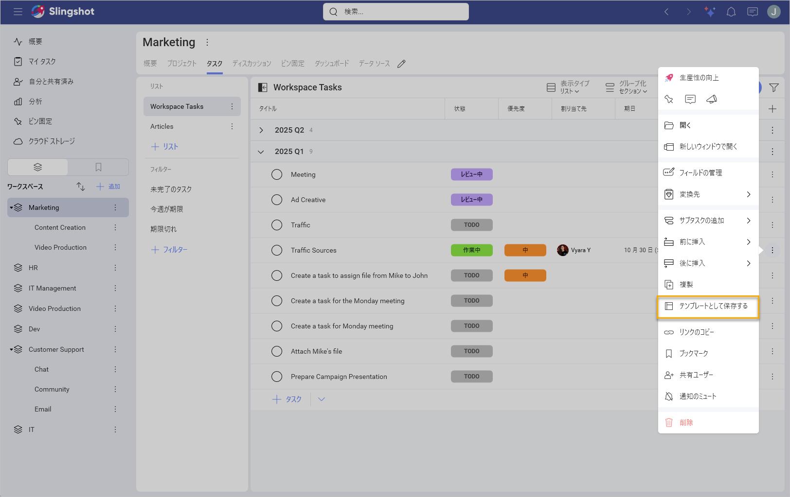
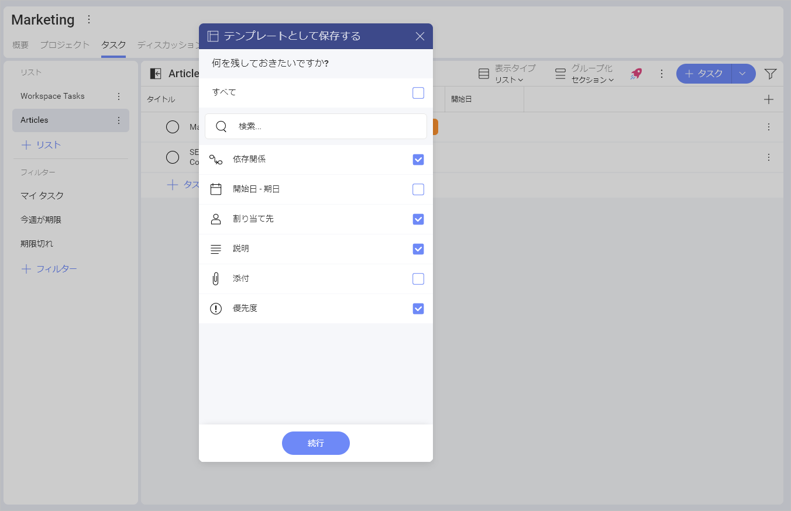
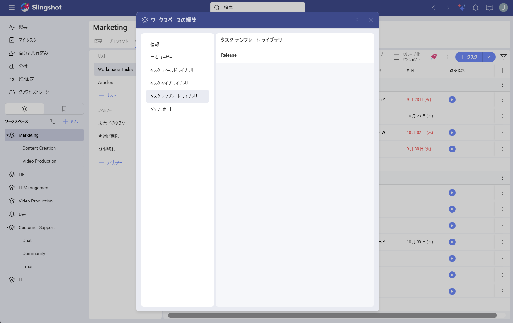
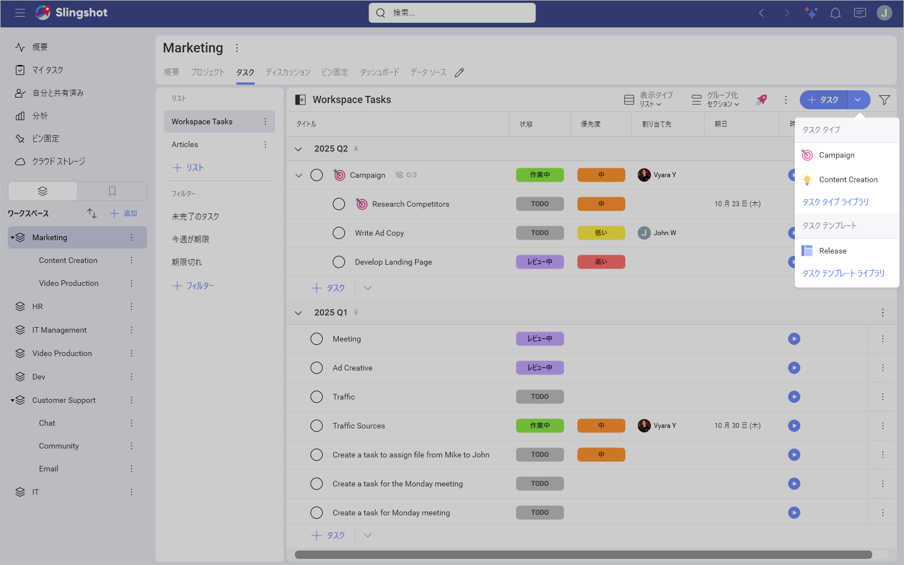
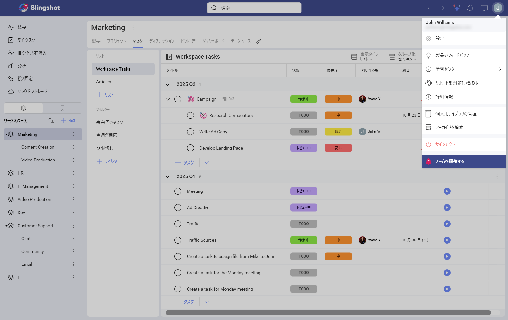
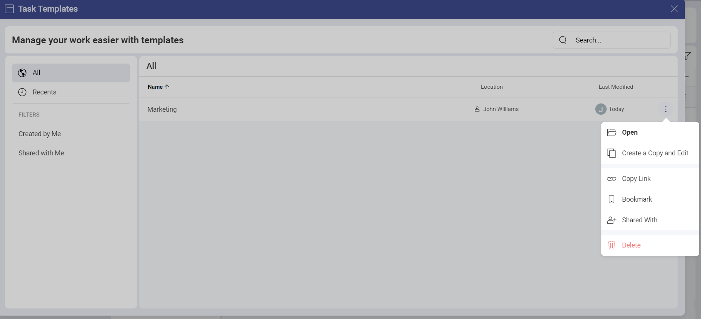
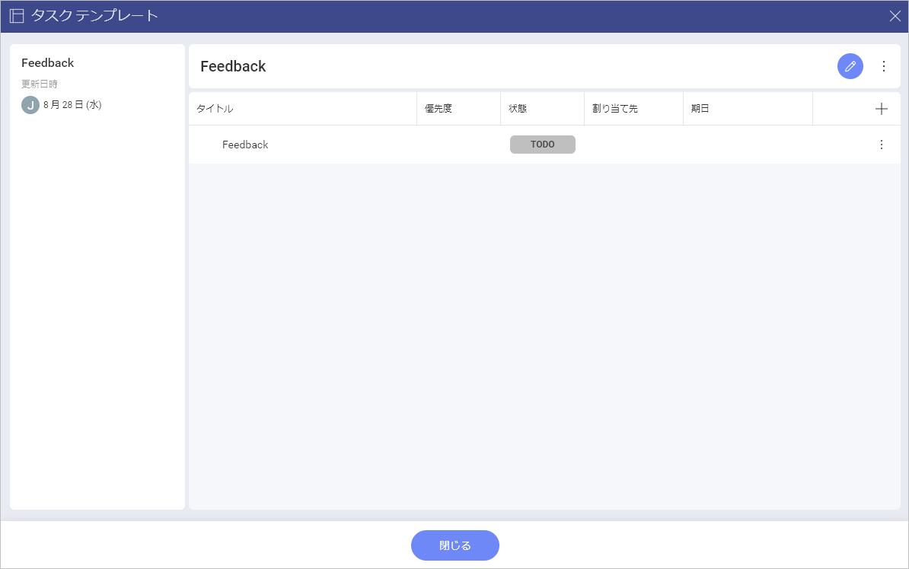
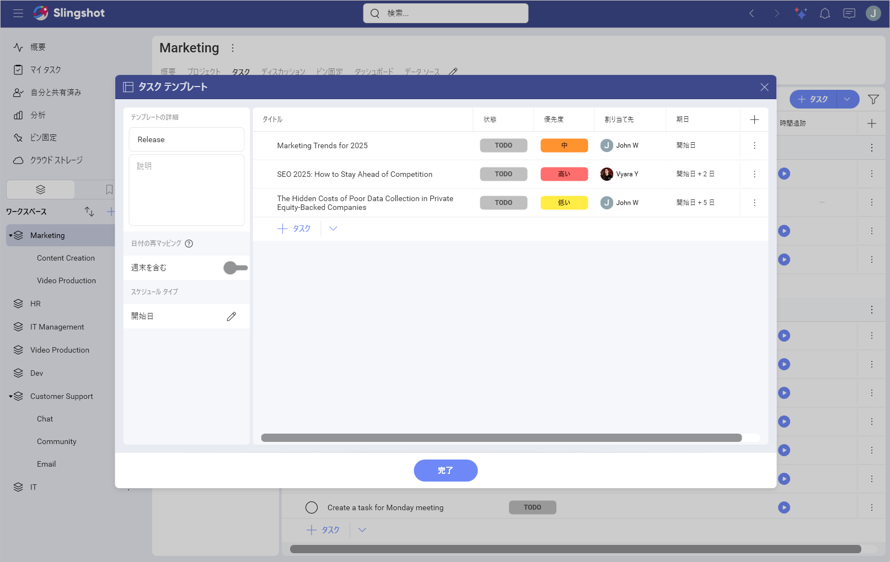

# タスク テンプレート

タスク テンプレートを使用すると、作成済みのタスク テンプレートを再利用することで、時間を節約し、生産性を向上させることができます。特定のタスク テンプレートにすべての情報を保持するか、チームのニーズに合わせて調整するかを選択するオプションを使用して、以前に作成したタスク テンプレートを簡単に再利用できます。

## タスク テンプレートを作成する方法

タスク テンプレートを作成するオプションは、*Slingshot* および *Slingshot Enterprise* ユーザーが利用できることに注意してください。

タスク テンプレートは、さまざまなプロジェクト、ワークスペース、または **[マイ タスク]** セクションで作成できます。タスク テンプレートを作成するオプションにアクセスするには、次のことを行う必要があります:

1.	特定のタスク (以下を参照)、タスク リスト、またはタスク セクションのオーバーフロー メニューを開きます。

2.	**[テンプレートとして保存する]** をクリックまたはタップします。

3. 次のダイアログが開きます。ここで、テンプレートに使用するタスクのフィールド (例: 優先度) を選択できます。タスクに[カスタムフィールド](custom-fields.md)がある場合は、それを保持することもできます。準備ができたら続行、**[続行]** をクリックまたはタップします。
       
  

テンプレートを作成する前に、次のオプションがあります:

1.	タスク テンプレートを作成するため、タスク テンプレートに名前を付ける。

2.	説明を追加 **(オプション)**。

3.	[週末を含む] オプションのオン / オフを切り替える **(オプション)**。

4.	**[スケジュール タイプ]** を選択。ここで、開始日と期日を設定できます **(オプション)**。

5.	タスクをフィルタリング。選択した基準に基づいてタスクをフィルタリングできます **(オプション)**。

6.	タスクを開く、サブタスクを追加 / 削除。ここから、別のタスクの真上または真下にタスクを挿入することもできます **(オプション)**。

7.	テンプレートの他のタスクと一緒に使用する新しいタスクを追加 **(オプション)**。

  

タスク テンプレートを作成したら、それを使用して新しいタスクまたは一連のタスクを作成できます。 

## さまざまなタスク テンプレート リストにアクセスする方法

タスク テンプレートはライブラリに整理されます。タスク テンプレートは、ワークスペースやプロジェクト ライブラリ、またはプライベート ライブラリに保存できます。

>[!Note] ワークスペース タスク テンプレート ライブラリを開くと、ワークスペースとそのプロジェクトの両方に保存されているテンプレートを参照できます。

タスク テンプレートのライブラリを開くには、次の操作を行います:

1. プロジェクトまたはワークスペースの設定を開きます。

2. **[タスク テンプレート ライブラリ]** をクリックまたはタップします。

 

タスク リストを開いている場合は、右上隅にある **[+ タスク]** 分割ボタンをクリックまたはタップし、**[タスク テンプレート ライブラリ]** を選択できます。

  

プライベート タスク テンプレートを開くには、プロフィール設定に移動し、**[個人用ライブラリの管理]** をクリックまたはタップします。

 

これに加えて、各タスク テンプレートの右側にあるオーバーフロー メニューを開いて、次のアクションを実行することもできます:

- テンプレートを開く。

- コピーを作成して編集する。これにより、**[テンプレートとして保存]** ダイアログが表示され、テンプレートのコピーを作成する前に変更を加えることができます。

- タスク テンプレートへのリンクをコピー。

- テンプレートを **[ブックマーク]** に追加するか、そこから削除。

- テンプレートを削除。

<!--  -->

## タスク テンプレートを編集する方法

タスク テンプレートを編集するには:

1.	テンプレートをクリックまたはタップして開きます。

2.	右上隅にある鉛筆アイコンをクリックまたはタップします。

3.	**[タスク テンプレート]** ダイアログが開き、必要な変更を加えることができます。準備ができたら、**[完了]** をクリックまたはタップします。

>[!NOTE] 変更を適用するためのオプションは、**[テンプレートとして保存する]** ダイアログと同じであることに注意してください。

タスクの作成方法と使用方法の詳細については、[こちら](tasks.md#タスクを作成する方法)をご覧ください。
