# タスク タイプ

タスク タイプを使用すると、管理スタイルやビジネス ニーズに合わせて自分のタスクやチームのタスクをカスタマイズできます。これらを再利用することで、時間を節約し、デジタルワークスペースの効率を高めることができます。 

タスク タイプの作成と編集は、*Slingshot* および *Slingshot Enterprise* の機能です。Slingshot を無料版で使用している場合でも、既存のタイプを使用してタスクに割り当てることができます。

## タスク タイプを使用する理由は何ですか?

例えば、カスタマーサポートチーム向けにカスタムのタスクタイプを作成し、チームのワークスペースで異なるケースについてのタスクを作成できるようにしました。これにより、他のチーム メンバーが必要なときにサポートに参加できます。

**「サポート」** と名付けました。さらに視認性を向上させるために、**「チャット」** や **「メール」** といった必須のラベルをいくつか追加し、各ケースがどのチャンネルから来たのかを確認できるようにしました。 

**「状態」** も追加しました。 

ケースに関する情報をできるだけ多く取得するために、**「長いテキスト」** フィールドを必須としてマークしました。 

追跡の目的で、このタスク タイプのデフォルトの **「割り当て先」** フィールドを保持しました。これにより、各チーム メンバーがワークスペース内で持っているタスクの数を確認できます。

最後に、タスクの管理をより効率的にするために **「開始日」** と **「期日」** フィールドも保持しました。 

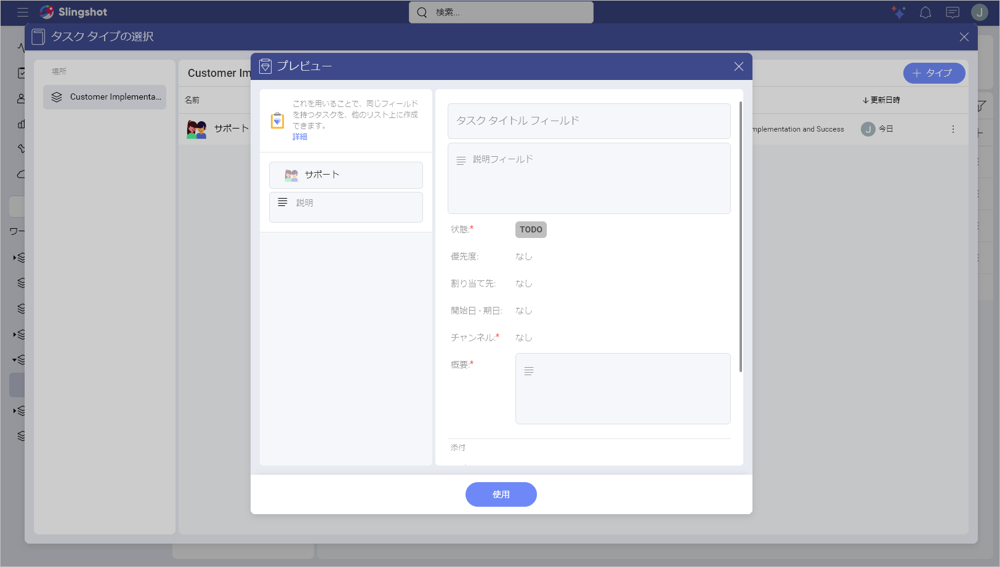

## タスク タイプ ライブラリとは何ですか?

タスク タイプ ライブラリは、基本的に特定の場所に保存されているタスク タイプのリストです。

組織や異なるワークスペース、異なるプロジェクト、個人のタスクごとにタスク タイプを設定できます。つまり、組織用のライブラリ、各ワークスペースとそのプロジェクト用のライブラリ、個人のタスク用のライブラリを持つことが可能です。

### 組織内のタスク タイプ ライブラリ

組織が作成したタスク タイプを確認して編集したい場合は、以下の手順を実行します:

1.	組織のオーバーフロー メニューを開きます。

2.	**[組織設定]** を選択します。

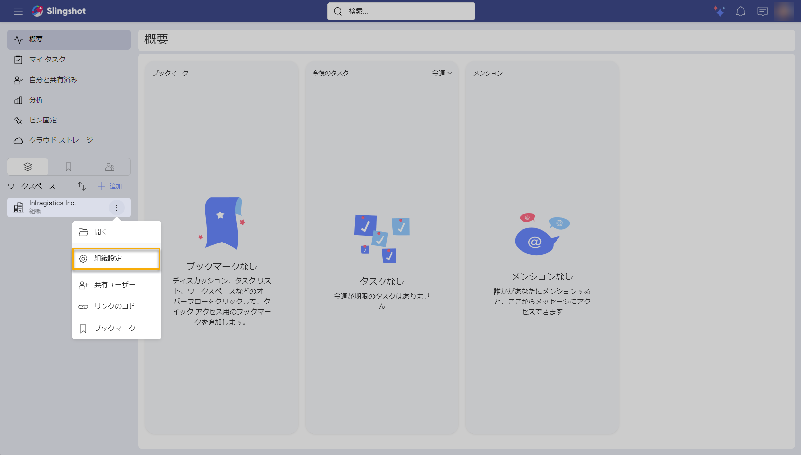

3.	**[タスク タイプ ライブラリ]** を開くと、組織内のすべてのタスク タイプのリストが表示されます。

>[!Note] 組織内のタスク タイプを削除できるのは、管理者権限を持つユーザーのみです。

### 個人タスクのタスク タイプ ライブラリ

個人タスクに作成したすべてのタスク タイプの概要を確認するには、以下の手順を実行します:

1.	右上隅に移動して、プロフィール写真を選択します。

2.	**[個人用ライブラリの管理]** を選択します。

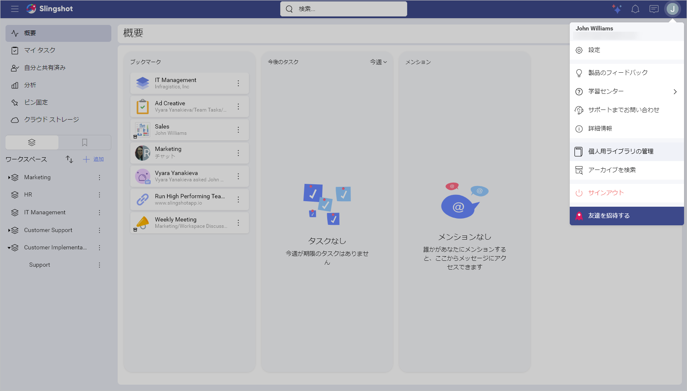

3.	ここで、個人タスク タイプ、タスク テンプレート、タスク フィールドのリストがすべて見つかります。

タスク タイプを個人用ライブラリに保存すると、自分だけが利用できます。

### ワークスペースとそのプロジェクト内のタスク タイプ ライブラリ

ワークスペースに参加していて、そのワークスペースで利用可能なタスク タイプとプロジェクトの全リストを表示する場合は、以下の手順を実行する必要があります。

1.	ワークスペースのオーバーフロー メニューを開きます。

2.	**[ワークスペース設定]** をクリックまたはタップします。

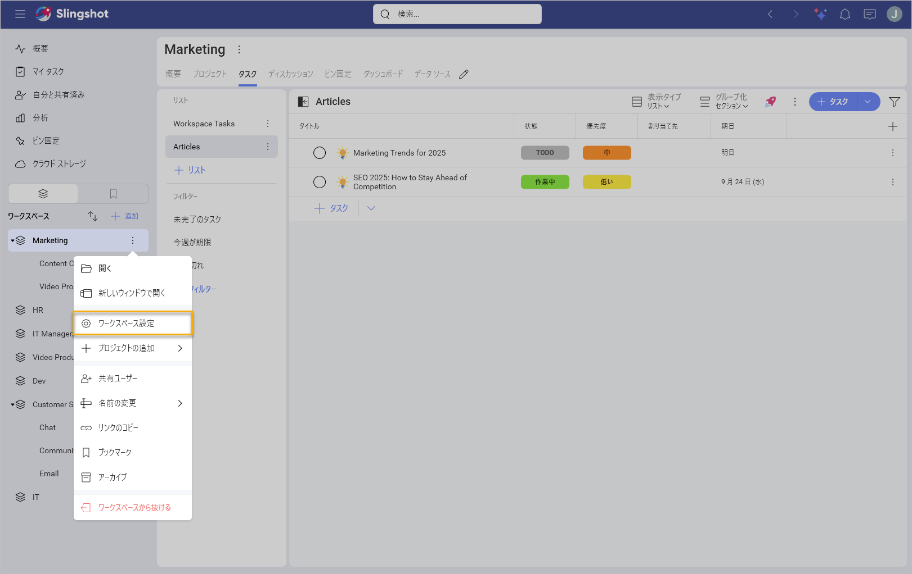

3.	**[タスク タイプ ライブラリ]** を選択します。ワークスペースやそのプロジェクトで使用されているタスク タイプのリストが表示されます。

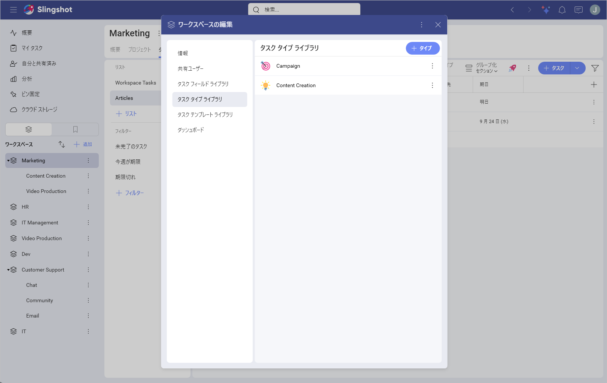

ここからタイプを編集、複製、削除することができます。**[+ タイプ]** ボタンから新しいタスク タイプを作成することもできます。

ワークスペース内で編集者または管理者の権限を持つすべてのユーザーがライブラリを変更できます。つまり、タイプを編集、複製、または削除できます。新しいタスク タイプを作成することもできます。

組織の管理者だけがライブラリからタスク タイプを削除できます。編集者は、タイプを編集および複製し、新しいタイプを追加することができます。

タスク タイプを編集すると、その変更はこのタイプを使用するすべてのタスクに適用されます。

>[!Note] 特定のタイプを削除しても、そのタイプのタスクは引き続きそれを使用します。ただし、削除されたタイプは編集できず、新しいタスクの作成には使用できなくなります。

## タスク タイプを作成する方法

タスク タイプを作成するには、以下の手順を実行できます:

1.	タスク リストのオーバーフロー メニューまたはタスクのオーバーフロー メニューを開きます。 

2.	**[ボタン操作]** を選択します。

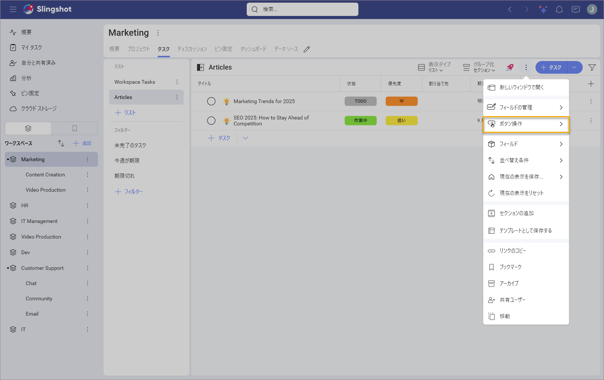

3.	**[タスク タイプ ライブラリ]** をクリックします。

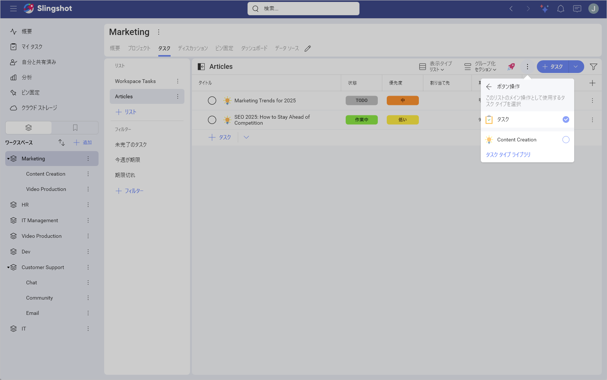

4.	**[+タイプ]** をクリックまたはタップします。

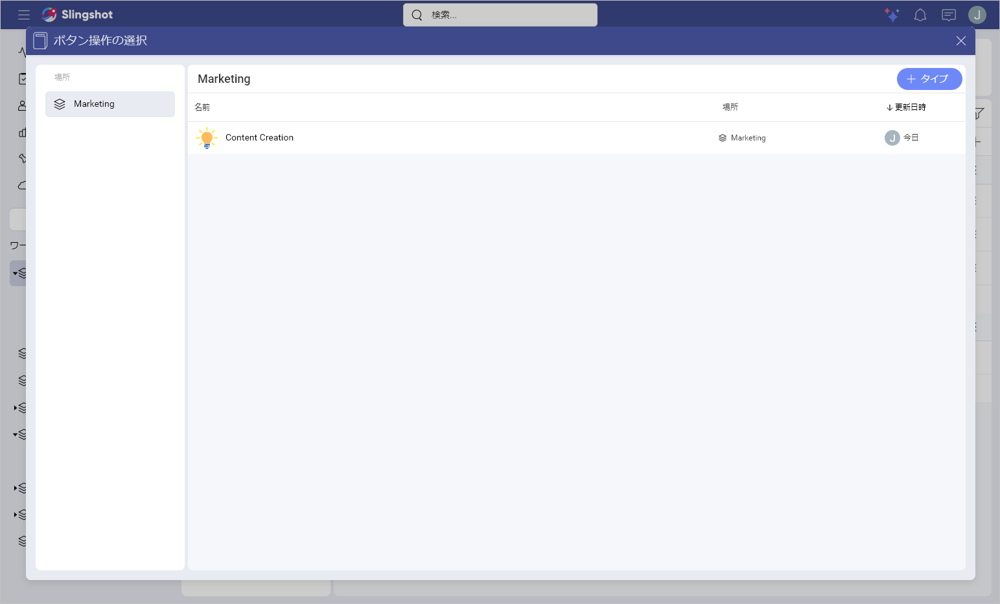

5.	ダイアログが表示され、タスク タイプのタイトルと説明を追加したり、[カスタム フィールド](custom-fields.md)を追加および削除したりできます。以下の例では、**「Campaign Type」** を新しいフィールドとして追加しました。 

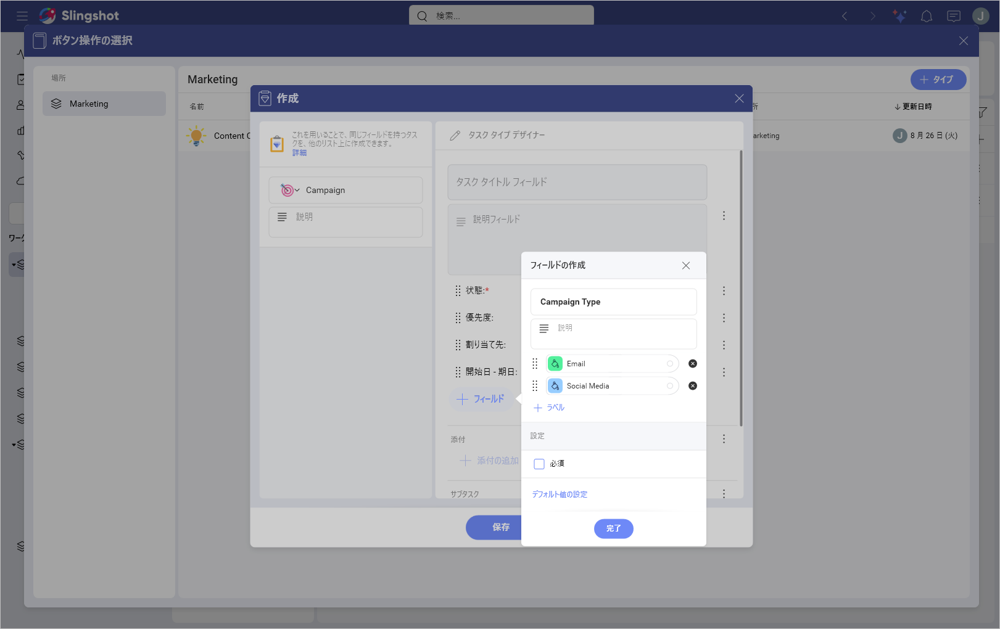

6.	準備ができたら、**[完了]**、**[保存]** の順にクリックまたはタップします。

>[!Note] タスク タイプのカスタム フィールドを必須としてマークすると、同じタスク タイプから新しいタスクを作成するときにのみ、そのフィールドに入力する必要があります。 

## タスクにカスタム タイプを追加する方法

タスクにカスタム タイプを追加する方法はいくつかあります。

タスク リストにタスクがない場合、最初のタスクを作成するときに、リスト全体にデフォルトのタスク タイプを割り当てることができます。これにより、すべてのタスクが同じ基準を満たすことが保証され、時間を節約できます。

そのためには、以下の手順を実行します:

1.	**[+ タスク]** をクリックまたはタップします。

2.	最近使用したタスク タイプから選択するか、ワークスペースまたはそのプロジェクトの*タスク タイプ ライブラリ*を開いて、タスク タイプのリストからタイプを選択できます。

3.	タスクの左上にタスク タイプの名前が表示されます。タスクのタイトルと、その他の重要な詳細を追加します。

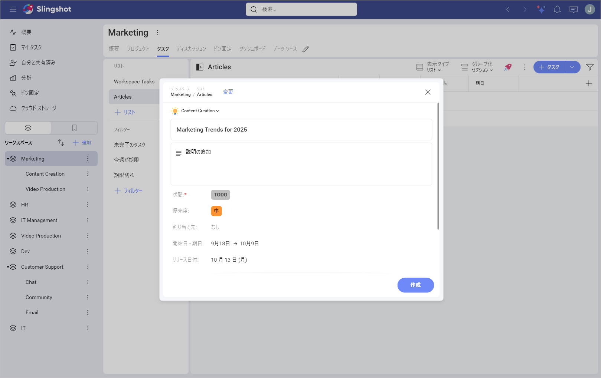

4.	**[作成]** をクリックまたはタップしてタスクを保存します。

5.	右上隅のタスクのデフォルト ボタンが変更さます。(以下を参照)

タイプが割り当てられていないタスクのリストがある場合は、以下の手順でそれらをすべて特定のタイプに一度に変換できます。

1.	タスク リストのオーバーフロー メニューを開きます。

2.	**[リストの変換]** をクリックまたはタップします。

3.	目標に最も適したタスク タイプを選択します。

4.	タスクは選択したタスク タイプに変換されます。この操作により、タスク リストのデフォルト タスク タイプも設定します。

既にデフォルトのタスク タイプが設定されているタスク リストがある場合でも、**[ボタン操作]** でチームのニーズに合った別のタイプに変更できます。

そのためには、以下の手順を実行します: 

1.	タスク リストのオーバーフロー メニューを開きます。

2.	**[ボタン操作]** をクリックまたはタップします。

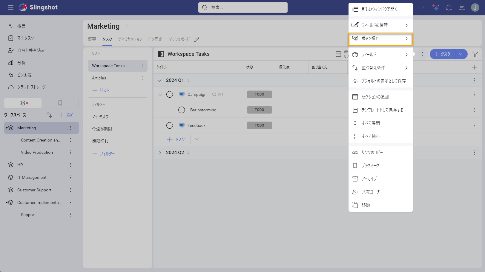

3.	目標に最も適したタスク タイプを選択します。

4.	右上隅に新しいタスク タイプが表示されます。 

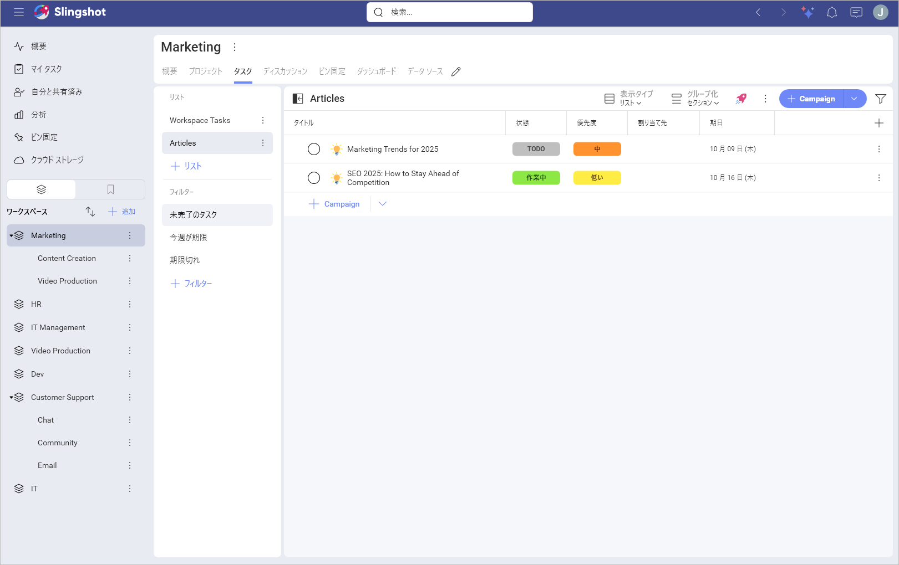

>[!Note] タスク リストにすでに存在するタスクは影響を受けません。ボタン操作では、デフォルトのタスク ボタンのみを変更できます。新しいタスクを作成する場合は、デフォルトのタスク タイプとそのフィールドを直接使用して時間を節約できます。

すでにタスクを作成している場合、またはタスクを作成中の場合は、次の場合にタイプを選択できます。

1.	タスクリストの右上にある **[+ タスク]** ボタンをクリックまたはタップします。

2.	タスクの左上にあるアイコンから **[変換先]** を選択します。

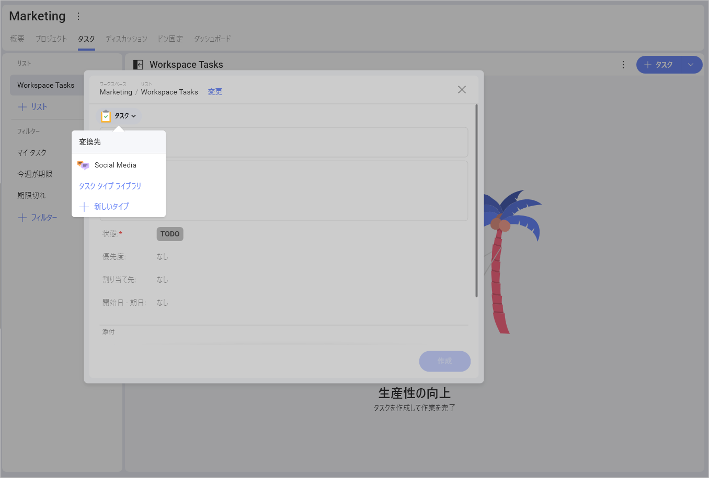

3.	タスク リストやワークスペース内のタスク タイプから選択できます。いずれも目標に適合しない場合は、新しいタスク タイプを作成できます。

4.	タスクにタイプを追加すると、タスクの左上隅に変更が表示されます。

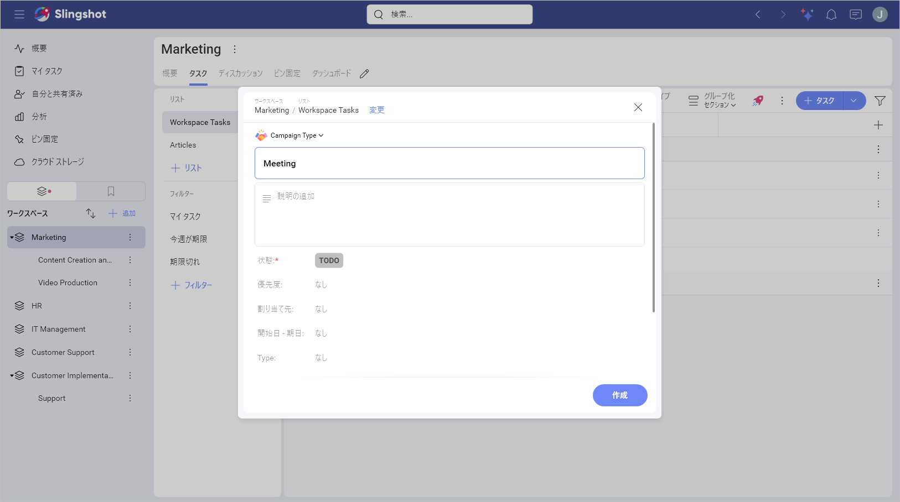

タスクにすでにタイプがあるが、異なるフィールドを持つ別のタイプを使用したい場合は、以下の手順を実行できます。

1.	タスクのオーバーフロー メニューを開きます。以下の例では、*「Campaign」* という名前のタスクのタイプを変更しました。

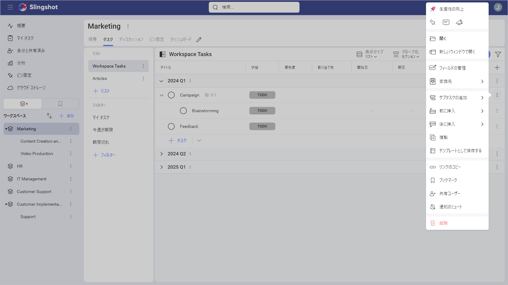

2.	**[変換先]** をクリックまたはタップします。

3.	新しいタイプを選択します。この場合、*「Content Creation」* を選択しました。

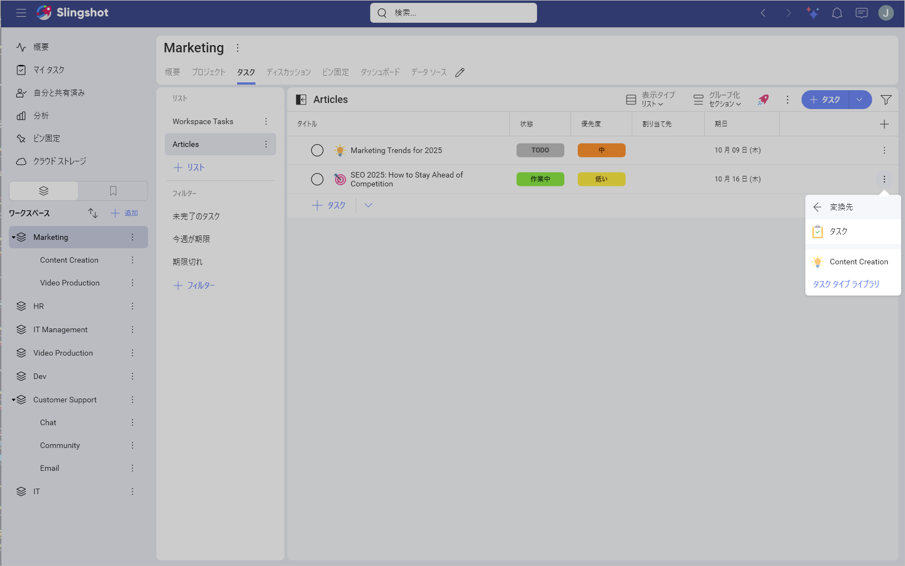

その後、初期タイプのフィールドを保持するかどうかを決定できるダイアログが表示されます。 

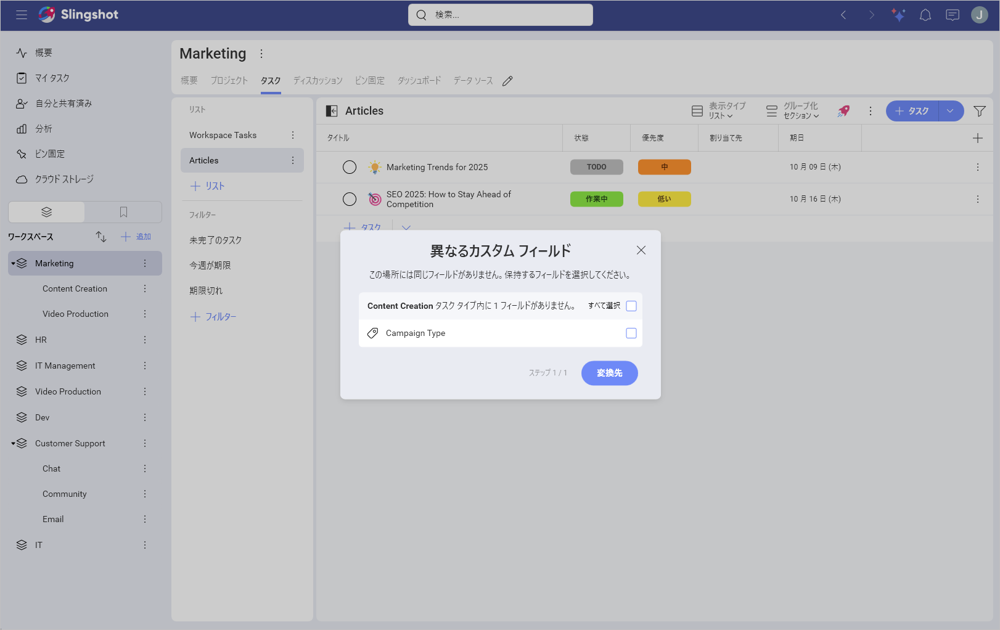

一部のフィールドを保持することにした場合、それらは新しいタイプに転送されます。同じタイプを使用している他のすべてのタスクは、変更を反映するように更新されます。つまり、新しいフィールドがそれらのタスクに追加されます。フィールドが[タスク フィールド ライブラリ](custom-fields.md)にない場合は、追加するオプションが表示されます。

5.	変更を保存すると、タスク アイコンが更新され、新しいタイプが表示されます。

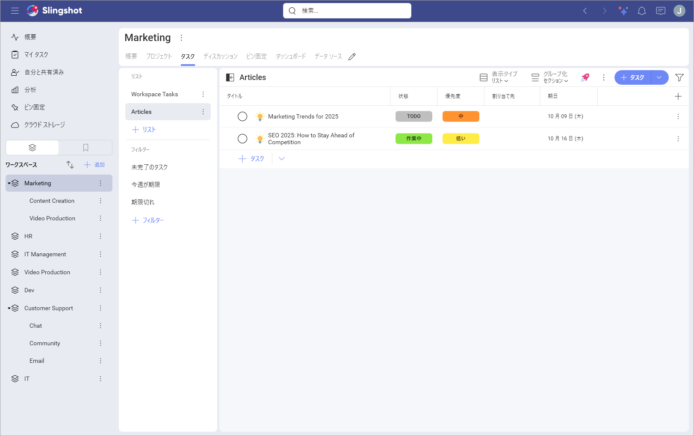

>[!Note] タスクのタイプを変更する場合は、タスクの担当者に通知されます。また、新しいタイプのタスクを開くと、割り当てられたユーザーはどのフィールドが削除または追加されたかを確認できます。

以下の手順でタスクのタイプを変更することもできます。

1.	タスクを開きます。

2.	右上隅のタスク タイプをクリックまたはタップしてタイプを選択します。この場合は、*「Content Creation」* を選択しました。

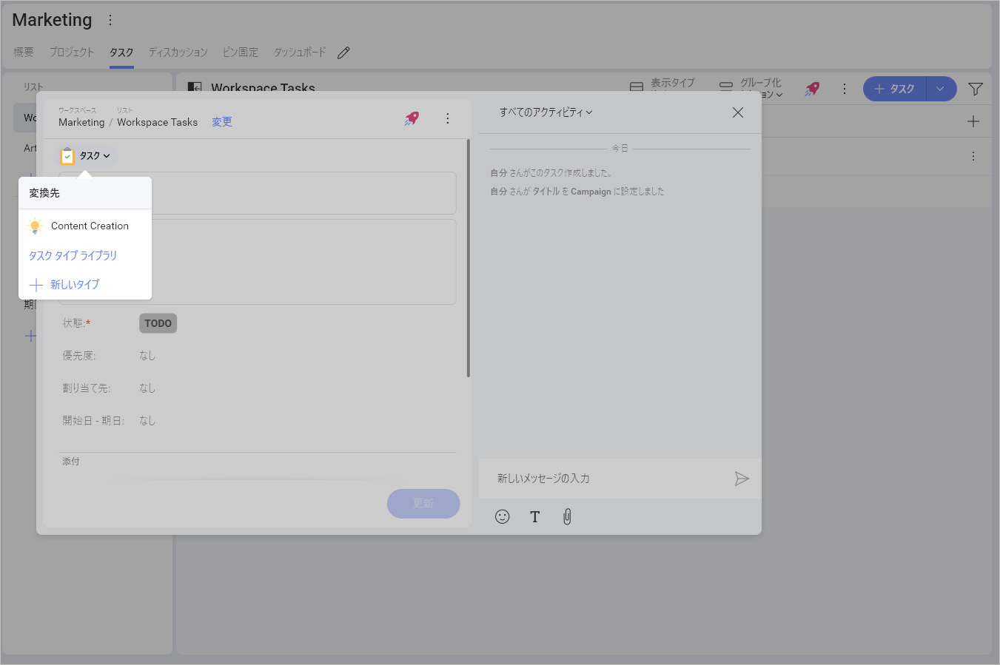

3.	前述のように、新しいタイプに異なるフィールドがある場合は、フィールドを保持するオプションが表示されます。フィールドを保持することを選択した場合、同じタイプを使用している他のすべてのタスクが更新され、変更が反映されます。

4.	準備ができたら、**[変換先]** をクリックまたはタップします。

## サブタスクにカスタム タイプを追加する方法

大きくて複雑なタスクがある場合は、見やすくするためにサブタスクに分割することができます。 

サブタスクは親タスクのタイプを引き継がないため、作成時に特定のタイプに変換できます。サブタスクを作成するには 2 つの方法があります。

すでにタスクを開いている場合は、以下の手順を実行できます。

1.	*[サブタスク]* まで下にスクロールし、**[+ タスクの追加]** をクリックまたはタップします。

2.	サブタスク ダイアログでは、サブタスクのタイトルを追加したり、使用するタスク タイプを選択したりできます。  タスク タイプごとにタスク フィールドが異なります。目標に最も適したものを選択します。この場合、*「Campaign Type」* を選択しました。

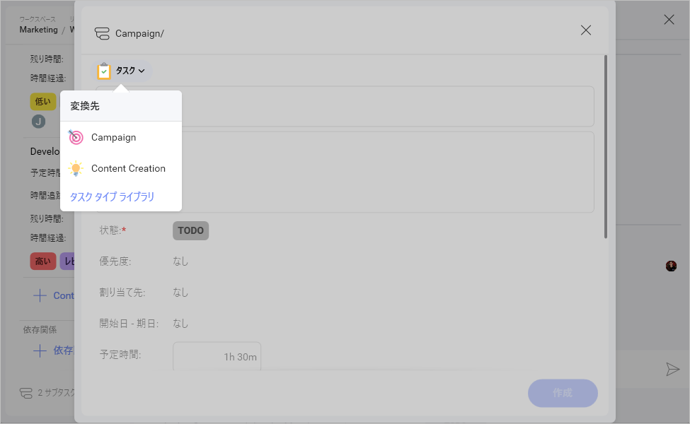

3.	準備ができたら、**[作成]** をクリックまたはタップします。

4.	タスク リストの親タスクの下にサブタスクが表示されます。

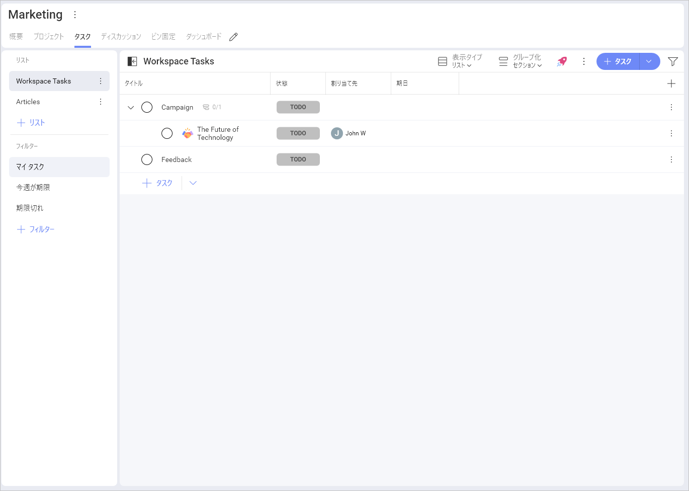

タスク リストを確認して、タスクを小さなサブタスクに分割する必要があることに気付いた場合は、以下の手順を実行できます。

1.	タスクのオーバーフロー メニューを開きます。

2.	**[サブタスクの追加]** を選択します。

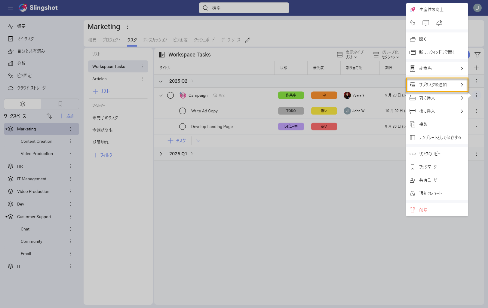

3.	ここで、サブタスクに使用するタスク タイプを選択できます。 

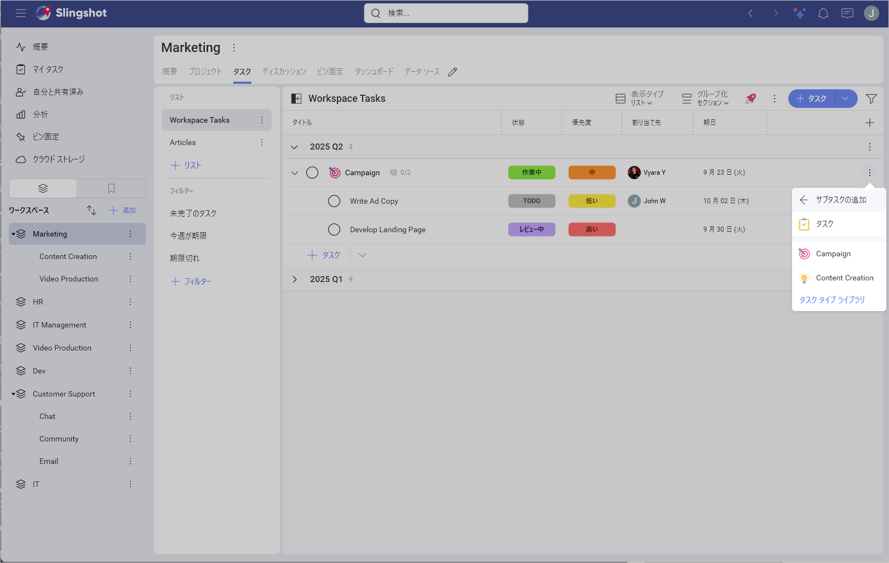

4.	選択したタイプに基づいて、異なるタスク フィールドが表示されます。

5.	変更の準備ができたら、**[作成]** をクリックまたはタップします。

6.	サブタスクはタスク リスト内の親タスクの下に表示されます。

サブタスクが同じ基準を共有する場合は、サブタスクにデフォルトのタイプを設定して、すべての新しいサブタスクが同じタイプになるようにすることができます。

サブタスクのデフォルト タイプを設定するには、以下の手順を実行する必要があります。

1.	親タスクのオーバーフロー メニューを開きます。

2.	**[フィールドを管理]** をクリックまたはタップします。

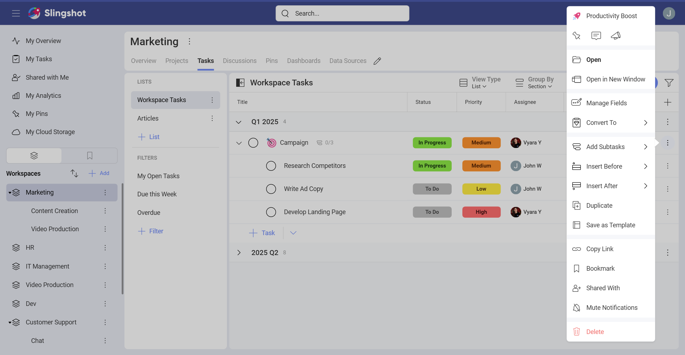

3.	**[サブタスク フィールド]** のオーバーフロー メニューを開きます。

4.	**[ボタン操作]** をクリックまたはタップします。

5.	さまざまなタスク タイプのリストが表示されます。目標に最も適したものを選択します。

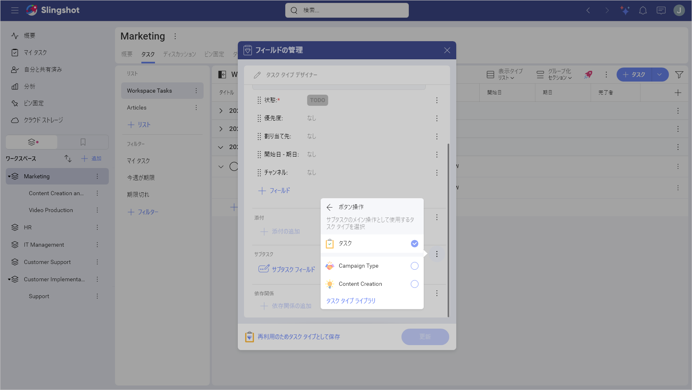

6.	デフォルトのタスク タイプを選択すると、*[サブタスク]* の下に表示されます。変更を保存するには、**[更新]** をクリックまたはタップします。

7.	新しいサブタスクの **[+ タスク]** ボタンの代わりに、親タスクにタスク タイプのタイトルが表示されます。

## タスク タイプを削除する方法

編集者または管理者の権限を持つユーザーのみが、ワークスペース内のタスク タイプ ライブラリからタスク タイプを削除できます。

特定のタイプを削除しても、そのタイプのタスクは引き続きそのタイプを使用します。ただし、タイプを編集したり、新しいタスクの作成に使用したりすることはできなくなります。この操作は元に戻せません。

タスク タイプを削除するには:

1.	インターフェースの右上隅、またはリスト内の最後のタスクの下にある **[+ タスク]** ボタンをクリックまたはタップします。

2.	**[タスク タイプ ライブラリ]** をクリックまたはタップします。

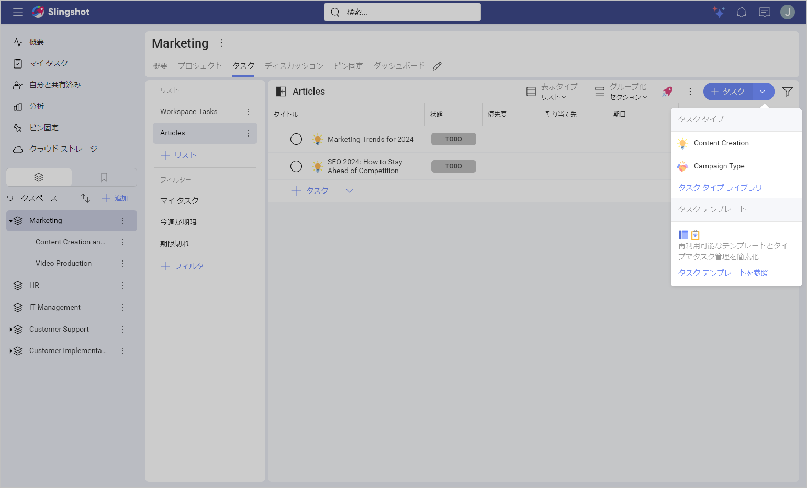

3.	タスク タイプのリストが表示されます。削除したいもののオーバーフロー メニューを開きます。

4.	**[削除]** を選択します。

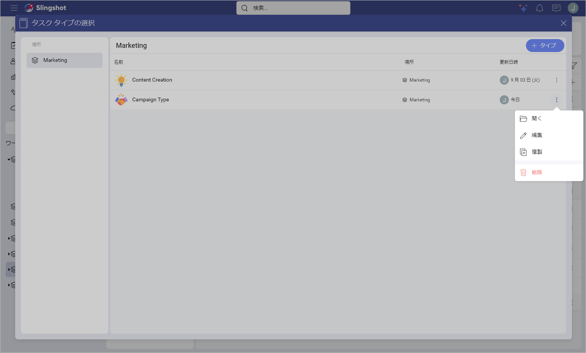

5.	特定のタスク タイプを削除すると、それを編集したり、新しいタスクに使用したりできなくなることを通知する警告が表示されます。このタイプを使用している古いタスクは影響を受けません。それでもタスク タイプを削除する場合は、**[削除]** をクリックまたはタップします。

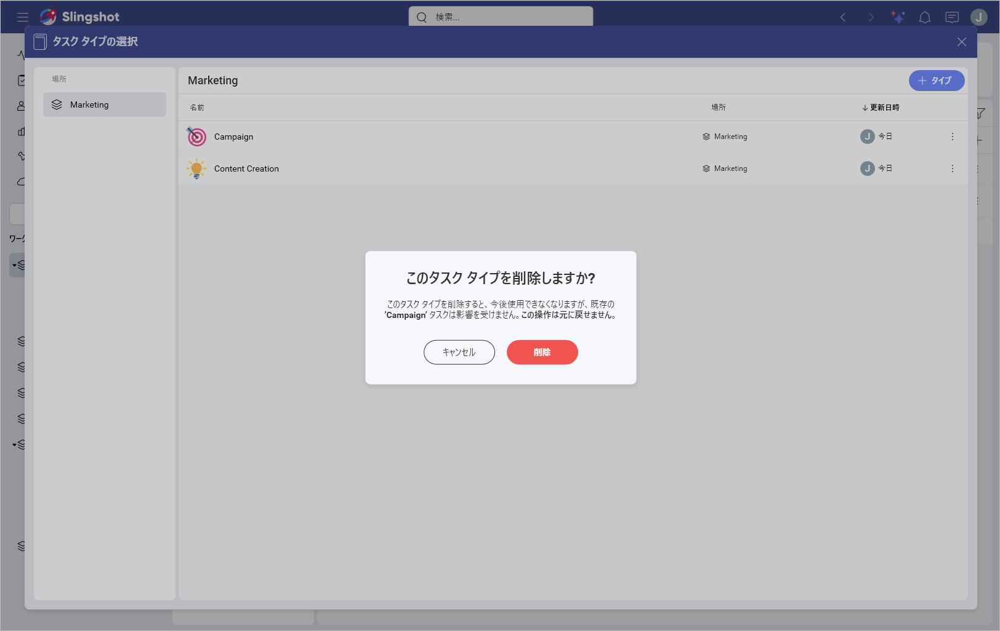

ワークスペースの設定またはそのプロジェクトのいずれかの設定から **[タスク タイプ ライブラリ]** を開いたときに、タスク タイプを削除することもできます。 
以下の手順で実行できます。

1.	ワークスペースまたはプロジェクトのオーバーフロー メニューをクリックまたはタップします。この場合、ワークスペースを編集しました。

2.	**[ワークスペース設定]** をクリックまたはタップします。

3.	**[タスク タイプ ライブラリ]** を選択します。

4.	タイプのオーバーフロー メニューから **[削除]** をクリックまたはタップします。

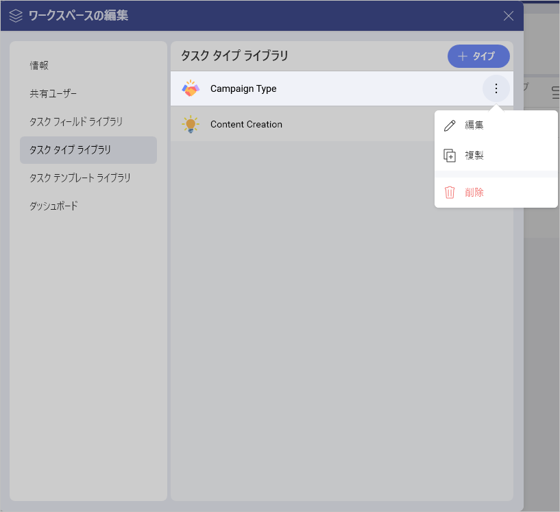

5.	特定のタスク タイプを削除すると、それを編集したり、新しいタスクに使用したりできなくなることを通知する警告が再度表示されます。このタイプを使用している古いタスクは影響を受けません。それでもタスク タイプを削除する場合は、**[削除]** をクリックまたはタップします。

