# タスクの詳細

ようこそ! このトピックは、タスクに関する詳細を紹介します。

## 個人タスクと共有タスク
Slingshot では、個人なタスクと共有タスクを使用できます。これらはほとんど同じように機能しますが、以下に詳述するいくつかの違いがあります。

ユーザー自身だけが**個人タスク**にアクセスでき、**[タスク]** で見つけることができます。

ワークスペースのすべてのメンバーは、割り当てられているかどうかに関係なく、そのワークスペース内で作成されたタスクにアクセスできます。そして、すべてのメンバーがこれらの共有タスクを自由に管理できます。

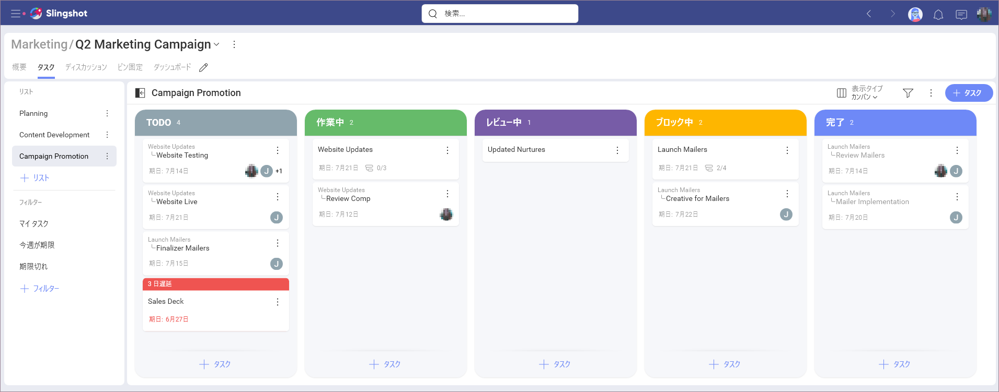

>[!NOTE] 親ワークスペースのメンバーは、サブワークスペースに参加していない場合でも、すべてのサブワークスペースのタスクを表示できます。ただし、親ワークスペースのメンバーではないサブワークスペースのメンバーは、親ワークスペースのタスクを表示できません。

## タスクにアクセスする方法

ワークスペースに移動し、上部の **[タスク]** タブを選択すると、タスクにアクセスできます (以下を参照)。

場所に応じて、さまざまなタスクにアクセスします。

**[概要]** では、割り当てられたすべてのタスクにアクセスできます。これらのタスクは [マイタスク] 内に保存されます。そこには、個人タスクとワークスペースのタスクの両方があります。すべてのタスクを 1 か所にまとめるのに非常に便利です。

**ワークスペース**内では、誰が割り当てられているかに関係なく、作成されたすべてのタスクにアクセスできます。  
また、**[マイタスク]** プリセット [フィルター](#タスクをフィルタリングする方法)を使用すると、自分に割り当てられたタスクのみが表示されます。サブワークスペースを含む親ワークスペースにいる場合は、**[マイタスク]** を使用して、ワークスペースとそのすべてのサブワークスペースで自分に割り当てられているすべてのタスクを検索します。 

タスクを開くには、タスクをクリックまたはタップするだけです。

## 新しいワークまたはタスクサブタスクを作成する方法

選択した表示タイプ (リスト、カンバン、またはタイムライン) に関係なく、画面の右上にあるボタンを使用して、いつでも**新しいタスク**を作成できます。

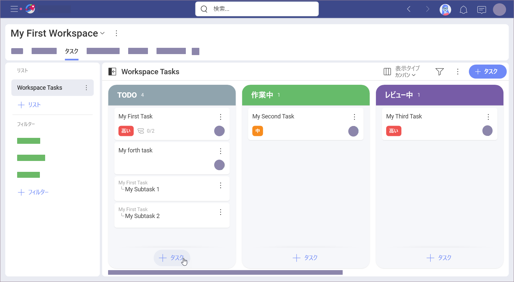

上に示したように、*表示タイプ*に応じて、他の [+ タスク] ボタンが常にあります。

以下に示すように、タスクのオーバーフロー メニューを使用して、新しい**サブタスク**を直接作成できます。

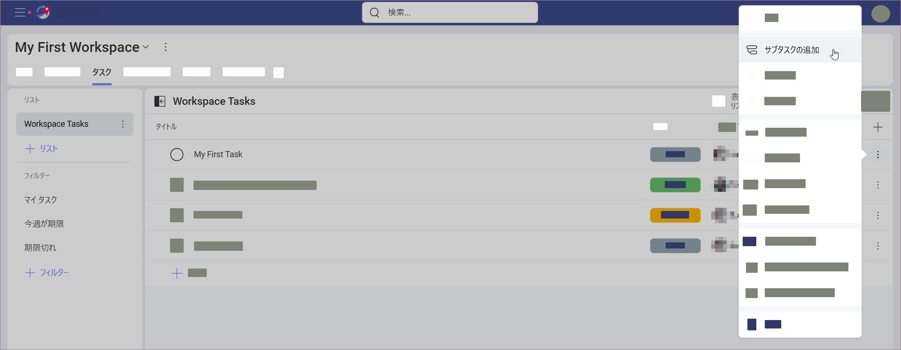

または、すでに開いているタスクのサブタスクを作成することもできます:

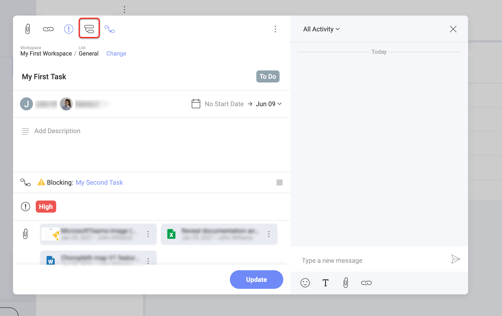

タスクを開くと、新しいサブタスクを挿入することもでき、この方法で既存のサブタスクを並べ替えることができます (以下を参照)。

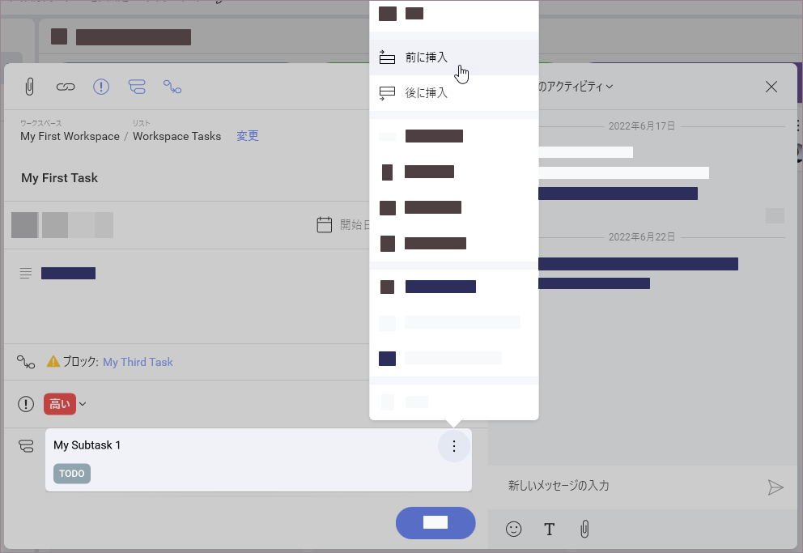

## タスクを別のタスクに依存させる方法 

2 つ以上のタスクは、互いの完了に依存する場合があります。Slingshot は、タスクの**依存関係**プロパティを使用して、すべての人にそのことを通知するのに役立ちます。 

上部の **[依存関係]** アイコンを選択すると、タスク作成ダイアログでタスクの依存関係を設定できます (下を参照)。 

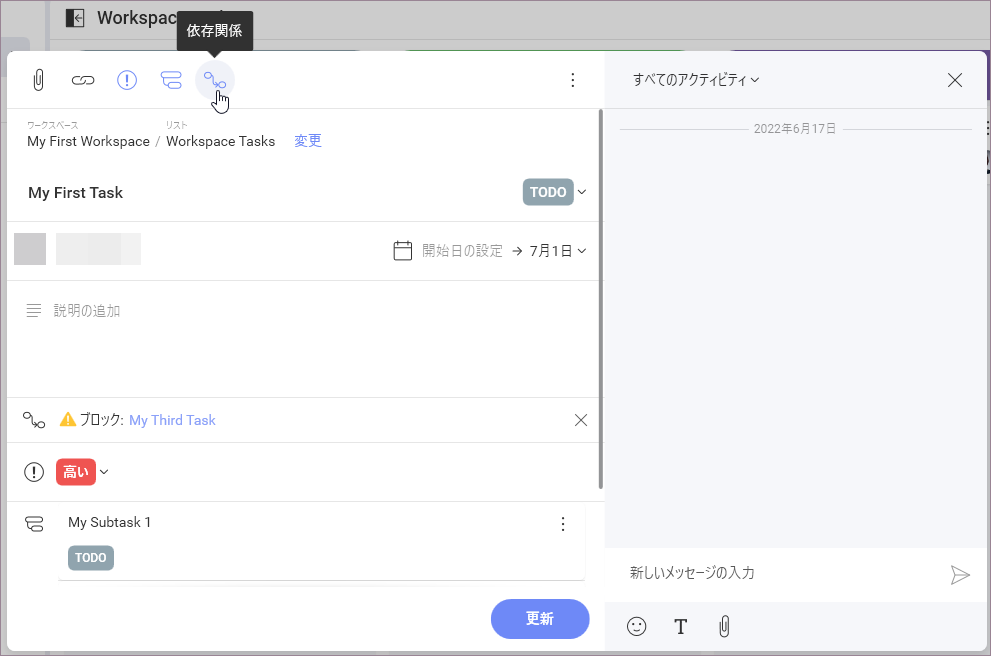

ここでは、2 つの依存関係タイプから選択できます:

* **[待機中]** - これは、別のタスクが終了する前にタスクを開始できないことを意味します。 
* **[ブロック]** - このタスクが完了する前に他のタスクを開始することはできません。

**[+ 待機中タスクを選択]** 青いボタンを選択して、タスクの前に完了する必要のあるタスクを追加します。**[+ ブロック タスクを選択]** 青いボタンを選択して、タスクが完了する前に開始できないタスクを追加します。1 つのタスクが他の複数のタスクに依存したり、複数のタスクをブロックしたりする可能性があるため、同じタスクに両方の依存関係を設定できます。

## プロパティを変更する方法

名前、割り当て先、依存関係、状態、優先度など、タスクのすべてのプロパティは、さまざまな方法を使用して変更できます。

タスクを開く**最良の方法**は、タスクをクリックまたはタップするかオーバーフロー ボタンを押してから [開く] を選択することです。

**より高速な方法**は、以下に [状態] プロパティを指定して示すように、変更するプロパティ値をクリックまたはタップするだけです。

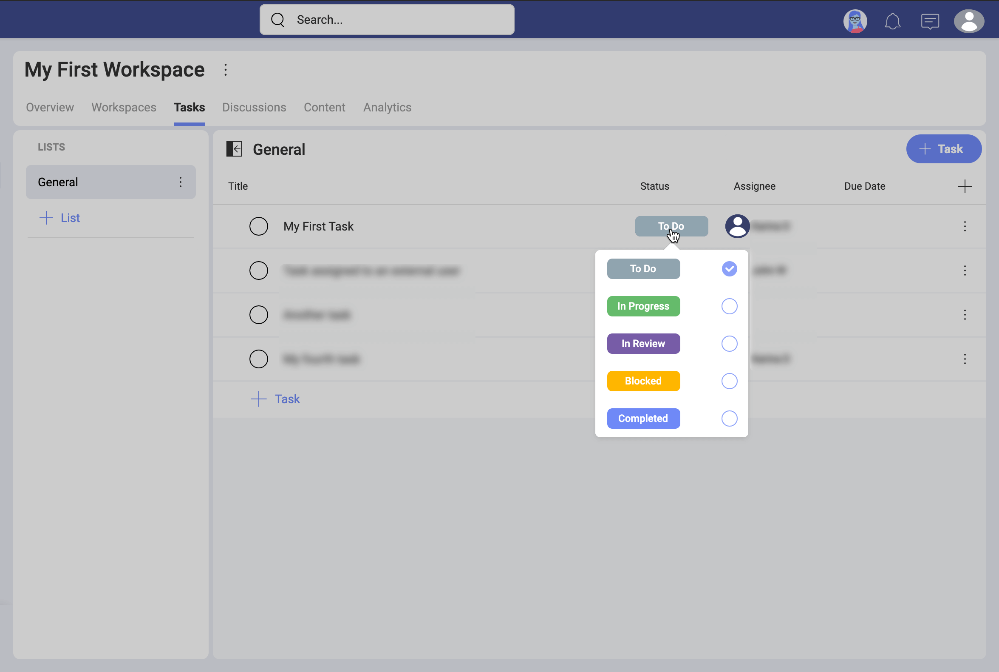

## プロパティを表示 / 非表示にする方法

タスクには、*リスト*および*カンバン*で表示できる多くのフィールド プロパティがあります。デフォルトでは、タスクを開く前に表示できるのは、タスクの*名前*、*割り当て先*、および*期日*のみです。

プロパティを表示 / 非表示にするには、上部の**オーバーフロー** ボタン (**[+ タスク]** ボタンの横) > **[フィールド]** をクリックまたはタップし、プロパティのリストから選択します (以下を参照)。

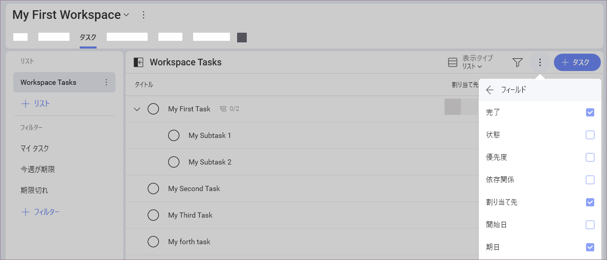

## タスクをフィルタリングする方法
フィルタリングを使用すると、選択できるタスクの数が少なくなり、現在必要なタスクを見つけるのに役立ちます。

画面の右上にあるフィルター アイコンをクリックまたはタップすると、**フィルター エディター**にアクセスできます (下のスクリーンショットを参照)。

フィルター エディターでは、**ベーシック ルール**またはより**高度なルール**を作成できます。ほとんどの場合、**ベーシック** ルールで十分です。フィルターでより複雑な条件を定義する必要がある場合は、**高度**をお勧めします。

フィルターを保存しておいて、後で再び使用したい場合があります。これにより、自分に関連する、すでにフィルタリングされたタスクのリストを手元に置いておくことができます。 

フィルターを作成して保存するには、以下に示すように [+ フィルター] を使用します。

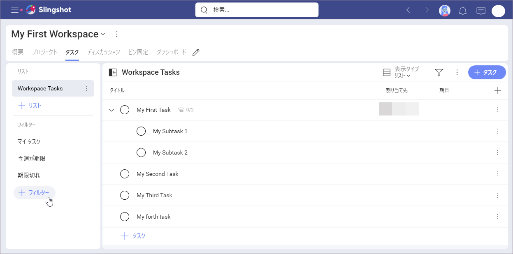

Slingshot には、すぐに使用できるいくつかのフィルターがあります: **[マイタスク]**、**[今週が期限]**、および **[期限切れ]** (上のスクリーンショットに表示)。ただし、いつでも新しいカスタム フィルターを作成したり、既存のカスタム フィルターを編集したりできます。

ワークスペースで作成および保存したフィルターは、自分だけでなく他のメンバーにも表示されることに注意してください。

さらに、以下に示すように、**[フィルターとして保存]** を使用して、その場で作成したフィルターを保存できます。

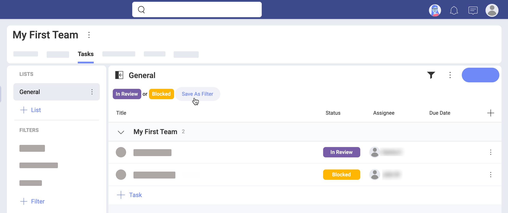

タスクのフィルタリングを停止するには、**フィルター アイコン**をクリックまたはタップして、**[フィルター]** ダイアログを開きます。次に、下の **[クリア]** ボタンを選択して現在のフィルターを削除し、**[適用]** をクリックして変更を保存します。 

特定のタスクが見つからない場合は、縮小されたパネルを展開したり、既存のフィルターを削除したり、必要なタスクのプロパティを使用してフィルターを追加したりしてみてください。アクティブなフィルターがあるかどうかを識別しやすくするために、アイコンが変わります。

## リスト、カンバン、タイムラインを切り替える方法

達成したいことに応じて、3 つの異なる表示タイプ (リスト、カンバン、タイムライン) から選択できます。

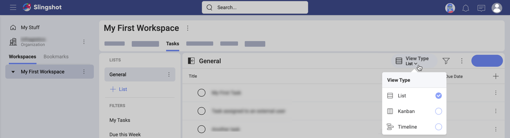

デフォルトでは、タスクは単純な**リスト**と見なされますが、これで十分な場合がよくあります。このドキュメントのスクリーンショットのほとんどは、*リスト*表示でタスクを示しています。これは、ほとんどの場合、優先表示タイプが*タスク*の使用方法と管理方法に影響を与えないためです。その場合、各表示タイプの違いを示します。 

*カンバン*は、作業の視覚化と効率の最大化を支援するためにデザインされたワークフロー管理方法として一般に知られている日本語の単語です。Slingshot では、**カンバン**表示にタスクの視覚的表現がカードの形式で表示されます。各カードには、状態、期日、割り当て先などの[タスク プロパティ](#プロパティを変更する方法)など、タスクに関する情報が含まれています。

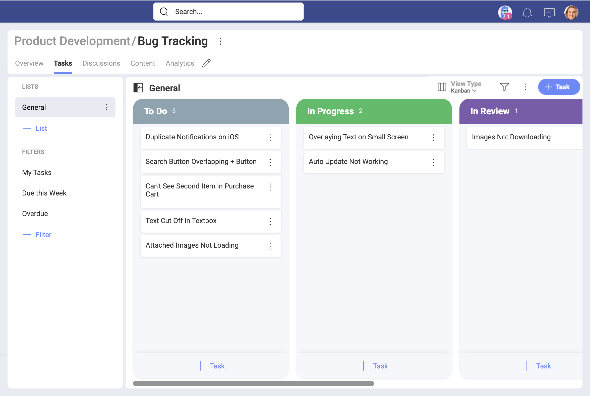

その上、カードは列に配置されています。デフォルトでは、列は状態ワークフローのさまざまな段階を表します (上記を参照)。ドラッグアンドドロップを使用して、その場でカードの状態を変更することにより、ワークフロー内でカードを移動できます。 

**タイムライン**には、常にイベントのリストが時系列で表示されます。Slingshot では、デザインされた期間のタスクを表示できます。

タイムラインでタスクを選択し、その終了をドラッグして開始と期日を再配置できます。 

さらに、[ズーム] ドロップダウンを使用して、スケール (日、週、月) を変更できます。上部の **[今日]** ボタンを使用して、現在の日に戻ります。スケールが週または月を示している場合、**今日**はそれぞれ現在の週または月の初めに戻ります。 
上部のオーバーフロー メニューの **[週末を表示]** チェックボックスをオンにすることで、週末を表示 / 非表示にすることもできます。

タイムラインの各タスクの両隅にフックがあります。タスクの左フックをドラッグして、別のタスクに接続します (下のスクリーンショットを参照)。これにより、*[待機中]* の[**依存関係**](#タスクを別のタスクに依存させる方法)を最初のタスクに追加します。右フックを使用して、ブロック依存関係を追加します。 

## タスクをグループ化する方法

グループ化のオプションには、セクション、優先度、割り当て先、およびその他の基準によるタスクの順序付けが含まれます。タスクをグループ化するには、**オーバーフロー メニュー > [グループ化]** を選択します (以下を参照)。

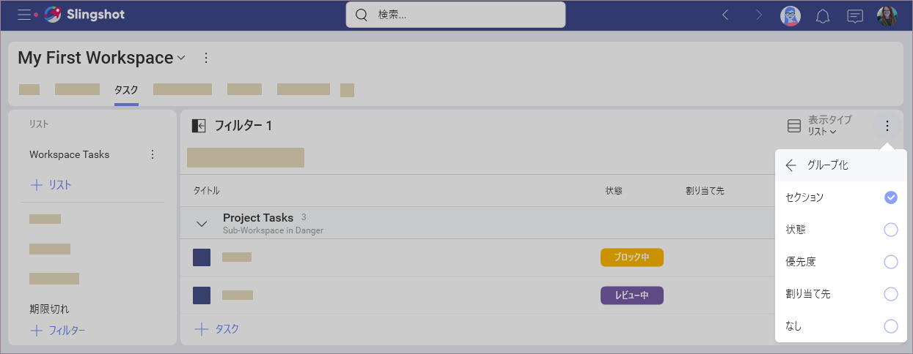

*グループ化*は、すべての_表示タイプ_で使用できます。タスクをグループ化すると、同じユーザーに割り当てられたタスクなど、特定のプロパティを共有するタスクをすばやく見つけることができます。フィルタリングとは異なり、グループ化によりすべてのタスクが同時に表示されます。*グループ化*基準を変更すると、現在のリストとタスクの表示方法にのみ影響します。他のワークスペース メンバーは、同じリストに異なるグループ化基準を適用できますが、これはプロファイルでのこのリストの表示方法には影響しません。 

## タスクを並べ替える方法 

タスクがどのように順序付けられているのか疑問に思うかもしれません。並べ替えは、タスク プロパティを基準として使用して、タスクを昇順または降順で並べ替えるのに役立ちます。 

並べ替えは、*リスト*表示と*タイムライン*表示にのみ適用できます。  

**リスト**表示では、タスクはデフォルトで作成日順に並べられています。これは、最後に作成したタスクがリストの一番下に追加されることを意味します。並べ替え条件を変更するには、リストの上部にあるプロパティ タイトルをクリックまたはタップし、*状態*、*割り当て先* (名前)、*開始 / 期日*、*添付*ファイル、*優先度*などの昇順または降順でタスクを並べ替えます。下のスクリーンショットを参照してください。並べ替えるプロパティがない場合は、*リスト*表示に[プロパティを表示する方法](#プロパティを表示--非表示にする方法)を参照してください。 

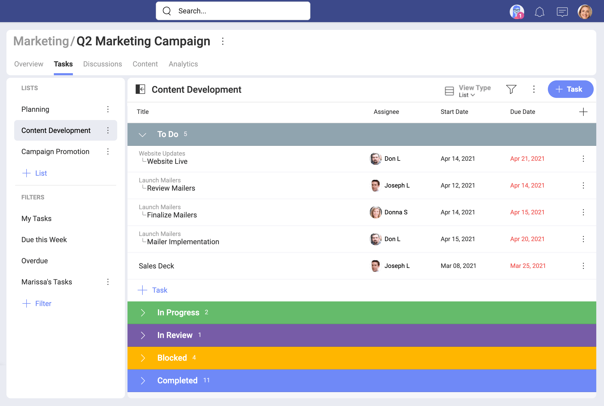

**タイムライン**表示では、タスクはデフォルトで順序付けられています。ただし、右側のオーバーフロー メニューの *[並べ替え条件]* オプションを使用できます。

## リストとセクションを使用する方法

Slingshot では、**リスト**と**セクション**を使用してタスクを整理できます。  

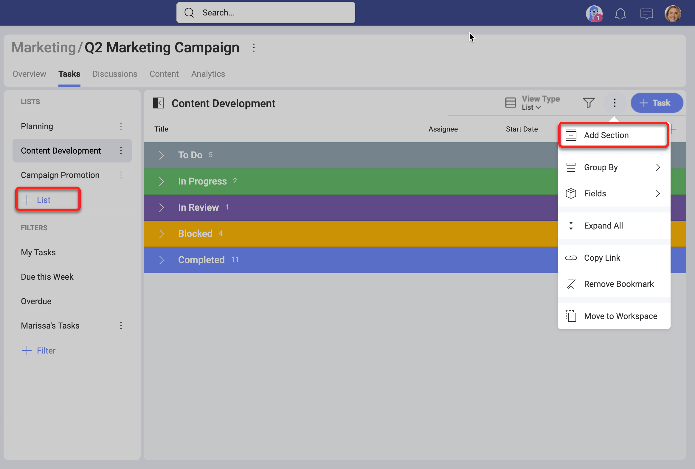

**セクション**はリストを分割したものです。リストには 1 つ以上のセクションを含めることができ、タスクのリストを整理する自然な方法は、セクションごとにグループ化することです。

**リスト**は、タスクを整理するのに役立ち、必要に応じて再編成、コピー、および移動できます。
これは、必要なリストやセクションを事前に計画するのではなく、作業に集中できるため、非常に重要です。これらの変更は生産性を高めて時間を無駄にしないようにデザインされています。

## タスクを移動する方法 

同じワークスペース内のタスク リスト間、または同じ親ワークスペース内の異なるサブワークスペース内のリスト間でタスクを移動できます。タスクは常にすべてのサブタスクとともに移動されます。 

タスクを移動するには、タスクを開き、タスク名のすぐ上にある *[変更]* の青いボタンをクリックまたはタップします (下を参照)。ワークスペースに移動して新しい場所を選択し、タスクを移動する場所をリストします。完了すると、タスク リストの下部にタスクが表示されます。

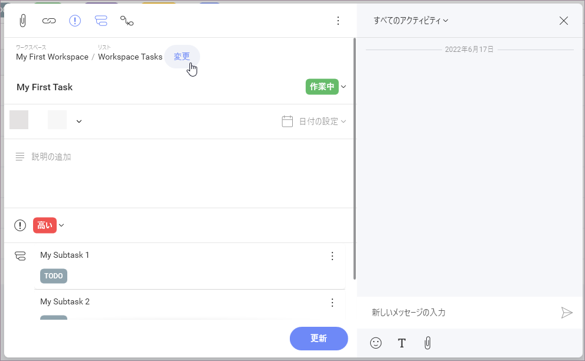

または、タスクをクリックして押したまま、別のリストにドラッグします。次に、そこにドロップします。あるサブワークスペースから別のサブワークスペースに移動するタスクにドラッグアンドドロップを使用することはできません。

>[!NOTE] モバイルでまもなく登場!
ドラッグアンドドロップ タスクは現在、Slingshot モバイルでは使用できません。 

以下の場合にタスクを**移動することはできません**: 
-	2 つの親ワークスペース間のタスクを移動したい場合
-	サブタスクを移動したい場合 
-	ワークスペースまたはサブワークスペースの*閲覧者*である場合

## タスク リストを移動する方法 

完全なタスク リストをあるワークスペースから別のワークスペースに移動できます。移動先ワークスペースは、同じ親ワークスペースの下にある必要があります。タスク リストを親ワークスペースからそのサブワークスペースの 1 つに移動することもできます。 

タスク リストを移動するには、オーバーフロー メニュー > *[移動]* > 移動先のワークスペース > *[移動]* を選択します。 

これで、新しいワークスペースでタスク リストを使用できます。

## 添付ファイルを追加する方法

**添付**を追加する機能により、Slingshot はタスクとサブタスクに関連するすべての情報を確実にキャプチャします。

各タスクには、特定のタスクやサブタスクの画像、ドキュメント、リンクなど、1 つ以上の添付ファイルを含めることができます。

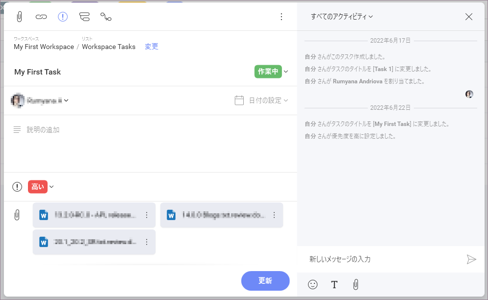

添付されたファイルは、開いたり、ダウンロードしたり、タスクから切り離したり (ピン固定を解除) できます。

> [!NOTE]
> タスクへのファイルの添付は、ボードへのファイルのピン固定に似ています。個人用またはワークスペースのクラウド ストレージからコンテンツをリンクできます。どちらの場合も、添付ファイルが Slingshot に保存されることはありません。

ファイルを添付するには、タスクを開き、以下に示すようにクリップ アイコンをクリックまたはタップします。

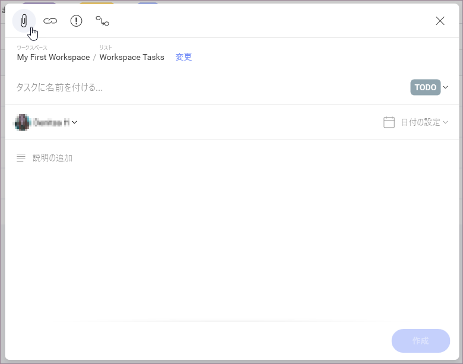

## ディスカッションまたはチャット メッセージからタスクを作成する方法

Slingshot は、すべてのコミュニケーション ツールとコラボレーション ツールが 1 つの場所にあることを保証し、リモート チームがどこにいても生産性を維持できるようにします。 

以下に示すように、メッセージからタスクを作成して生産性を向上させます。

ディスカッションまたはプライベート / グループ チャット メッセージを使用して、すばやく開始できます。メッセージからタスクを追加する場所を選択すると、新しいタスクの説明にメッセージが自動的に追加されます。