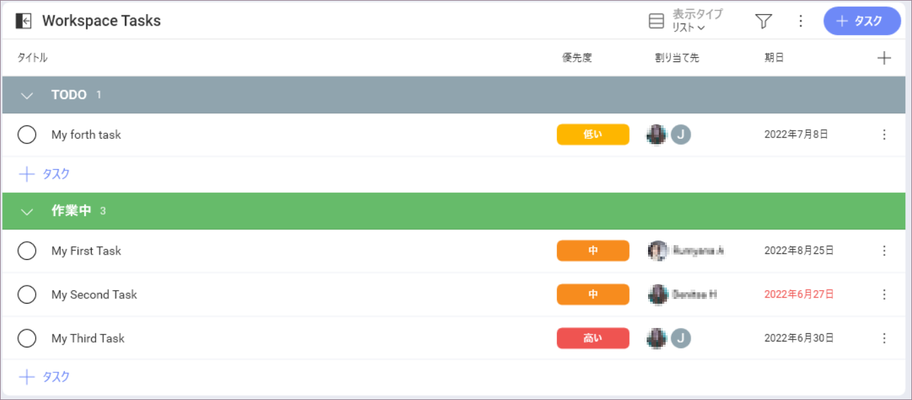
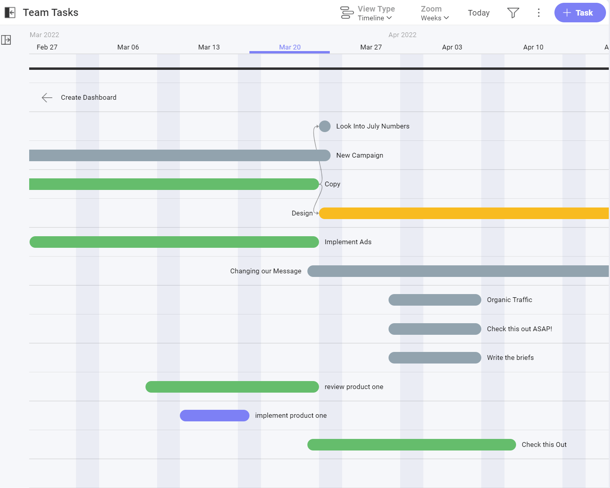
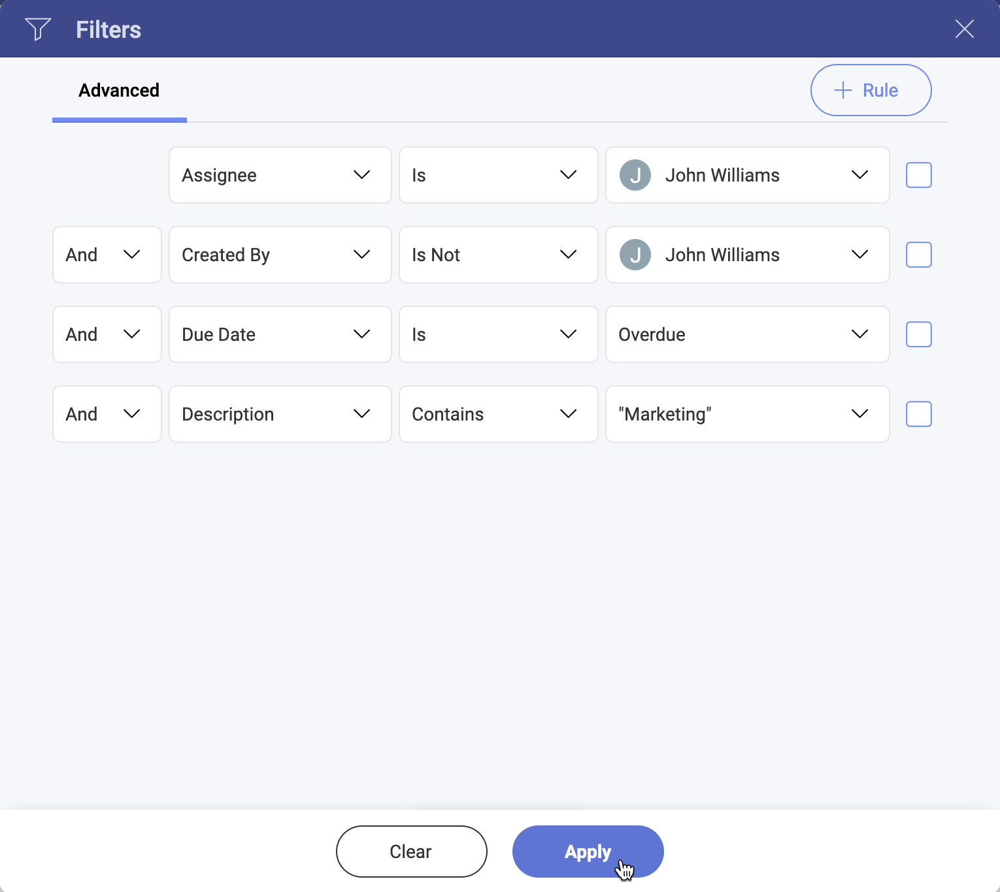

# タスク

プロジェクトを成功させるためには、タスク管理がその中心となります。プロジェクトのライフサイクル全体を通してタスクを管理するには、すべてを 1 か所にまとめる必要があります。プロジェクトを順調に進め、時間どおりに完了するには、期限、依存関係、優先度のすべてを設定することが不可欠です。   

ワークスペースとプロジェクト内で使用可能なタスク タブがあり、それらのワークスペースとプロジェクトの全員に割り当てられたすべてのタスクが一覧表示されます。[マイタスク] セクションで、自分に割り当てられている自分のタスクを表示できます。

Slingshots のすべてのプロジェクト管理機能の詳細については、短いチュートリアル ビデオをご覧ください。  

> [!Video https://www.youtube.com/embed/D1yqDISM5PM]

## タスクとは?

タスクは、実行する必要のある作業を視覚的に表したものです。タスク内で、関連するドキュメントを保存し、責任の所在を明確にし、会話をスレッド化して、すべてを 1 か所で透明化することができます。  

## タスクを作成する方法  

Slingshot でタスクを作成する方法は複数あります:  

- [+ タスク] ボタンを使用すると、リストの一番下にタスクが追加されます。
- セクションを使用している場合は、インラインの [+ タスク] を使用してセクションにタスクをすばやく追加できます。  
- タスクを別のタスクの真上または真下に挿入する場合は、そのタスク オーバーフロー メニューから挿入できます。

サブタスクは、タスク カード内または親タスクのオーバーフロー メニューから作成できます。

>[!IMPORTANT] **Slingshot ヒント**: Slingshot のチャット、ピン固定、またはダッシュボードから直接タスクを作成することもできます。Slingshot 内からより多くの生産性フローをチェックして、生産性を向上させます。

## タスク フィールド  

タスクは、チームやプロジェクトの生産性を高めるために非常に重要です。タスク カードには次のフィールドがあります:

1.	**タスクの名前**: タスクに明確なタイトルを設定します。  
2.	**割り当て先**: 1 人、複数、グループ、またはワークスペースをタスクに割り当てられます。  
3.	**開始日と期日**: 開始日と期日を使用して、期限に明確な期待値を設定します。  
4.	**状態**: [レビュー中]、[作業中]、[完了] などのタスクの状態を設定します。
5.	**添付**: クラウド プロバイダーから直接、またはドラッグアンドドロップを使用してドキュメントとファイルを追加します。  
6.	**URL**: 参照用にタスクに URL を添付します。  
7.	**優先度**: チームの優先度事項を設定して、チームがワークロードをより効果的に管理できるようにします。
8.	**サブタスク**: サブタスクを作成して、作業をより適切に分割します。
9.	**説明**: 何を行う必要があるかを担当者が理解できるように、タスクに関する詳細を追加します。
10.	**アクティビティ**: 状況に応じて、タスクに関するスレッド化された会話を行います。 
11.	**タスクの依存関係**: ユーザーのタスクに対する説明責任を持って、プロジェクトの成功への明確な道筋を設定します。 

## タスクの整理  

タスクをリストに整理して、さらにグループ化することができます。リスト内にセクションを追加して、リストをさらに分類することもできます。タスクは、リストとセクションの間のタスク カード内のドラッグアンドドロップまたはタスク カード内の変更ボタンでリストとセクションの間を移動できます。  

## タスクの表示タイプ

タスクのデフォルトの表示タイプはリストです。3 つの表示タイプ (リスト、カンバン、タイムライン) から選択して、利便性ユーティリティを最大化するために異なるレイアウトを利用できます。表示タイプを切り替えるには、[表示タイプ] ドロップダウン (タスク リストの右上) を使用します。  

各タスクの表示タイプごとに、フィルタリング、表示するタスク フィールドの選択、状態、優先度、割り当て先、またはセクションによるグループ化を行うことができます。   

### リスト

リストの表示タイプ内からプロジェクト管理とタスクの更新を高速化します。 

次の場合は、リストの表示タイプを使用することをお勧めします: 

- サブタスクとタスク階層を簡単に視覚化したい場合 

- 任意の基準でタスクを並べ替えまたはグループ化したい場合 

- セクションを使用してタスクを整理したい場合

### かんばん

状態ワークフローのさまざまな段階を表す列内のカードとしてタスクを表示します。列間でタスクをドラッグアンドドロップして、状態を変更できます。

次の場合は、カンバンの表示タイプを使用することをお勧めします:  

- 状態ワークフローに焦点を当て、それをグラフィカルに視覚化したい場合 

- タスクのリストの全体的な状態をすばやく確認したい場合

### タイムライン

タイムラインの表示タイプを使用して、プロジェクトの完了と依存関係の明確なパスを確認します。ズームインまたはズームアウトして、日、週、または月ごとにのタイムラインを表示します。

次の場合は、タイムラインの表示タイプを使用することをお勧めします: 

- 一度に複数のタスクの依存関係を視覚化したい場合 

- グラフィカルな方法で、時間軸でタスクをフレーム化したい場合 

#### タスクの依存関係

タイムラインの表示タイプを使用して、タスク間の依存関係を視覚化できます。

2 つ以上のタスクは、互いの完了に依存する場合があります。Slingshot は、タスクの依存関係について全員に情報を提供するのに役立ちます。

依存関係には次の 2 つのタイプがあります: 

- **[待機中]** - これは、別のタスクが終了する前にタスクを開始できないことを意味します。 

- **[ブロック]** - このタスクが完了する前に他のタスクを開始することはできません。 

## タスク フィルター  

フィルターを使用すると、特定の条件を満たす一連のタスクを表示できます。定義済みのフィルターがあるほかり、フィルターを保存して後で使用することもできます。 

### 定義済みのフィルター

Slingshot には、特定のタスクをすばやく見つけるのに非常に役立つ、いくつかの定義済みフィルターが含まれています。

編集または削除できないこれらの定義済みフィルターは次のとおりです:

- **[マイタスク]** – 現在のワークスペース内で自分に割り当てられた各タスク。 

- **[今週が期限]** – 現在の週に期限が設定された各タスク。 

- **[期限切れ]** – 期日が本日より前にで、期限切れになった各タスク。 

### フィルターの作成

フィルター エディターにアクセスするには、オーバーフローの隣にあるフィルター アイコン (画面右上) をクリック / タップします。 

フィルター エディターでは、ベーシック ルールまたはより高度なルールを作成できます。ほとんどの場合は、ベーシック ルールで十分です。フィルターでより複雑な条件を定義する必要がある場合は、高度なルールをお勧めします。 

タスクのフィルタリングを停止するには、フィルター アイコンをクリック / タップして、[フィルター] ダイアログを開きます。次に、下の [クリア] ボタンを選択して現在のフィルターを削除し、[適用] をクリックして変更を保存します。 

>[!IMPORTANT] **Slingshot ヒント**: 特定のタスクが見つからない場合は、縮小されたパネルを展開したり、既存のフィルターを削除したり、必要なタスクのプロパティを使用してフィルターを追加したりしてみてください。アクティブなフィルターがあるかどうかを識別しやすくするために、アイコンが変わります。

### フィルターの保存

フィルターを保存しておいて、後で再び使用したい場合があります。Slingshot を使用すると、特定のフィルターを保存し、必要に応じて後で編集できます。これは、既にフィルター処理されてるされている関連タスクのリストを手元に置いておくのにと非常に便利です。 

### 高度なフィルタリング

ほとんどの場合、基本的なフィルタリングで十分ですが、高度なルールを使用した追加のフィルタリング オプションもあります。  

高度なフィルターを作成する必要があるときは、できることは次のとおりです: 

- [～である]、[～ではない]、[～より前]、[～より後] などのフィールドにに基づいてく条件を適用します。 

- [および]、[または] などの演算子を使用します。 

例として、次のルールを作成して、タスクの期限が 2022 年 6 月 30 日以前であり、説明に「Marketing」という単語が含まれている、他のチーム メンバーによって作成されたすべての John Williams に割り当てられたのタスクで、彼自身ではない他のチーム メンバーによって作成されたタスクすべてを取得できます: タスクの期限が 2022 年 6 月 30 日以前であり、説明に「Marketing」という単語が含まれています。

