# タスク

プロジェクトを成功させるためには、タスク管理がその中心となります。プロジェクトのライフサイクル全体を通してタスクを管理するには、すべてを 1 か所にまとめる必要があります。プロジェクトを順調に進め、時間どおりに完了するには、期限、依存関係、優先度のすべてを設定することが不可欠です。   

ワークスペースとプロジェクト内で使用可能なタスク タブがあり、それらのワークスペースとプロジェクトの全員に割り当てられたすべてのタスクが一覧表示されます。**[マイ タスク]** セクションで、自分に割り当てられている自分のタスクを表示できます。

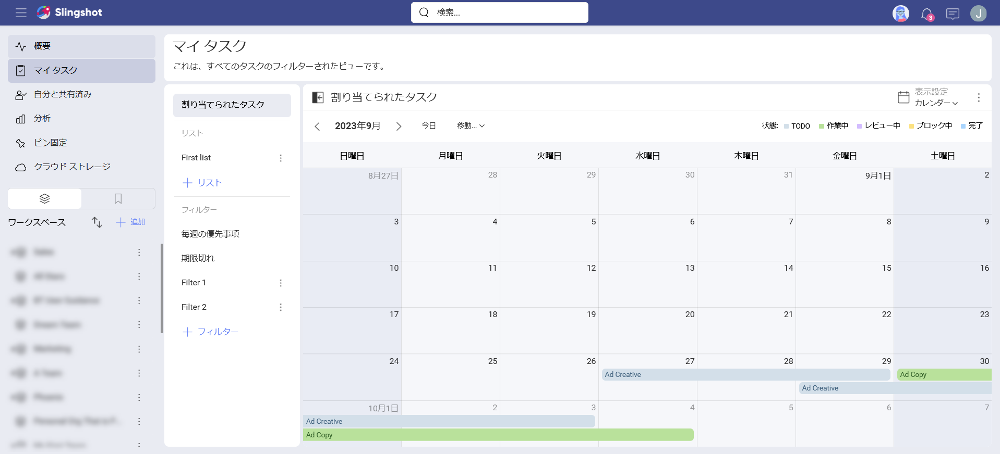

## タスクとは?

タスクは、実行する必要のある作業を視覚的に表したものです。タスク内で、関連するドキュメントを保存し、責任の所在を明確にし、会話をスレッド化して、すべてを 1 か所で透明化することができます。  

## タスクを作成する方法

Slingshot でタスクを作成する方法は複数あります:  

- **[+ タスク]** ボタンを使用すると、リストの一番下にタスクが追加されます。

- セクションを使用している場合は、インラインの **[+ タスク]** を使用してセクションにタスクをすばやく追加できます。

- タスクを別のタスクの真上または真下に挿入する場合は、そのタスク オーバーフロー メニューから挿入できます。

サブタスクは、タスク カード内または親タスクのオーバーフロー メニューから作成できます。

>[!IMPORTANT] **Slingshot ヒント**: Slingshot のチャット、ピン固定、またはダッシュボードから直接タスクを作成することもできます。Slingshot 内からより多くの生産性フローをチェックして、生産性を向上させます。

## タスク フィールド  

タスクは、チームやプロジェクトの生産性を高めるために非常に重要です。[カスタム フィールド](custom-fields.md)が追加されていないタスク カードには、次のフィールドがあります:

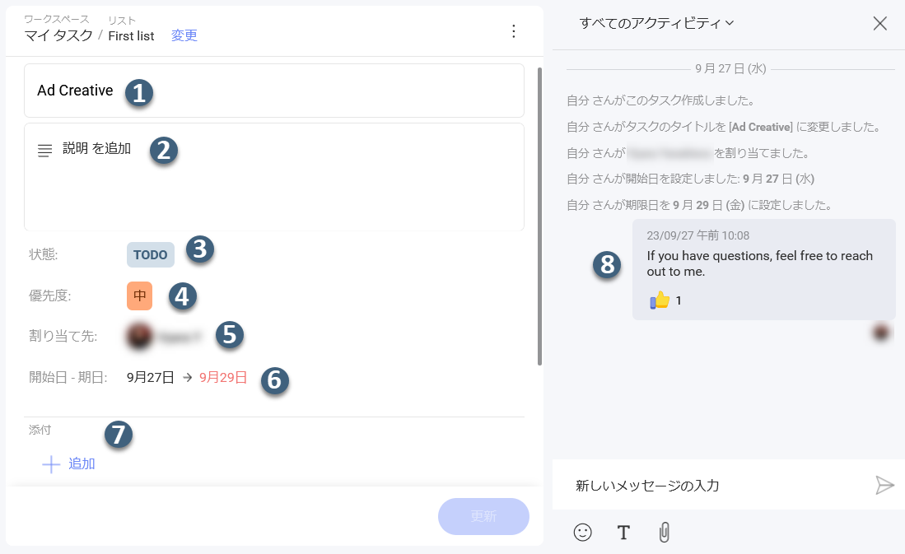

1.	**タスクの名前**: タスクに明確なタイトルを設定します。

2.  **説明**: 何を行う必要があるかを担当者が理解できるように、タスクに関する詳細を追加します。

3.	**状態**: [レビュー中]、[作業中]、[完了] などのタスクの状態を設定します。

4.	**優先度**: チームの優先度事項を設定して、チームがワークロードをより効果的に管理できるようにします。

5.	**割り当て先**: 1 人、複数、グループ、またはワークスペースをタスクに割り当てられます。

6.	**開始日と期日**: 開始日と期日を使用して、期限に明確な期待値を設定します。

7.	**添付**: タスクにドキュメントとファイル (URL、ダッシュボード、データ ソースなど) を追加します。

8.	**アクティビティ**: 状況に応じて、タスクに関するスレッド化された会話を行います。

9. **変換先**: タスクの[タイプ](./task-types.md)を変更します。

10. **生産性の向上**: [生産性の向上](productivity-boost.md)アイコンから直接タスクをピン固定したり、チャットやディスカッションを開始したりできます。

タスクにサブタスクまたは依存関係を追加する場合は、タスク カードを下にスクロールします。

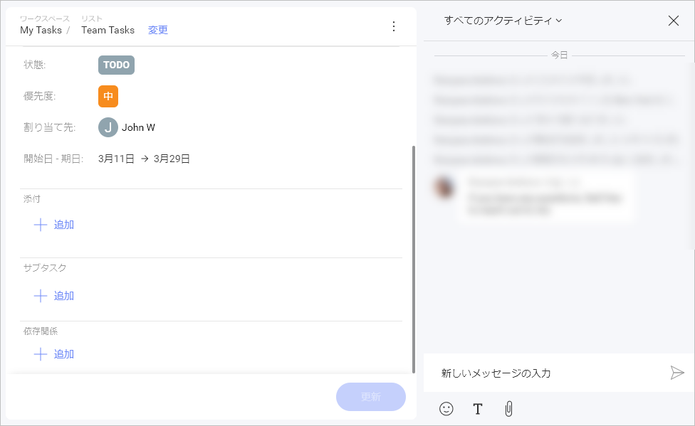

### デフォルトのタスク フィールド

タスクをより適切に整理するには、デフォルトのタスク フィールドを使用できます。デフォルトのタスク フィールドのリストを開くには、タスク リストの右上隅にある**プラス** ボタンをクリックまたはタップしてください。

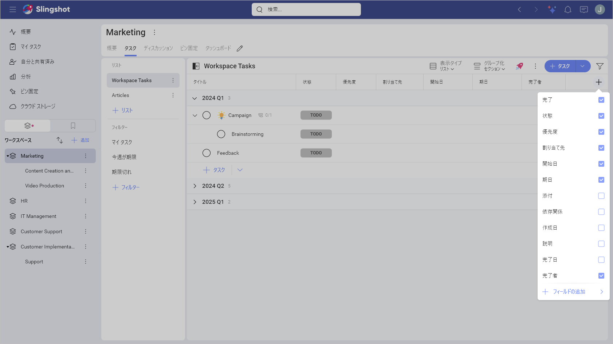

ここでは、次のフィールドから選択できます。**完了、状態、優先度、担当者、開始日、期限、添付、依存関係、作成日、説明、完了日**、および**完了者**。

### カスタム タスク フィールド

カスタムフィールドを使用して、タスクを内部の業務プロセスにより適合させることができます。カスタム フィールドの詳細については、[こちら](custom-fields.md)をクリックまたはタップしてください。

### タスクの説明

タスクの説明セクションでは、さまざまなテキスト書式設定ツールを使用して、タスクに関する詳細を追加できます。URL や絵文字を追加することもできます。

  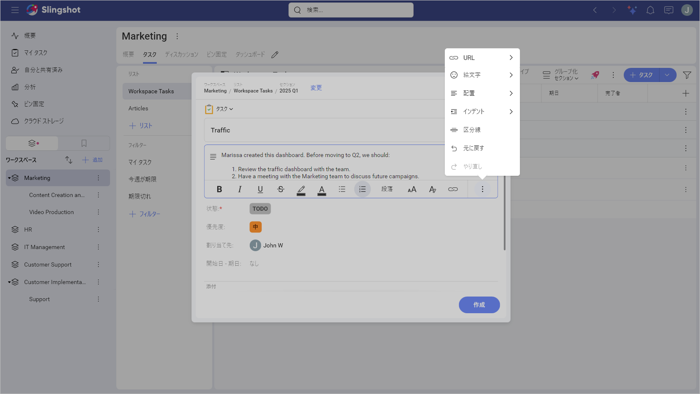

現在、これらのオプションは macOS Monterey でのみ使用できることに注意してください。

## タスクの複製

新しいタスクのセットを作成する代わりに、以下の手順でタスクを複製することで、時間を節約し、生産性を高めることができます。

親タスクを複製する場合は、それに関連付けられているすべてのサブタスクを複製できます。

1.	**[マイ タスク]** を開きます。

2.	オーバーフロー メニューをクリックします。 

3.	**[複製]** を選択します。

 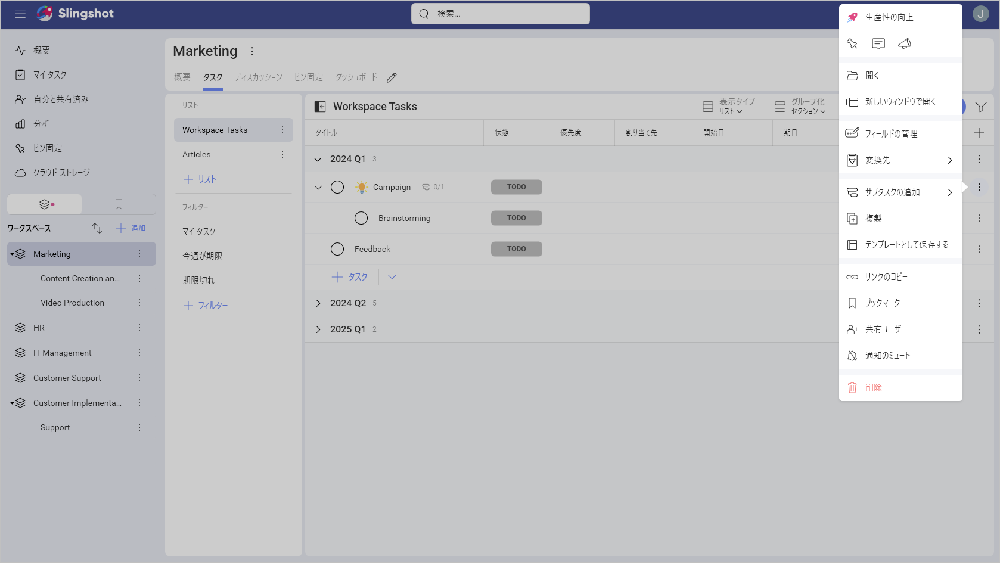

4.	ダイアログが開き、タスクを複製するときに保持する内容を選択できます。タスクのタイトルを変更することもできます。同じ割り当て先を維持することにした場合は、タスクの作成後に割り当て先に通知するオプションが表示されます。

 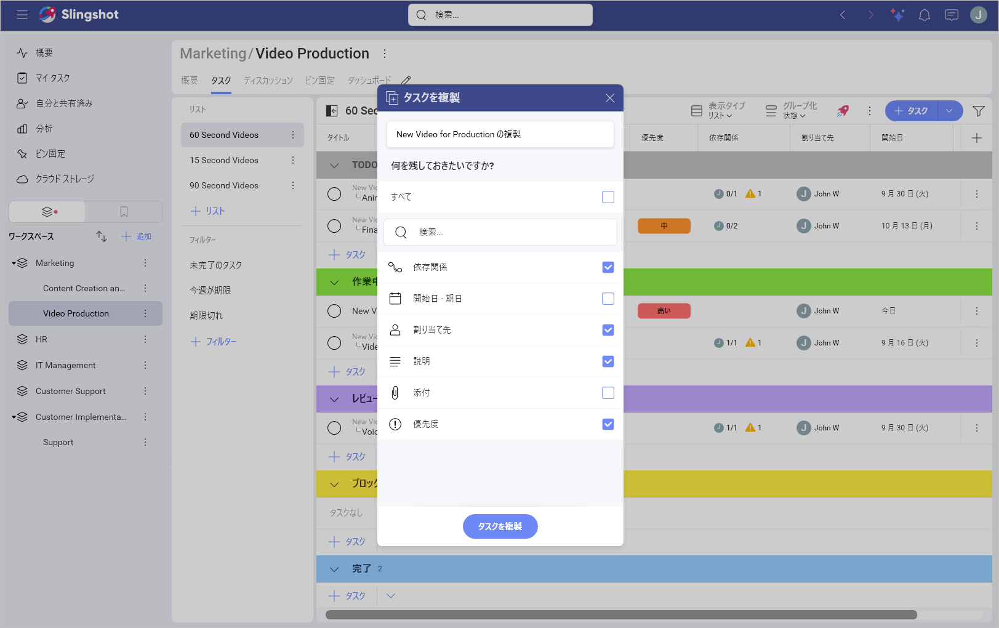

5.	設定を保存すると、カード フィールドが表示され変更できます。

 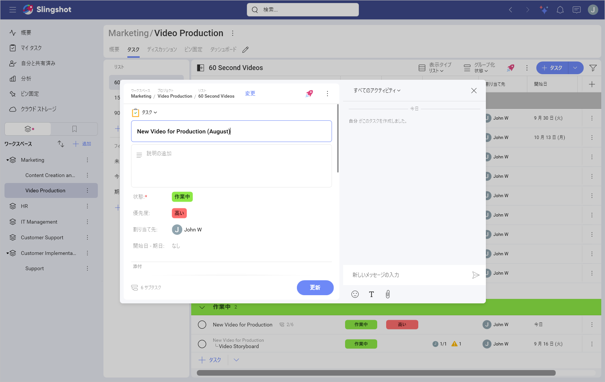

6.	準備ができたら、**[更新]** をクリックします。タスクは、**[マイ タスク]** セクションのサブタスクにあります。

 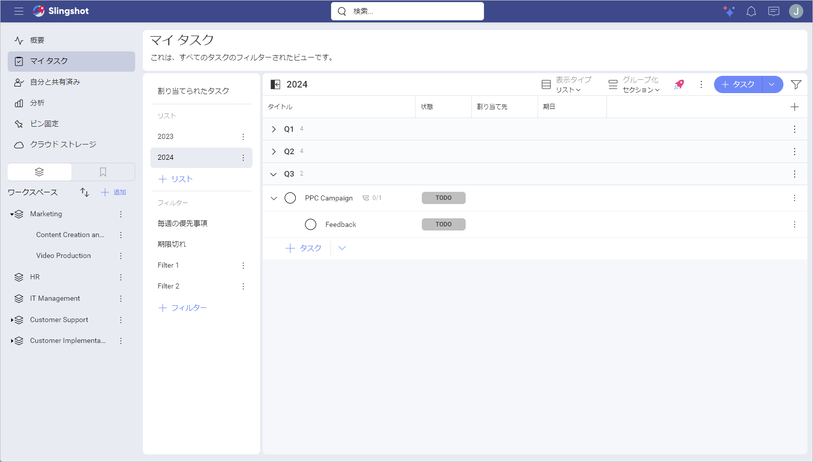

## タスクの整理  

タスクをリストに整理して、さらにグループ化することができます。リスト内にセクションを追加して、リストをさらに分類することもできます。タスクは、リストとセクションの間のタスク カード内のドラッグアンドドロップまたはタスク カード内の変更ボタンでリストとセクションの間を移動できます。  

## タスクの表示タイプ

4 つの表示タイプ (カレンダー、リスト、カンバン、タイムライン) から選択して、利便性ユーティリティを最大化するために異なるレイアウトを利用できます。**[表示タイプ]** ドロップダウン メニューを使用してビューを切り替えます。

各タスク ビュー内で、チームの目標に最も適した方法でタスクをフィルタリングできます。

### カレンダー

チームのスケジュールとタスクの進捗状況をよりよく把握するために、カレンダー上でタスクを表示します。

次の場合は、カレンダー ビューを使用します:

- 簡単なドラッグ アンド ドロップで**開始日**と**期日**を変更したい場合。

- ワンクリックでタスクの単一の日付を選択したい場合。

- スケジュールされていないタスクをざっと確認したい場合。(スケジュールされていないタスクを表示するには、[表示設定] の横にある 3 点メニューをクリックまたはタップし、**[予定外の項目を表示]** を選択します。)

### リスト

リストの表示タイプ内からプロジェクト管理とタスクの更新を高速化します。 

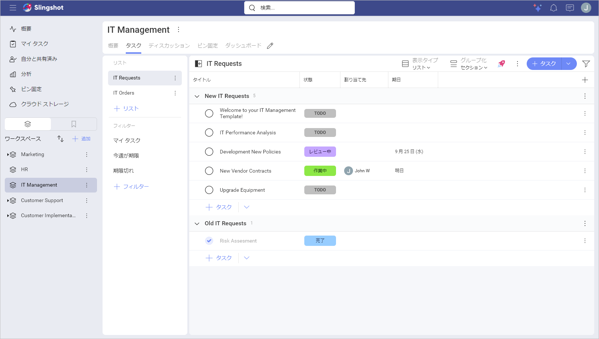

次の場合は、リストの表示タイプを使用することをお勧めします: 

- サブタスクとタスク階層を簡単に視覚化したい場合 

- 任意の基準でタスクを並べ替えまたはグループ化したい場合 

- セクションを使用してタスクを整理したい場合

### かんばん

状態ワークフローのさまざまな段階を表す列内のカードとしてタスクを表示します。列間でタスクをドラッグアンドドロップして、状態を変更できます。

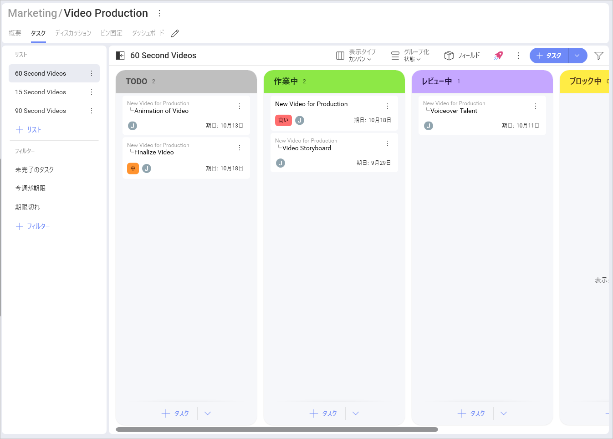

次の場合は、カンバンの表示タイプを使用することをお勧めします:  

- 状態ワークフローに焦点を当て、それをグラフィカルに視覚化したい場合 

- タスクのリストの全体的な状態をすばやく確認したい場合

### タイムライン

タイムラインの表示タイプを使用して、プロジェクトの完了と依存関係の明確なパスを確認します。ズームインまたはズームアウトして、日、週、または月ごとにのタイムラインを表示します。

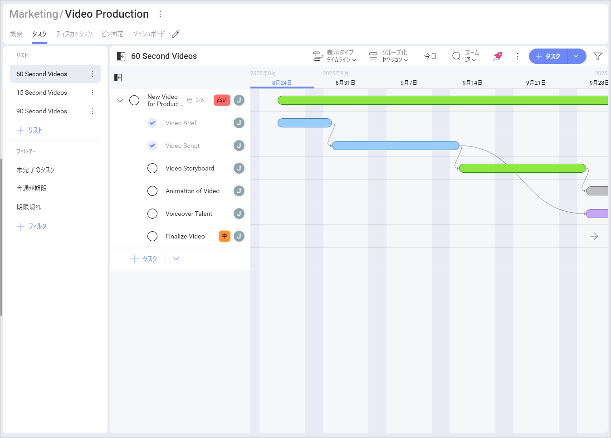

次の場合は、タイムラインの表示タイプを使用することをお勧めします: 

- 一度に複数のタスクの依存関係を視覚化したい場合

- グラフィカルな方法で、時間軸でタスクをフレーム化したい場合 

### デフォルトのタスク表示

ワークスペースまたはプロジェクトのチーム メンバーに、特定の方法で整理されたタスク リストを初期表示させたい場合は、次のことができます:

1. **生産性の向上**の横にあるオーバーフロー メニューを開きます。

2. デフォルトのビューを選択するには、**[デフォルトの表示として保存]** をクリックまたはタップします。

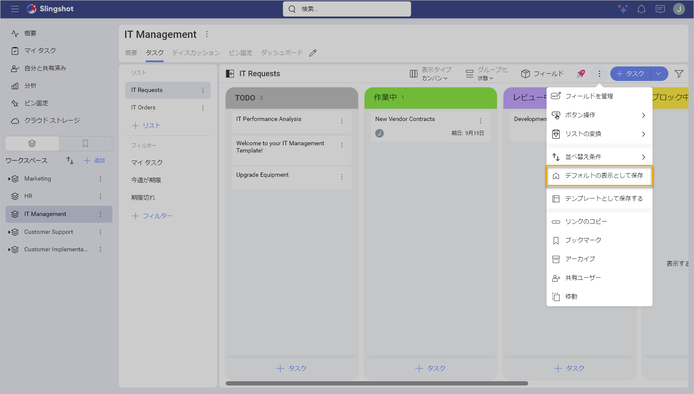

**[デフォルトの表示にリセット]** を選択すると、いつでも設定を元の状態にリセットできます。

>[!NOTE] デフォルトのタスク表示を設定できるのは、ワークスペースまたはプロジェクトの**管理者**だけです。

### タスクの依存関係

タイムラインの表示タイプを使用して、タスク間の依存関係を視覚化できます。

2 つ以上のタスクは、互いの完了に依存する場合があります。Slingshot は、タスクの依存関係について全員に情報を提供するのに役立ちます。

依存関係には次の 2 つのタイプがあります: 

- **[待機中]** - これは、別のタスクが終了する前にタスクを開始できないことを意味します。 

- **[ブロック]** - このタスクが完了する前に他のタスクを開始することはできません。 

## タスク フィルター  

フィルターを使用すると、特定の条件を満たす一連のタスクを表示できます。定義済みのフィルターがあるほかり、フィルターを保存して後で使用することもできます。 

### 定義済みのフィルター

Slingshot には、特定のタスクをすばやく見つけるのに非常に役立つ、いくつかの定義済みフィルターが含まれています。

編集または削除できないこれらの定義済みフィルターは次のとおりです:

- **[マイ タスク]** – 現在のワークスペース内で自分に割り当てられた各タスク。 

- **[今週が期限]** – 現在の週に期限が設定された各タスク。 

- **[期限切れ]** – 期日が本日より前にで、期限切れになった各タスク。 

### フィルターの作成

新しいフィルターを作成するには、次の手順で実行できます: 

1. **[フィルター]** の下にある **[+ フィルター]** をクリックまたはタップします。

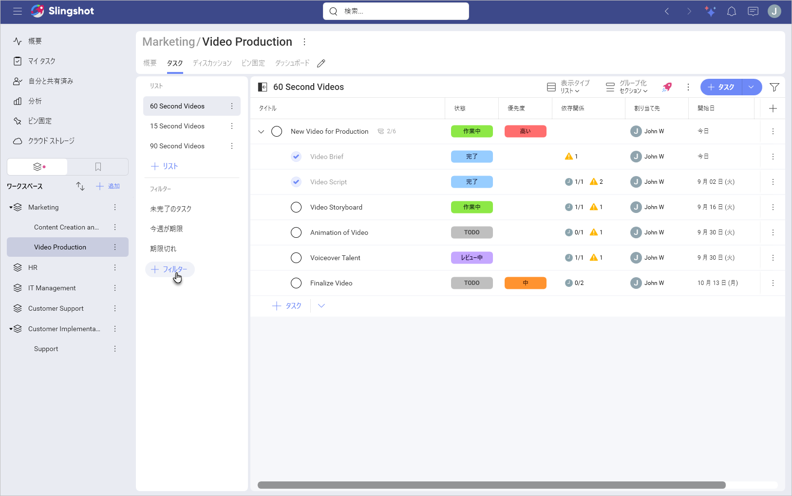

2. フィルターの名前を追加し、フィルターに含めるものを選択します。

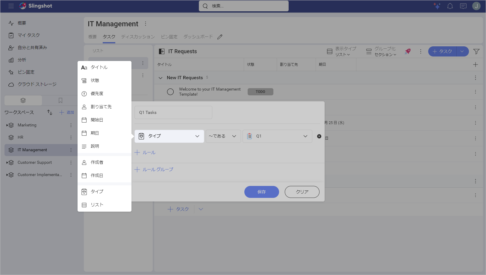

3. **[保存]** をクリックまたはタップします。

4. フィルター リストに新しいフィルターが表示されます。

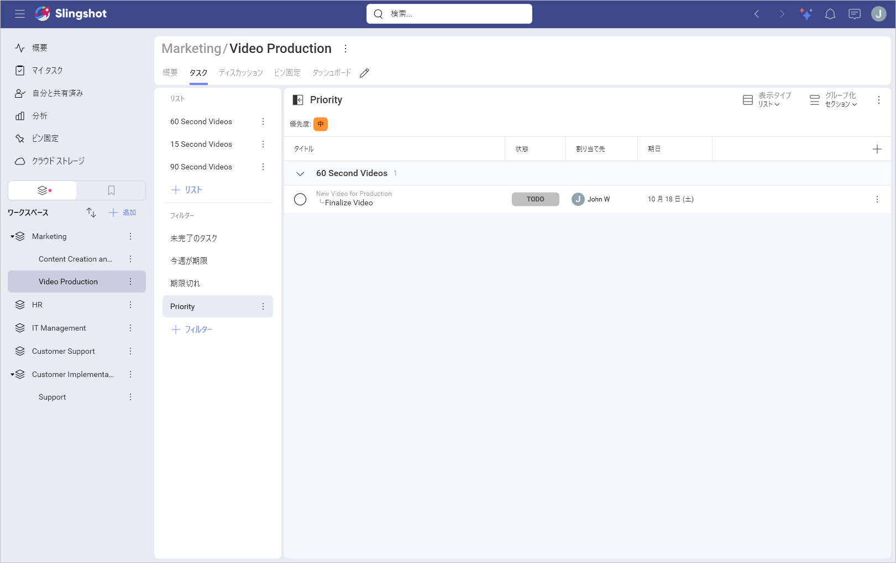

タスクのフィルタリング方法を変更したい場合は、フィルターをさまざまな方法で調整できます。たとえば、タスク タイプ (Q1 以外のタスク) でフィルタリングしたい場合は、次の操作を実行できます。

1. 選択したフィルターの横にあるオーバーフロー メニューをクリックまたはタップします。

2. **[編集]** を選択します。

3. タイプを Q1 **[～ではない]** に変更します。

4. **[保存]** を選択して変更を保存します。 

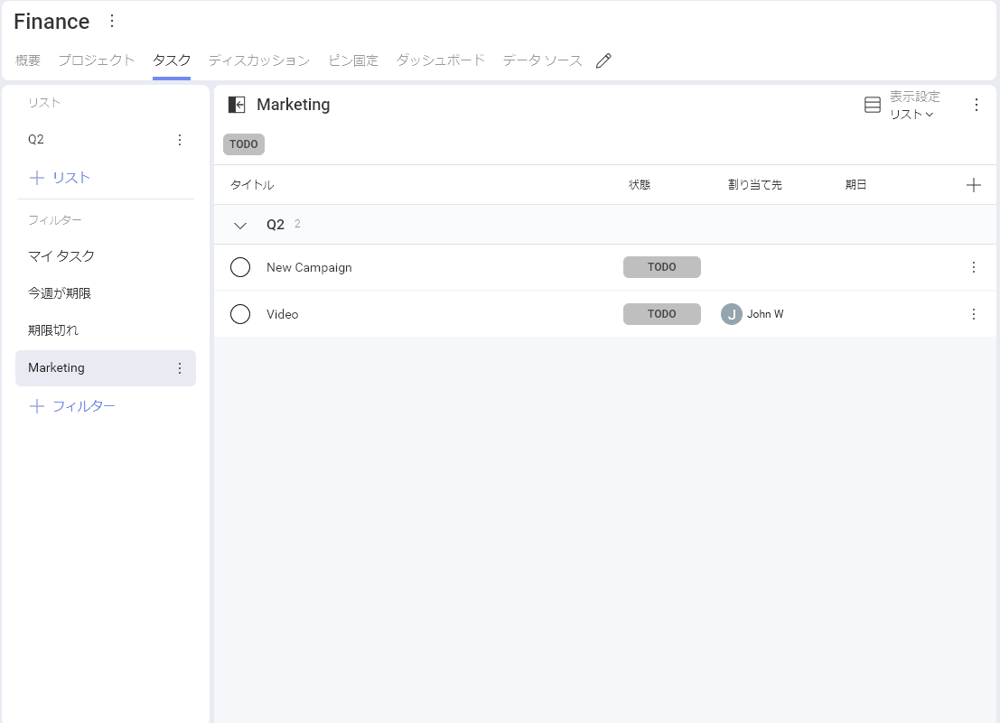

>[!IMPORTANT] **Slingshot ヒント**: 特定のタスクが見つからない場合は、縮小されたパネルを展開したり、既存のフィルターを削除したり、必要なタスクのプロパティを使用してフィルターを追加したりしてみてください。アクティブなフィルターがあるかどうかを識別しやすくするために、アイコンが変わります。

**[+ ルール]** ボタンからフィルターにルールを追加することもできます。

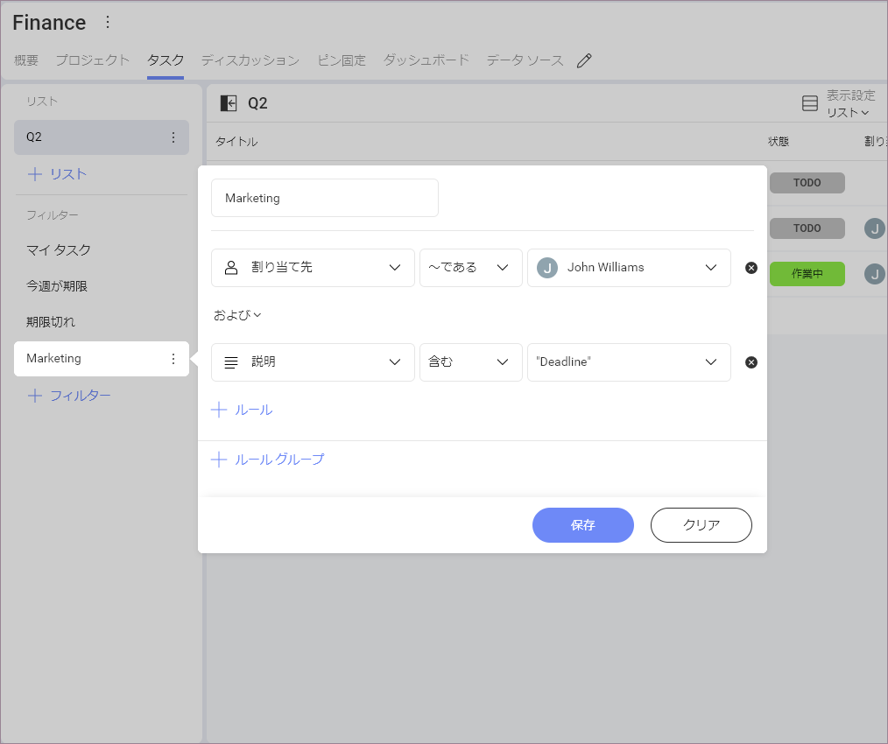

