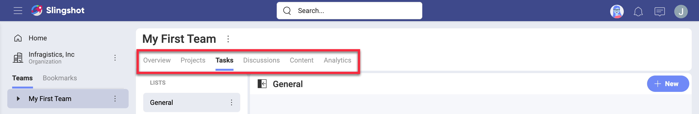
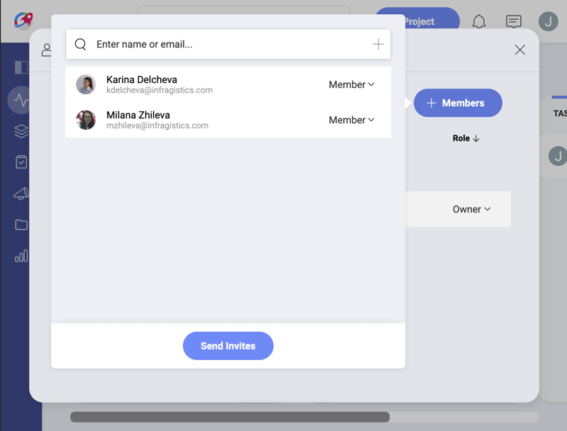
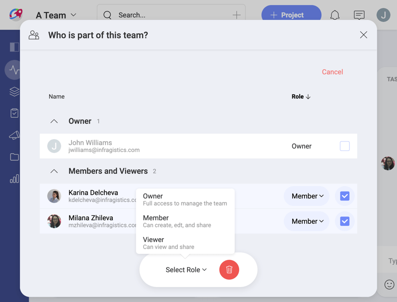
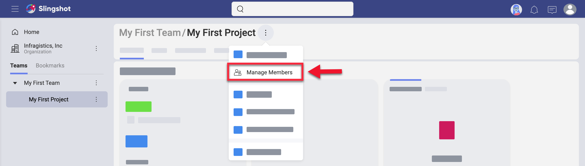
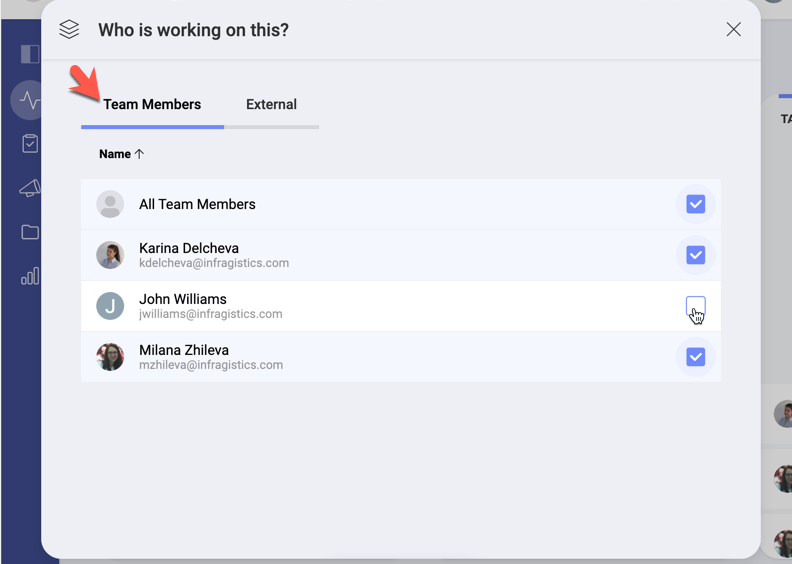
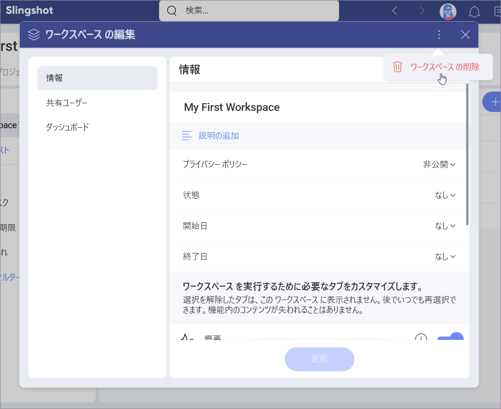
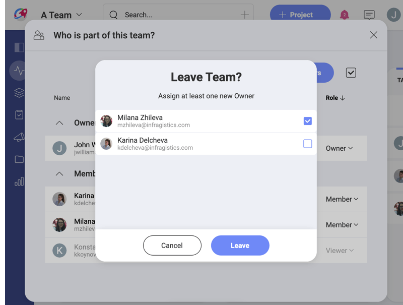

# Starting with Teams

Welcome!  
Read on to get answers to most of your questions about teams.

## Organization vs Team vs Project

In Slingshot, people can join an organization, one or more teams, and also one or more projects.  
The purpose of having an organization team is for company leaders to have the ability to communicate key goals, metrics, strategies, and important announcements throughout their organization.   
The organization team is named after your organization (e.g. your company's name). Members need to log in with their organization’s email to be associated with the organization team.

The Organization team has only three available tabs on the right: *Discussions, Content*, and *Dashboards*.

Teams can be associated with the organization team or not. They can include members from within and out of the main Organization team. Team members share not only *Content, Dashboards*, and *Discussions*, but also *Projects* and *Tasks*.

Projects live inside of a team, but are not limited to its members. You can invite people from other teams to every project. A project contains its own *Overview, Tasks, Discussions, Content,* and *Dashboards*. You can also assign tasks within a project to people, who are not part of the project or the team.

## How can I access my teams?

You can access your teams on the very left of the screen as shown below.

By scrolling down you are able to navigate all your teams and their projects. If you bookmarked a team to keep it at hand, you can select bookmarks here to find that team faster. This also goes for the projects. Under each project's name you will find the team it is part of (see below).

To **navigate to any team**, just click/tap over it.

## How can I discover and join other teams?

To become a team member you first need to discover your new team. Select the _Join or Create a Team_ button at the bottom of your teams' list to open a dialog with the available teams to join:

In this dialog, you will find **only public teams, which are part of your Organization**. You can join these teams by yourself, receiving the role of a Member.

To become part of **teams, which are outside of your organization**, you need to be invited by their Owner via email.

## How can I create a new team?

Every user in Slingshot can create teams.  
**Access the team creation menu** by selecting the *Join or Create a Team button* (see screenshot below) > *+ Create Team*. In this dialog, configure the following:

* ***Team Name*** - giving your team a descriptive and meaningful name is always worth the effort.
* *(Optional)* ***Description*** - descriptions are helpful and nice to have, but absolutely optional in Slingshot.
* ***Organization*** - choose whether your team will be part of the main Organization or will exist as your *Personal* team. How to choose and what is the difference?  
    - **Teams, part of the main organization**, follow the internal rules and principles of the organization. These teams can be [discovered and joined](#how-can-i-discover-and-join-other-teams) by every member of the main Organization.

    - **Personal teams** give you more freedom and less discoverability. Others cannot find your team in the _Join list_ so they can join only if they are invited. Only you and other owners of this team can manage it and delete it.
* **Privacy** - this setting is only available for teams, part of the main organization.
    - **Public** teams can be discovered and joined in the _Join or Create a Team screen_.
    - **Private** teams are undiscoverable and can only be joined through an invitation received via email.

>[!NOTE]
>Be aware that your team can be deleted by an Owner of the main organization anytime (even if you are an Owner too).

Click *Create* and proceed to **inviting team members** by adding their emails to the list:

>[!NOTE]
>When adding members, whose emails are not auto-completed by Slingshot, type the whole email and press Enter to add it to the list of users you want to invite.

After selecting **Send Invites** button your new team is created. You will find it in the [Teams' list](#how-can-i-access-my-teams) shown above.

## How can I get visibility over a team?

Every team has its central place where the most important information is visible at first look. This is the Teams **Overview**.  
Upon accessing a team, you will have its *Overview* opened.  

You can find three widgets in every team's overview: **_Details_**, ***Your Mentions*** and ***Task Status*/*Activity*** the following elements in every team's overview:

1. **Settings** of the team - select the gear icon to view or [change](#how-can-i-change-the-teams-privacy-name-or-description) the team's name, description, organization, and privacy settings. You can also [delete](#deleting-vs-leaving-a-team) the team.
2. **Team members** - click on the profile images (or initial) icons on the left board to view or [manage members](#how-can-i-manage-team-members).
3. **Content** - click the overflow menu to pin content, weblinks and dashboards that are essential for your team's work. To do this, select the overflow menu on the right of *CONTENT*. Use the team's *Content* tab on the left to store and organize more content.

    >[!NOTE] If your teammates don't have the file (folder) in their cloud storage or shared cloud storage, they **will not be able to access the content** pinned in the Team *Overview*. In this case, pin the file (folder) in *Content* (in the left tab) to share it with them.

4. **Mentions** - when other team members mention you, a team, or a project of yours (by using the _@ sign_) in a *Topic* in the *Teams' Discussions* or in the _Activity_ chat (see in *number 6* below), you will see a notification on this board. Upon clicking on it, you will be navigated to where the message is located.
5. **Task Status** - here you will find a list of all members. Under each name, you will see the number of all current tasks for each user. The circle on the right uses colors to show what part of all tasks  is complete (blue), not started (grey), in progress (green), in review (purple), blocked (yellow).
6. **Activity** - here you will find a log of all recent activity in your team - changes in settings, team members, tasks, etc.
7. **Overflow** menu - use this menu to add your team's overview to *Bookmarks* or copy a link to it to your clipboard.

## How can I manage team members?

Team members are an essential part of the concept for a team. As an owner of a team, you may want to have more control over the members and their permissions.

**Only team owners can**:
- invite new members;
- remove members, and
- change members' roles.

**Access the team members' dialog** by selecting the team's [Overview](#how-can-i-get-visibility-over-a-team) > Details widget (on the left) >  profile images icons (above _Content_).

To **invite new members** click on the *+ Members* blue button.

In the dialog above, you will find a list of all team members and their roles. You can **change each member's role or remove the member** from the team by clicking on the role's dropdown.

You can change the role of or remove **more than one member at the same time**. To do this:

1. Select the checked box on the right of the *+Members* blue button.
2. Checkboxes on the right of members' roles appear:

3. Select the checkboxes of members you want to remove/change the roles of.
4. Choose the trash icon or a role from the menu at the bottom center of the screen and **apply for all simultaneously**.

## Can I work with people from outside of a team?

Sometimes you may need to work on a particular task or project with people outside of your team. In this case, it doesn't make sense to add them as members to your team.

You can **assign tasks** to members outside of your team in the team's *Tasks* tab on the left.

Users will receive a notification about the task they were assigned. For them the task will appear in *Home > Tasks*.  

All members of a team can be members for its projects and you can also **add external members to projects**.  

To do this:

1. Navigate to your **team** > **Projects** > **Selected Project** > Project **Overview** (in the tab bar on the left).
2. Click/tap on the **profile images icons** (left widget in *Overview*) to open _Who is working on this?_ dialog:

3. Choose **External** > **+ Members** blue button to add members who are not part of the team to this project.

You can also go directly to a project's *Tasks* tab and **assign a task to an external member**.

>[!NOTE] **External members** you can work with are any other Slingshot users. They don't need to be part of the same main Organization as you.

External members, who are added to a project, will receive **notifications** about the project and its state. They will also be notified when the project is mentioned (by using the *@ sign* + the project's name).

Every team member can **stop receiving (unfollow) notifications** about a project and its mentions. To do this, navigate to the *Who is working on this?* dialog > *Team members* and unmark the checkbox next to your name, as shown below:

The Owner of a team can also exclude team members from a project.  
After unfollowing a project, you will receive only **notifications about tasks** within this project assigned to you.    

## How can I change the team's privacy, name or description?

If you are **the Owner of a team** you can change your team's settings. To do this, go to the team's [Overview](#how-can-i-get-visibility-over-a-team) and select the gear icon:

Here you can change your team's name, description and privacy.

>[!NOTE] Not only Owners are allowed to change a team's settings. Your team's name and description can be changed by users with Members' permissions provided that your team is part of the main Organization and the user is an Owner of the main Organization. Your team can even be deleted by them. This is particularly useful when the Owner of a team happen to be an employee, who left the company but didn't assign new owners to the teams they created. 

## Why are teams public by default?

A newly created team is public by default, meaning that any member of the main organization can search and join the team. Trust and transparency are key elements for effective collaboration, and also help with ownership and accountability.

That being said, sometimes you might need to have a private team, leaving your team out of the search results. In this case, users can only join the team by getting invitations from existing members. This is helpful for teams that handle sensitive information, in those cases the organization wants to restrict access.

## Deleting vs leaving a team

To make a team disappear from your Slingshot space you can either delete or leave it.

Only the Owner can **delete a team**. As an exception, a Member can also delete a team if:

- the team is part of the main Organization;
- this Member is an Owner in the Main Organization.

To delete a team, go to its [settings](#how-can-i-change-the-teams-privacy-name-or-description) and select the overflow button:

Deleting a team removes it and all its contents for all its members.

To remove a team and its content only for you, use the **leave** option. You can do this by going to the team's [members list](#how-can-i-manage-team-members), click/tap your role and select *Leave* at the bottom. If you are **the only Owner of a team** you cannot leave it without assigning another member as an Owner.

All the members of the team who are suitable for an Owner’s role appear in a list in the *Leave Team?* dialog (see above).
