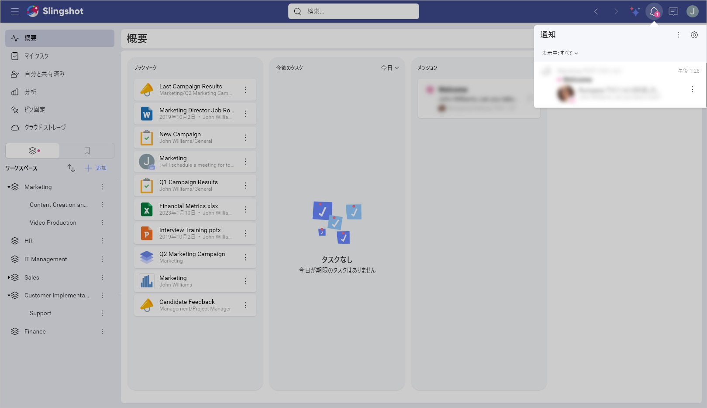

# ユーザー アカウントと設定の詳細

ようこそ! このトピックはユーザー アカウントと設定について説明します。

## ユーザー アカウントにアクセスする方法

右上隅に移動して、プロフィール写真を選択します。

ここでは、サインアウトしたり、Slingshot チームに貴重なフィードバックを提供したり、一般設定とプロファイル情報にアクセスしたりできます。

## どのようなサブスクリプション プランがありますか?

利用可能なプランについては、[価格](https://www.slingshotapp.io/ja/pricing)をご覧ください。

## Slingshot ユーザーア カウントはどの程度安全ですか?

利用者は、Slingshot ユーザーとして、アップロードするファイル、作成するメッセージ、作成するダッシュボードなど、さまざまな種類のコンテンツを所有しています。これらはすべて Slingshot アカウントの一部であり、ユーザーとして関連付けられています。とはいえ、利用者は自分自身が所有するコンテンツを完全に制御することができます。
Slingshot 内のセキュリティとデータ プライバシーの詳細については、[セキュリティとプライバシー](security.md)を参照してください。

## Slingshot ユーザー アカウントは Microsoft または Google アカウントとどのように関連していますか?

Slingshot は、2 要素認証を含む、データ アクセスと管理のための Microsoft と Google のセキュリティに基づいて構築されています。
さらに、Slingshot は GDPR に準拠しており、必要に応じて自身のデータをエクスポートおよび削除できます。
データ プライバシーの詳細については、[セキュリティとプライバシー](security.md)を参照してください。

## ユーザー アカウントを削除できますか?

はい。一般データ保護規則 (GDPR) を含むグローバルなデータ プライバシー法を満たすために、Slingshot はユーザーにすべてのプロファイル情報を削除できる機能を提供します。
詳細については、[セキュリティとプライバシー](security.md)を参照してください。

## 削除後、ユーザー アカウントを再度アクティブ化できますか?

はい。詳細については、[セキュリティとプライバシー](security.md)を参照してください。

## ユーザー アカウントのプロファイル情報をエクスポートできますか?

はい。ユーザー アカウントは、一連の資格情報、プロファイル情報、設定、およびユーザーが所有するコンテンツを含む、ユーザーの仮想表現です。
詳細については、[セキュリティとプライバシー](security.md)を参照してください。

## Slingshot でプロファイル情報を入力する必要があるのはなぜですか?

Slingshot のプロファイル情報には、名前や役職など、コラボレーション スペースでユーザーを識別できるようにする属性が含まれています。この情報は Slingshot と共同作業者にとって重要であるため、Emily (AI アシスタント) はプロファイル情報が 100% 完了するように通知してくれます。 

プロフィール情報にアクセスするには:
プロフィール写真を選択 > **[設定]** > **[プロフィール情報]**

ここでは、自分自身に関する次の情報を入力する必要があります:

* **名前** - これは Slingshot での表示名であり、他のユーザーが認識して **@ メンションする**ための名前です。[名前] をクリック / タップすることで名前を変更できます。準備ができたら **[名前の変更]** を選択します。
* **役職** - これは、役職 (たとえば、会計士) または組織内の役割 (たとえば、CFO) です。役職を追加するには、[役職] をクリック / タップします。準備ができたら **[変更]** を選択します。 
* **写真** - 写真は、Slingshot の共同編集者があなたが誰であるかを知るのに役立ちます。プロフィール写真は常に、64x64 ピクセルの正方形の画像に、縮小または拡大されます。コンピューターからファイルをアップロードしたり、デバイスのカメラで写真を撮ったり、デバイスのストレージから選択したりできます。
* **業種** - 組織に関する情報です。右側のドロップダウンから選択するか、業種を入力して **[OK]** をクリック / タップします。 
* **部署** - 所属する組織部署です。右側のドロップダウンから選択するか、部署を入力して **[OK]** をクリック / タップします。

終了したら、ダイアログを閉じます。変更が保存されます。  

## 言語を変更する方法

Slingshot は、次のようなさまざまなプラットフォームの言語と地域の設定を検出して適用します:
- Web ブラウザー
- Windows
- モバイル デバイス (Android と iOS)

利用可能な言語は、英語、ドイツ語、スペイン語、フランス語、イタリア語、日本語、韓国語、マレー語、オランダ語、ポルトガル語、ロシア語、中国語 (繁体および簡体) です。

## 通知言語を変更する方法

通知に使用できる 13 の言語から選択できます。 

通知設定を変更するには、アカウント設定に移動し、**[通知]** タブを選択します。 
または、通知パネルを開き、右上隅のオーバーフロー メニューから **[設定]** を選択することもできます (下のスクリーンショットを参照)。

## ダッシュボードの設定とは何ですか?
ダッシュボードは、Slingshot の **[分析]** スペースの一部です。
ダッシュボードの詳細については、[ダッシュボードの概要](analytics/dashboards/overview.md)をご覧ください。
ツールチップと十字線の設定の詳細については、[ダッシュボードの操作](analytics/dashboards/dashboards-interactions.md)を参照してください。

## データ ソースの資格情報とは何ですか?
[分析] では、初めてデータ ソースに接続するときに、資格情報 (ユーザー名、パスワード、およびドメイン) がこのデータ ソース資格情報に保存されます。これにより、将来的に資格情報を再利用できます。
データ ソースの詳細については、[データ ソースの概要](analytics/datasources/overview.md)を参照してください。 
