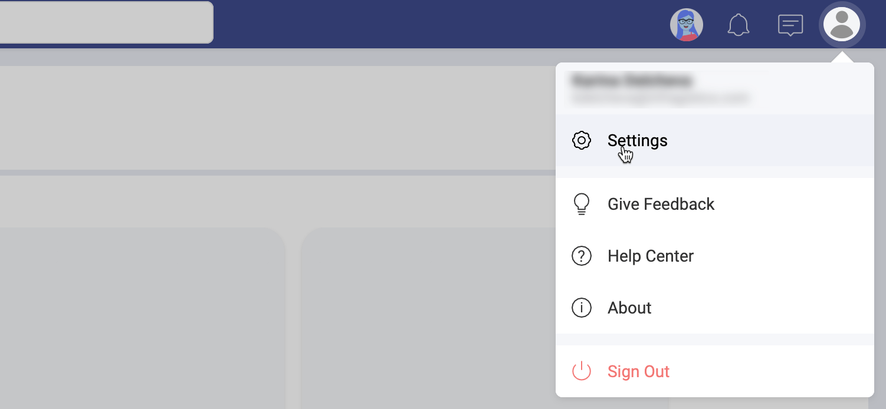
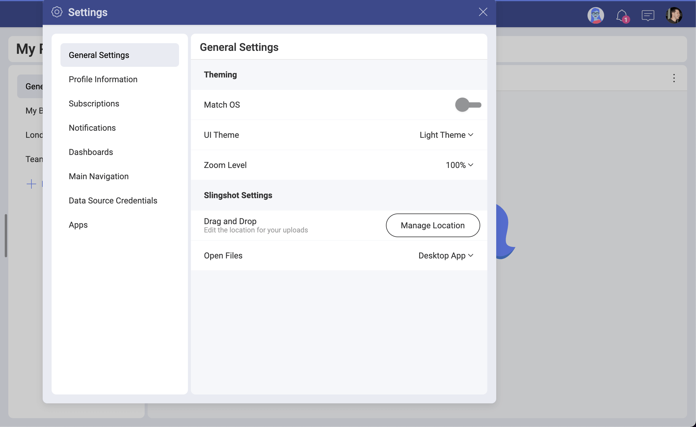

# ユーザー アカウントと設定

ユーザー アカウントを使用すると、アプリケーションまたはデバイスにサインインしてユーザーを認識できます。ユーザー アカウントは、任意のデジタル テクノロジー用に作成された仮想 ID として説明することもできます。
ユーザー アカウントには通常、ユーザー名とパスワードが含まれています。ただし、それだけではありません。特定のユーザーに関連付けられた設定とプロファイル情報のコレクションも保存されます。

ユーザーごとにデジタル エクスペリエンスを調整するのは一般的に行われています。さまざまな権限と機能を持つ 1 つ以上のタイプのユーザー (管理者、標準ユーザー、ゲストなど) を持つことができます。もう 1 つのよく使われる手法は、同じユーザー アカウントに異なるロールを割り当て、コンテキストに応じて異なる特権と機能を切り替えることです。

## Slingshot のユーザー アカウントとは?

これは、一連の資格情報、プロファイル情報、設定、およびユーザーが所有するコンテンツを含む、ユーザーの仮想表現です。

利用者は、Slingshot ユーザーとして、アップロードするファイル、作成するメッセージ、作成するダッシュボードなど、さまざまな種類のコンテンツを所有しています。これらはすべて Slingshot アカウントの一部であり、ユーザーとして利用者に関連付けられています。利用者は自分自身が所有するコンテンツを完全に制御することができます。
Slingshot 内のセキュリティとデータ プライバシーの詳細については、[セキュリティとプライバシ](security.md)ーを参照してください。

## プロフィール情報と設定の積極的な活用

アプリケーションの動作と全体的なエクスペリエンスは、プロファイル情報と設定を調整することで大幅に変更できます。ニーズに合わせてエクスペリエンスをカスタマイズしてみてください。これを行うには、[設定] に移動します。

ここで、さまざまな設定を自由に試して、Slingshot を自分の好みに合わせてください。
- ダークまたはライト テーマに変えたいですか?
- ズーム レベルを下げて画面に合わせたり、拡大して単語や画像を見やすくしたりしたいですか?
- ドラッグアンドドロップを使用してファイルをアップロードすることがよくあり、および、デフォルトのアップロード先を変更したいですか?
- ファイル (Word や Excel ドキュメントなど) を開くときに、ネイティブ アプリを使用しますか、それともブラウザーで開きますか?

さらに、他のユーザーと共同作業するときに自分を認識できるようになるため、**プロファイル情報**を完成させることをお勧めします。名前、写真、タイトルなどはすべてユーザーの仮想 ID の一部であり、Slingshot の体験に付加価値をもたらします。

## アプリケーション内インタラクションを最大限に活用する

Slingshot のデジタル AI アシスタントである Emily が、作業をより迅速に行うためのカスタマイズされたヒントを紹介します。ユーザー エクスペリエンスに直接影響するため、Emily からメッセージを受信する頻度や、Emily からのメッセージを受け取らない選択を選べます。

通知により、ワークスペース、タスク、新しいメッセージなどへの変更に関する最新情報が得られます。特に、タスクが自分に割り当てられていること、ワークスペースから削除されていること、またはフォローしているディスカッション スレッドで誰かがメッセージを送信したことを知ることができます。
[通知](notifications.md)の詳細については、リンクを参照してください。