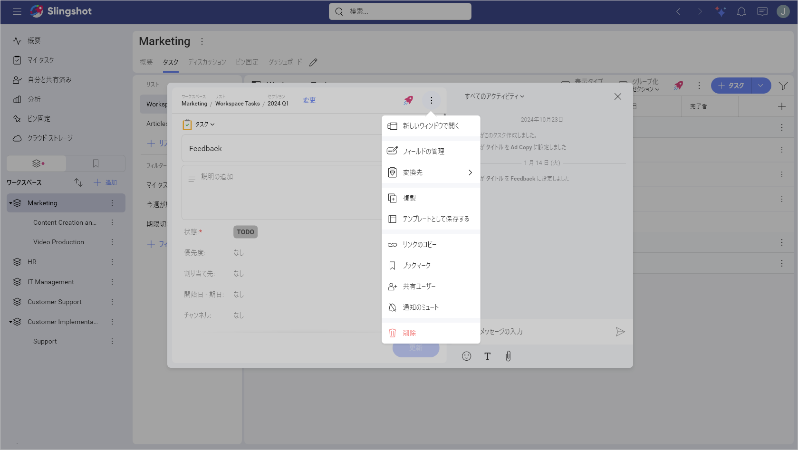
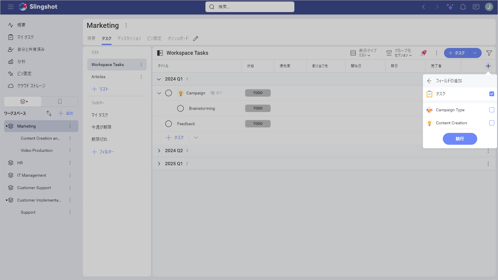
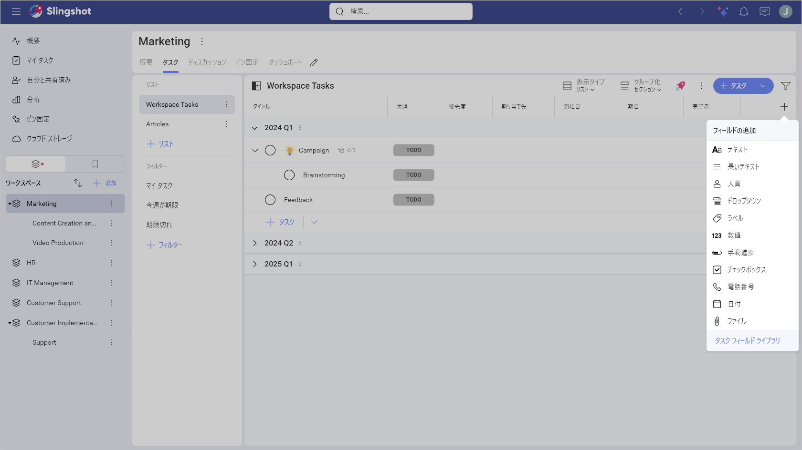
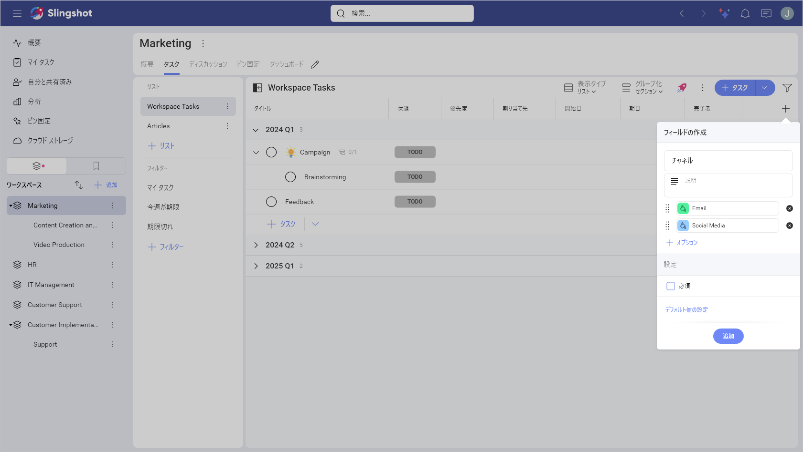

# カスタム フィールドとタスク タイプの使用 

[特定のタイプ](task-types.md)のタスクのフィールドを作成すると、そのタイプの他のすべてのタスクが更新され、変更が反映されます。 

タスクにカスタム フィールドを追加するには、以下のいずれかの方法を実行します。 

1. タスクのオーバーフロー メニューを開きます。 

2. **[フィールドの管理]** を選択します。 

3. **[+フィールド]** をクリックまたはタップします。 

4. さまざまなタイプのカスタム フィールドのリストが表示されます。目標に最も適したものを選択します。この場合、リリース用のフィールドを作成しました。 

5. 準備ができたら、**[完了]** をクリックまたはタップし、**[更新]** をクリックしてフィールドを追加します。 

## タスク タイプの変更 

特定のタスクのタイプを、会社の内部プロセスの変更をより適切に反映するカスタム フィールドを持つ別のタイプに切り替えたい場合があります。  

タスク タイプを変更するには、以下の手順を実行できます: 

1. タスクを開きます。 

2. オーバーフロー メニューを開き、**[変換先]** を選択します。 

3. 新しいタスク タイプを選択します。 

4. 新しいタイプに転送するフィールドを選択するように求められます。準備ができたら、**[変換先]** をクリックまたはタップします。 

以下の手順でタスク タイプを変更することもできます。

1. 右上隅のタスク リストで **[+]** フィールド ボタンをクリックまたはタップします。 

2. ここでは、タスク リスト内の既存のフィールドのオン/オフを切り替えたり、新しいフィールドを作成したりできます。カスタム フィールドを作成するには、**[+ フィールドの追加]** をクリックまたはタップします。 

3. 新しいカスタム フィールドを追加するタスク タイプを選択します。 

4. ここから、フィールドのタイプを選択してカスタマイズできます。 

5. 準備ができたら、**[追加]** をクリックまたはタップします。 

