# 表示形式タイプ

データのタイプによって、必要な表示形式は異なります。そのため、概要ウィジェットには、重要な情報を最適に表現するために複数の表示形式から選択できるオプションがあります。

ウィジェットによっては、さまざまな表示形式から選択できます。各表示形式タイプには、構成できるさまざまな要素があります。各表示形式タイプの詳細については、以下をお読みください。

**ピン固定**、**ダッシュボードからピン固定**、**ブックマーク**、**テキスト ウィジェット**、および**未読メンション**は表示形式を使用しません。 

**メンバー タスクの概要**および**状態別メンバー タスク** ウィジェットは表示形式タイプを使用しませんが、ビジネス目標に基づいてデフォルト設定を変更できます。

## 表示形式タイプ

定義済みのタスク、プロジェクト、ワークスペース ウィジェット、ダッシュボード、カスタム ウィジェットに表示形式を使用できます。

## タスク ウィジェット 

カスタム タスク ウィジェットを作成する場合、または **[タスク管理]** カテゴリのタスク ウィジェットを使用する場合、9 つすべての表示形式から選択できます。 

### 円

数値の比率をスライスで表示する場合は、円の表示形式を使用できます。円の表示形式を使用しているときは、フィルターを追加したり、凡例を表示したりできます。

たとえば、**[状態]** で分類されたワークスペース内のタスク数を確認したい場合は、次の手順を実行します:

1. ウィジェットのリストから **[状態別のタスク]** を選択します。

2. **[場所]** を開いてワークスペースを選択します。

3. **[円]** 表示形式を選択します。

4. **[フィルター]** 値を**自分 (動的)** に設定します。

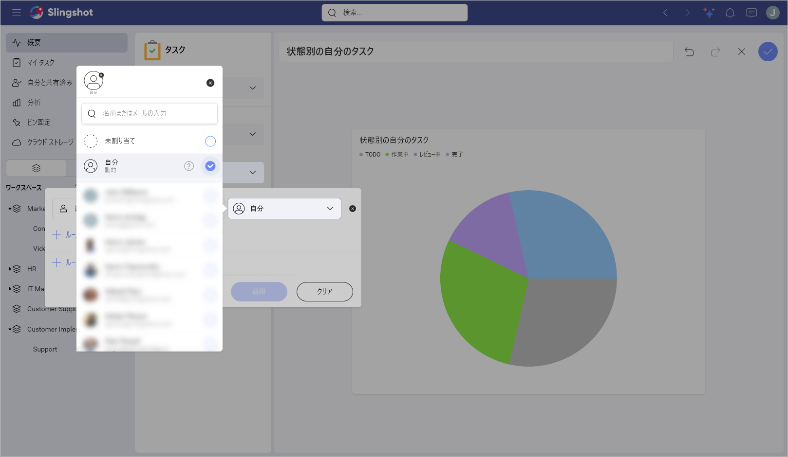

5. **[表示]** のドロップダウン メニューを開き、**[状態]** を選択します。

6. **[凡例の表示]** を有効にします。これにより、すべての状態の名前を確認できます。 

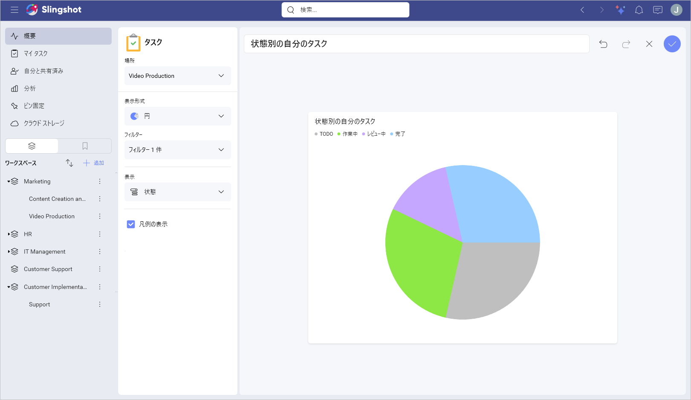

>[!Note]
> **プロジェクト別の未完了タスク** ウィジェットを使用する場合、**[終了日]**、**[開始日]**、**[状態]**、**[タイトル]** でタスクをフィルタリングすることもできます。

>[!Note]
> **[概要]** で **[タスク管理]** カテゴリからウィジェットを選択する場合、円の表示形式を使用しているときに **[値]** を追加することもできます。 

### ドーナツ型

ドーナツ型の表示形式では、**円**の表示形式と同じカスタマイズ要素が提供されます。フィルタを追加し、表示するデータを決定し、凡例を有効または無効にできます。

**[タスク管理]** カテゴリからウィジェットを使用している場合は、**[値]** を追加することもできます。 

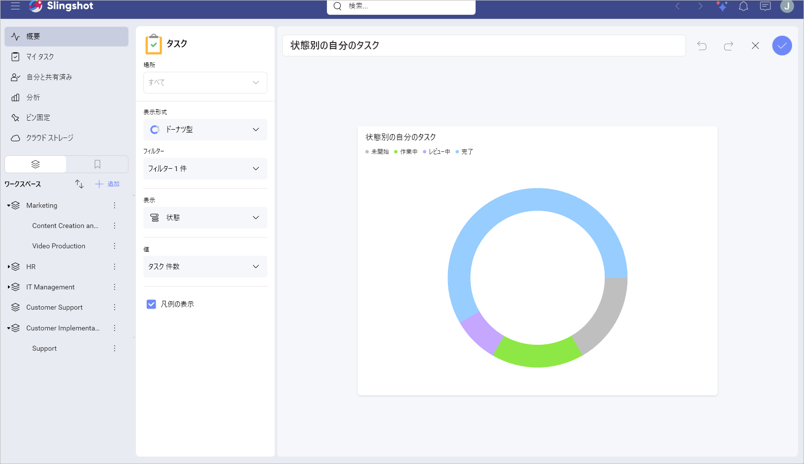

### 数値

数値の表示形式を使用して、フィルターと条件付き書式を使用してデータを表示できます。 

>[!Note]
>**数値**の表示形式は、**[タスク管理]** カテゴリのタスク ウィジェットおよびカスタム タスク ウィジェットで使用できます。

たとえば、ワークスペース内の期限切れタスク数を確認したい場合は、次の手順を実行します:

1. ウィジェットのリストから **[期限切れのタスク]** を選択します。

2. **[場所]** を開いてワークスペースを選択します。

3. **[数値]** 表示形式を選択します。 

4. **[期日]** を **[今日]** に設定します。

5. **[完了]** タスクを除外する **[状態]** フィルターを作成します。

6. 特定の条件を追加します。この例では、数値が 3 より大きい場合は赤、2 より小さい場合は緑にしました。(オプション)

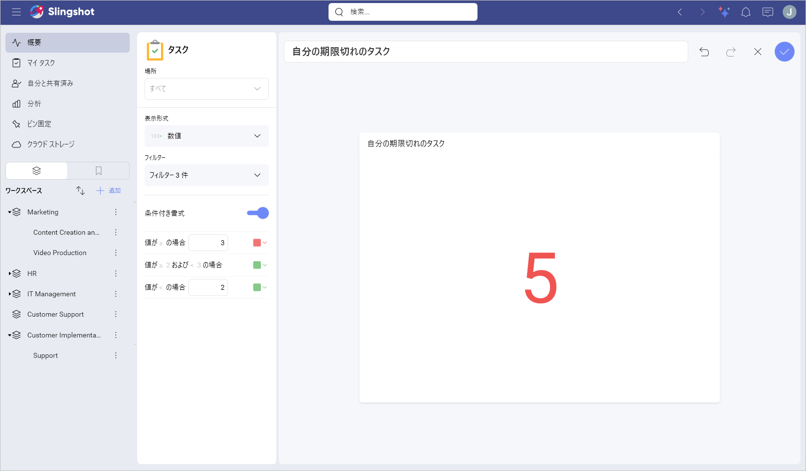

>[!Note]
> **[概要]** で **[タスク管理]** カテゴリからウィジェットを使用する場合、**数値**の表示形式を使用しているときに **[値]** を追加することもできます。 

### 折れ線

時間の経過に伴う傾向を表示する場合は、折れ線の表示形式を使用できます。**[フィルター]**、**[X 軸]**、**[Y 軸]** を追加したり、**[時間]** を設定したり、**[日付]** でタスクをグループ化したりできます。データをより適切に概要表示するために、**[凡例]** を有効にすることもできます。

たとえば、過去 7 日間にプロジェクトで完了したタスクを確認したいとします。その場合は以下の手順を実行します:

1. ウィジェットのリストから **[完了タスクの推移]** を選択します。

2. **[折れ線]** 表示形式を選択します。

3. **[フィルター]** 値を**自分 (動的)** に設定します。

4. **[X 軸]** のドロップダウン メニューを開き、**[完了日]** を選択します。

5. **[Y 軸]** に **[タスク件数]** を追加します。

6. 希望する **[期間]** を追加します。この例では、**[過去 7 日間]** を選択しました。

7. **[日付のグループ化]** を設定します。この例では、**[日]** を選択しました。

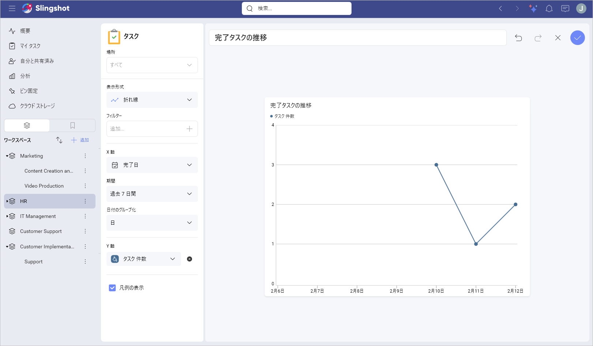

>[!Note]
> **[期間]** と **[日付のグループ化]** を設定できるのは、**完了タスクの推移**ウィジェットを使用している場合のみです。**[タスク管理]** カテゴリの他のタスク ウィジェットには、これらの要素はありません。

>[!Note]
>**プロジェクト別の未完了タスク** ウィジェットを使用する場合、**[タスク フィルター]** を設定することもできます。

### 棒

複数のカテゴリにわたって値を比較する場合は、棒の表示形式を使用できます。フィルター、X 軸、Y 軸を追加したり、凡例を表示または非表示にしたりできます。

たとえば、ワークスペース内のすべての未完了のタスクを表示したいとします。その場合は以下の手順を実行します:

1. ウィジェットのリストから **[未完了のタスク]** を選択します。

2. **[場所]** を開いてワークスペースを選択します。

3. **[棒]** 表示形式を選択します。

4. **[完了]** とは異なる値を持つ **[状態]** の **[フィルター]** を作成します。

5. **[Y 軸]** のドロップダウン メニューを開き、**[状態]** を選択します。

6. **[X 軸]** に **[タスク件数]** を追加します。

7. **[凡例]** を有効にします。 

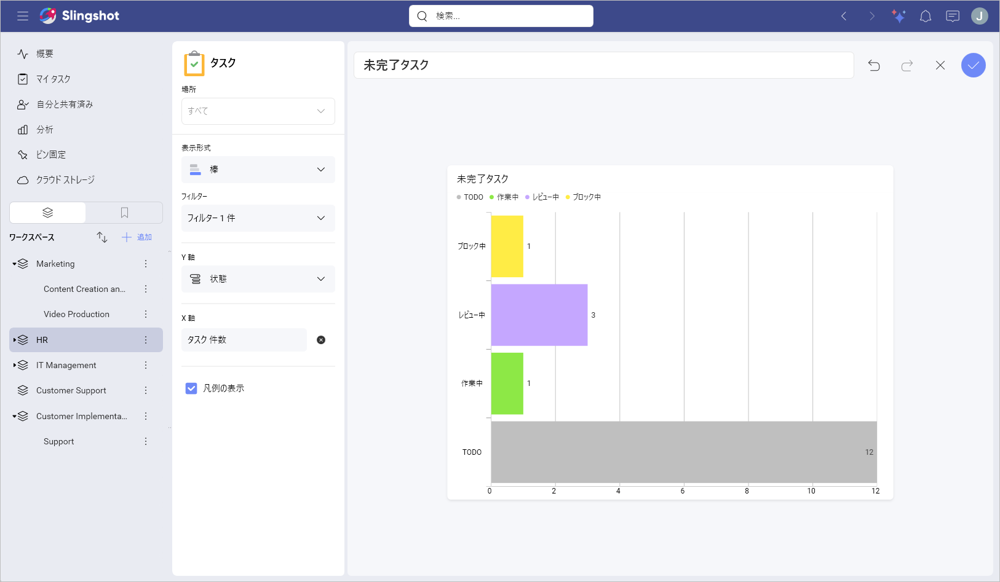

>[!Note]
>**[期間]** と **[日付のグループ化]** を設定できるのは、**完了タスクの推移**ウィジェットを使用している場合のみです。**[タスク管理]** カテゴリの他のタスク ウィジェットには、これらの要素はありません。

### 柱状

柱状の表示形式は、カスタマイズの点で棒の表示形式に似ています。同じ要素を構成できます。唯一の違いは、**[X 軸]** のドロップダウン メニューが表示され、**[Y 軸]** には **[タスク件数]** などの値を選択できることです。 

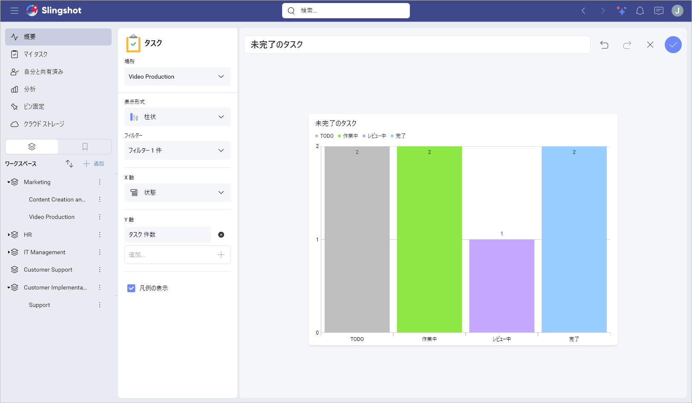

### リスト

データをグリッド形式で表示する場合は、リストの表示形式を使用できます。リストの表示形式では、タスクのフィルタリング、グループ化、並べ替えができます。

>[!Note]
> **[グループ化]** 要素は、**[タスク管理]** カテゴリのウィジェットおよびカスタム タスクで使用できます。 

たとえば、ワークスペース内の期限切れタスク数に関する詳細情報を確認したいとします。その場合は以下の手順を実行します:

1. ウィジェットのリストから **[期限切れのタスク]** を選択します。

2. **[場所]** を開いてワークスペースを選択します。

3. **[リスト]** 表示形式を選択します。

4. 2 つのフィルターを作成します: 1 つは **[今日]** より前の値を持つ **[期日]** 用、もう 1 つは **[完了]** とは異なる値を持つ **[状態]** 用。

5. **[グループ化]** を開いて値を選択します。この例では、**[セクション]** を選択しました。

6. フィールドを選択します。この例では、**[優先度]** と **[状態]** フィールドを選択しました。

7. **[並べ替え条件]** 要素の値を選択します。(オプション)

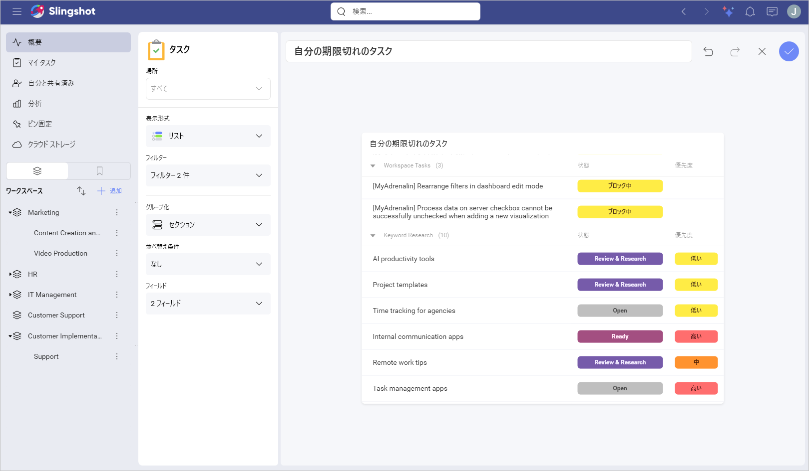

>[!Note]
> **[グループ化]** 要素は、**[タスク管理]** カテゴリのウィジェットおよびカスタム タスクで使用できます。

### タイムライン

タイムラインの表示形式を使用して、データを時系列順に表示できます。

たとえば、参加している各プロジェクトのすべてのブロック中タスクに関する詳細情報を確認したいとします。その場合は以下の手順を実行します:

1. ウィジェットのリストから **[自分のブロック中タスク]** を選択します。

2. **[場所]** を開きます。ここで、データを抽出するプロジェクトにマークを付けることができます。

3. **[タイムライン]** 表示形式を選択します。

4. 2 つのフィルターを作成します: 1 つは **[自分]** 値を持つ **[割り当て先]** 用、もう 1 つは **[ブロック中]** 状態を持つタスク用。 

5. **[グループ化]** を開いて値を選択します。この例では、**[セクション]** を選択しました。 

6. **[並べ替え条件]** 要素の値を選択します。この例では、**[優先度]** を選択しました。

7. 期間を選択します。この例では、**[週]** を選択しました。

8. 色を選択します。この例では、**[状態]** を選択しました。

9. **[凡例]** を有効にします。(オプション)

10. **[週末]** を有効にします。(オプション)

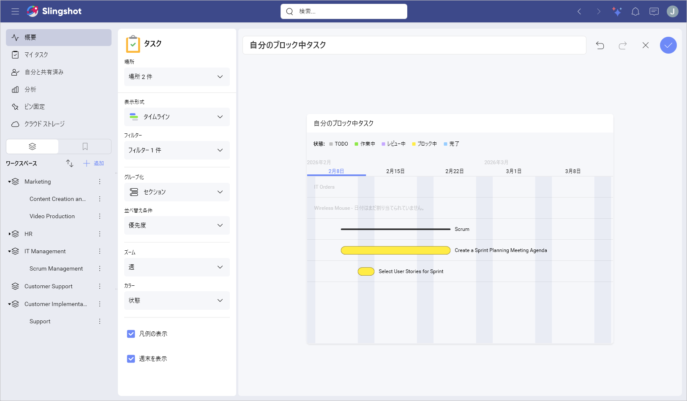

>[!Note]
> **[グループ化]** および **[並べ替え条件]** のオプションは、**[タスク管理]** カテゴリのすべてのウィジェットおよびカスタム タスクで使用できます。

### カレンダー 

データを日、週、または月に分散させたい場合は、カレンダーの表示形式を使用できます。

たとえば、ワークスペース内で作業中のすべてのタスクに関する詳細情報を確認したいとします。その場合は以下の手順を実行します:

1. ウィジェットのリストから **[作業中タスク]** を選択します。

2. **[場所]** を開いてワークスペースを選択します。

3. **[カレンダー]** 表示形式を選択します。

4. **[作業中]** 値を持つ **[状態] フィルター** を作成します。

5. **[ズーム]** のドロップダウン メニューを開き、**[月]** を選択します。

6. **[色]** に **[状態]** または **[優先度]** を選択します。この例では、**[優先度]** を選択しました。

7. **[日付]** に **[開始日 - 終了日]** を選択します。

8. **[凡例]** を有効にします。(オプション)

9. **[週末]** を有効にします。(オプション)

10. **[週番号]** を有効にします。(オプション)

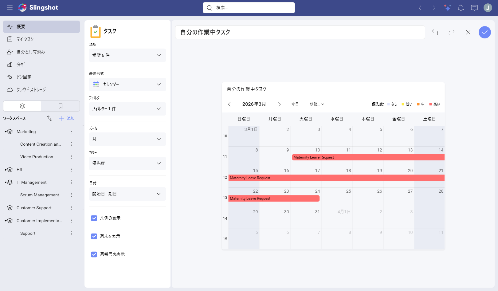

>[!Note] 
>**[色]** 要素は、**[タスク管理]** カテゴリのウィジェットおよびカスタム タスクでのみ使用できます。

## プロジェクト ウィジェット

プロジェクト カテゴリには、**プロジェクト タイムライン**と**プロジェクト別の未完了タスク**というウィジェットが含まれています。これらはそれぞれ、**[数値]** の表示形式を除く 9 つすべての表示形式を使用します。

今月開始されたすべてのプロジェクトとその状態の内訳を確認したい場合は、次の手順を実行します:

1. ウィジェットのリストから **[プロジェクト タイムライン]** を選択します。

2. **[場所]** を開いて、希望するプロジェクトを選択します。

3. 表示形式を選択します。この場合、**[円]** チャートを選択しました。チャートのタイプによって、構成できる要素が異なります。

4. **[開始日]** フィルターを作成し、その値に **[今月]** を選択します。

5. **[表示]** のドロップダウン メニューから **[状態]** を選択します。

6. **[凡例]** を有効にします。 

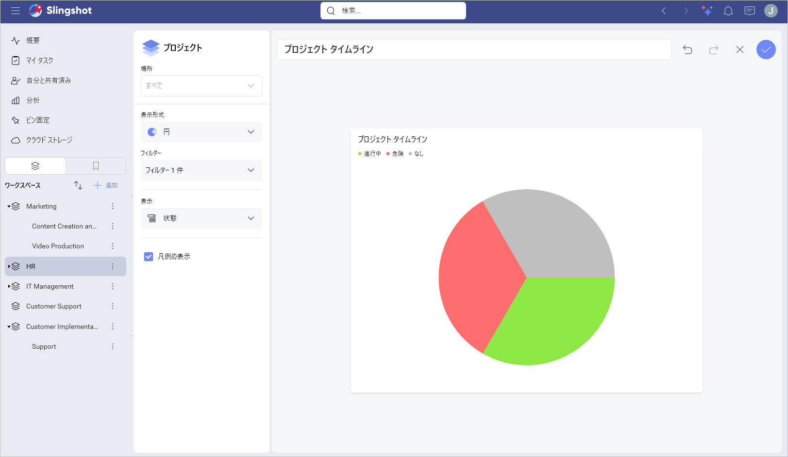

参加している各プロジェクトのすべての未完了のタスクのリストを確認したい場合は、次の手順を実行します:

1. **[プロジェクト別の未完了タスク]** を選択します。

2. **[場所]** を開いて、希望するプロジェクトを選択します。 

3. 表示形式を選択します。この場合、**[柱状]** の表示形式を選択しました。チャートのタイプによって、構成できる要素が異なります。

4. **[X 軸]** のドロップダウン メニューを開き、**[プロジェクト]** を選択します。

5. **[完了]** タスクを除外する **[状態]** フィルターを作成します。

6. **[Y 軸]** に **[タスク件数]** を追加します。

7. **[凡例]** を有効にします。

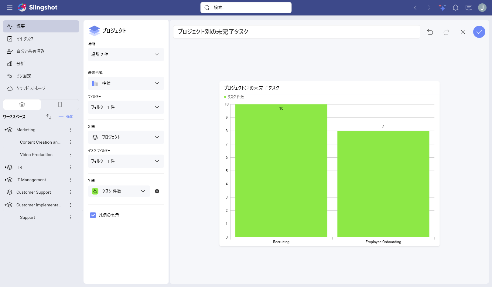

## ダッシュボード & 分析ウィジェット 

**データ分析**カテゴリには、**ダッシュボード**、**ダッシュボードからピン固定**、および**お気に入りのダッシュボード**(**概要**でのみ使用可能) というウィジェットが含まれています。

>[!Note] 
>**ダッシュボードからピン固定**ウィジェットは表示形式を使用しません。ただし、ピン固定の名前を変更したり、表示形式のピン固定を解除したり、置き換えたりすることができます。

**お気に入りのダッシュボード** ウィジェットには、**リスト**と**グリッド**の 2 つの表示形式があります。 

すべてのお気に入りダッシュボードにすばやくアクセスしたい場合は、**グリッド** の表示形式を使用できます。

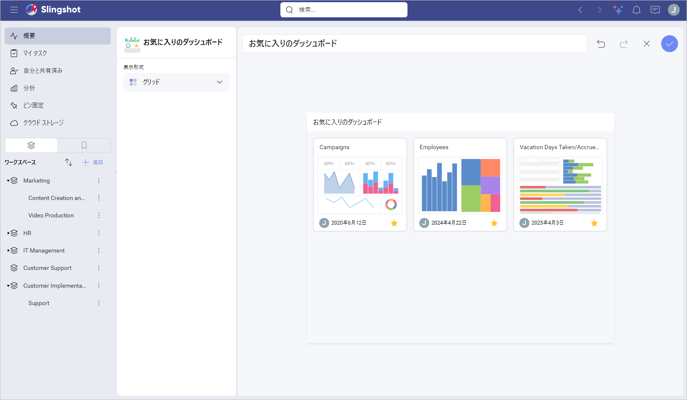

**[場所]**、**[更新日時]**、**[認証済み]**、**[アクセス]**、**[お気に入り]** などのフィールドを表示できるようにしたい場合は、**リスト**の表示形式を使用できます。

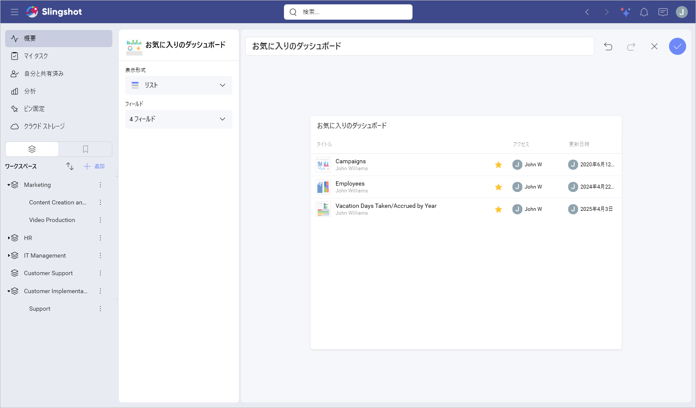

**ダッシュボード** ウィジェットにも、**リスト**と**グリッド**の 2 つの表示形式があります。これらのそれぞれを、より迅速にデータ駆動型の意思決定を行うのに役立つ方法で構成できます。

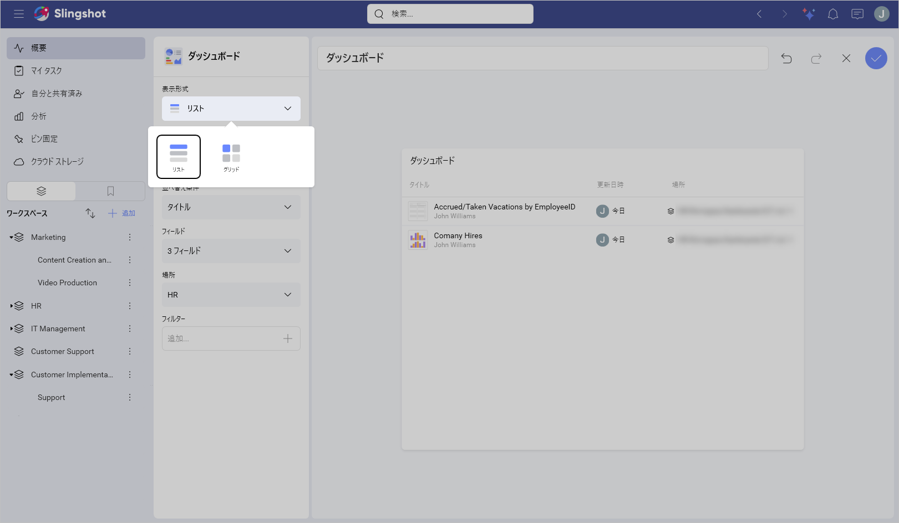

### グリッド

選択できるダッシュボード ソースには、**[フィルター]** と  **[手動選択]**の 2 つのタイプがあります。 

ダッシュボードをフィルタリングするだけの場合は、**[フィルター]** ソースを使用できます。たとえば、今週変更されたワークスペース内のすべてのダッシュボードを確認したいとします。その場合は以下の手順を実行します:

1. **[グリッド]** 表示形式を選択します。

2. **[ダッシュボード ソース]** で **[フィルター]** を選択します。

3. **[場所]** を選択してワークスペースを選択します。

4. 値が **[今週]** の **[更新日時]** フィルターを作成します。 

ダッシュボードを手動で選択する場合は、次の手順を実行します:

1. **[グリッド]** 表示形式を選択します。

2. **[ダッシュボード ソース]** で **[手動選択]** を選択します。

3. ダッシュボードを追加します。

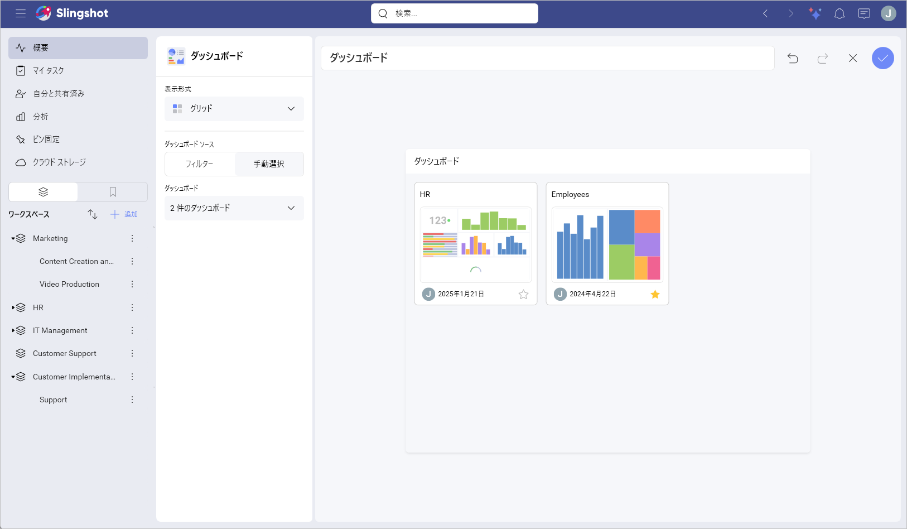

### リスト

リストの表示形式も、**[フィルター]** と **[手動選択]** の 2 つのタイプのダッシュボード ソースに分かれています。

ダッシュボードを並べ替えたり、リストにフィールドを追加したりする場合は、**[フィルター]** ソースを選択できます。

たとえば、特定のワークスペース内のすべてのダッシュボードのリストを確認したいとします。今月変更されたもののみを表示したい場合は、次の手順を実行します:

その場合は以下の手順を実行します:

1. **[リスト]** 表示形式を選択します。

2. **[ダッシュボード ソース]** で **[フィルター]** を選択します。

3. **[並べ替え条件]** のドロップダウン メニューを開き、**[タイトル]** を選択します。

4. **[フィールド]** を開き、**[場所]** と **[更新日時]** を選択します。

5. ワークスペースを選択します。

6. 値が **[今月]** の **[更新日時]** フィルターを作成します。 

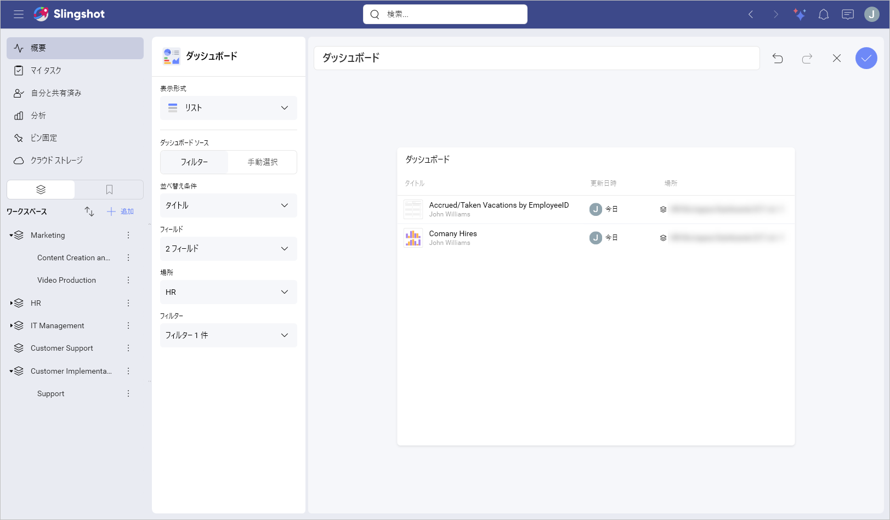

手動で選択したダッシュボードのリストにフィールドを追加する場合は、次の手順を実行します:

1. **[リスト]** 表示形式を選択します。

2. **[ダッシュボード ソース]** で **[手動選択]** を選択します。

3. **[フィールド]** のドロップダウン メニューを開いて、表示するフィールドを選択します。

4. ダッシュボードを追加します。

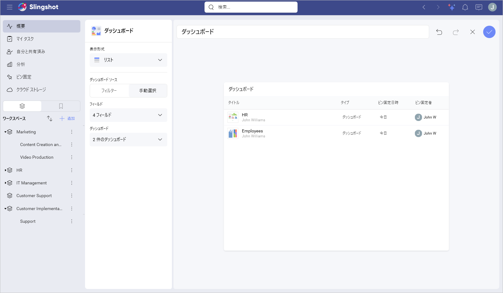

## カスタム ウィジェット

カスタム ウィジェットには 3 つのタイプがあります: 

タスク: カスタム タスクを作成する場合、上記のすべての表示形式から選択できます。カスタム タスクは、ワークスペースおよびプロジェクトの概要、および **[概要]** の概要に含めることができます。

プロジェクト: カスタム プロジェクトを作成する場合、**数値**を除く上記のすべての表示形式タイプから選択できます。カスタム プロジェクトは、ワークスペースの概要および **[概要]** の概要に含めることができます。

ワークスペース: カスタム ワークスペースを作成する場合も、**数値**を除く上記のすべての表示形式タイプから選択できます。カスタム ワークスペースは、**[概要]** の概要に含めることができます。

>[!Note]
>カスタム プロジェクトとワークスペースには、**タイムライン**または**カレンダー**の表示形式を使用しているときに **[色]** を構成するオプションはありません。

## メンバー ウィジェット

メンバー ウィジェットには、**メンバー タスクの概要**と**状態別メンバー タスク**の 2 つのタイプがあります。両方のウィジェットは表示形式タイプを使用しません。ただし、重要な情報を表示するために要素を構成することはできます。

プロジェクトでチームが現在取り組んでいる今週の期限切れのタスクすべての内訳を確認したい場合は、次の手順を実行します:

1. ウィジェットのリストから **[メンバー タスクの概要]** を選択します。

2. タスクの概要に含めるメンバーを選択します。

3. ワークスペースを選択します。

4. **[高い]** 値を持つ **[優先度]** フィルターを作成します。

5. **[日付フィールド]** に **[期日]** を選択します。

6. **[期間]** に **[今月]** を選択します。

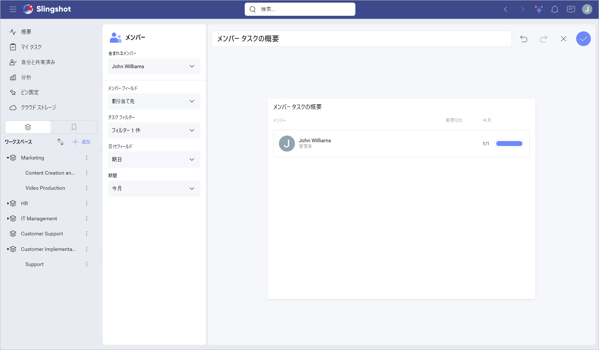

プロジェクト内の優先度の高いタスクをチーム メンバー間で均等に配分したい場合は、次の手順を実行します:

1. ウィジェットのリストから **[状態別メンバー タスク]** を選択します。

2. タスクの概要に含めるメンバーを選択します。

3. タスクを **[状態]** でグループ化します。

4. **[高い]** 値を持つ **[タスク フィルター]** を作成します。

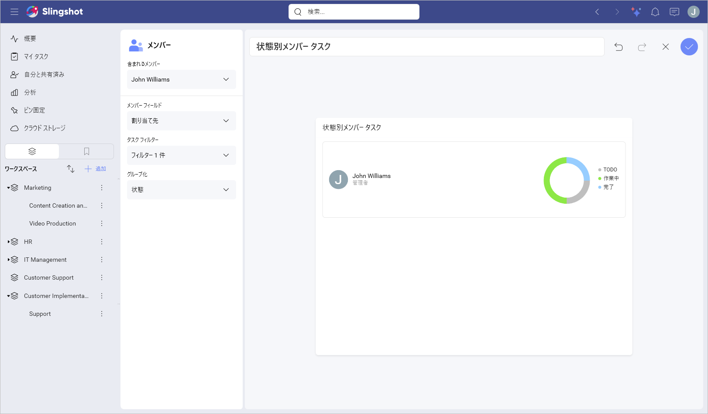
