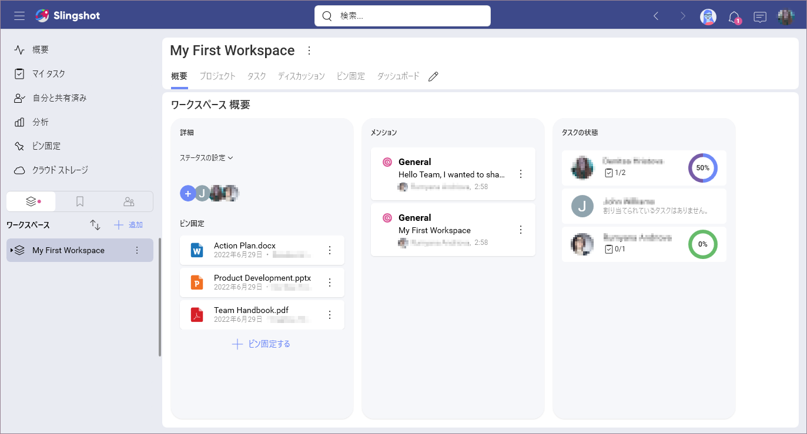
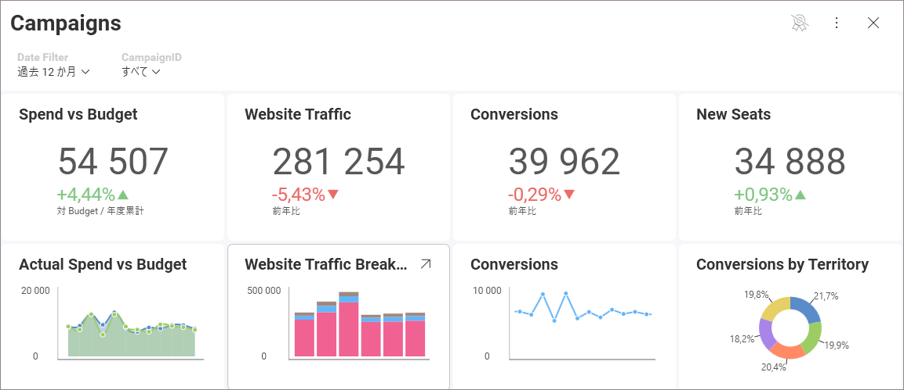
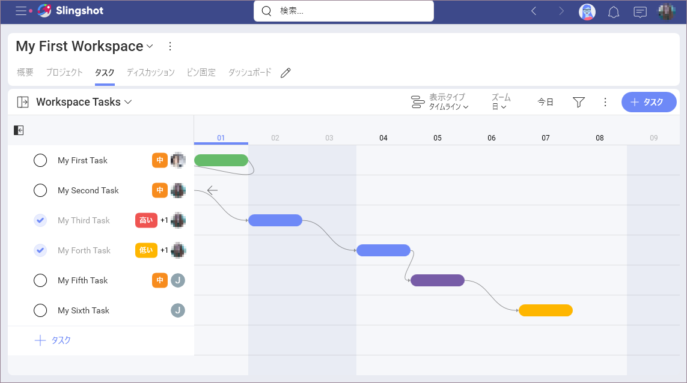

# Slingshot ヘルプ センターへようこそ

Slingshot は、作業するすべてのユーザーをデータに接続し、プロジェクト、コンテンツ、チャットを整理して、チームの力を解き放つ唯一のデジタル ワークプレイスです。

では、Slingshot はどのように役立つでしょうか? 以下をご覧ください。

## Slingshot のハイライト

##### **情報の検索とアクセスを容易にすることで、チーム、部門、外部クライアント全体に落ち着きと効率をもたらします**。

Slingshot を使用すると、探している情報を見つけるために複数のアプリケーションを切り替える必要がなくなります。データ分析、プロジェクトと情報の管理、チャット、および目標ベースのストラテジ ベンチマーク、これらすべてを 1 つのアプリにまとめて利用できるのは Slingshot だけです。

##### **チームがデータを利用して生産性を向上させるのを容易にすることで、実用的なインサイトを活用します**。

Slingshot には、完全なセルフ サービスのビジネス インテリジェンス ソリューションが付属しています。データにすばやく接続し、美しいダッシュボードを作成して、チームとインサイトを共有できるようにします。そして、それだけではありません。ダッシュボードは Slingshot のタスクおよびコラボレーション機能とシームレスに連携し、インサイトを真に行動に移すことがこれまでになく簡単になります。   

##### **全員が同じ目的とストラテジに集中し、従事することで、より良い結果を達成できます**。

全員が同じ目標向かうことで、チームはより戦略的に動き、より良い結果を達成し、最終的にはビジネス目標を超えることができます。

##### **ワークフローの透明性を高めて、所有と責任の文化を設計しましょう**。

締め切り、会話、およびデータを誰もが見られるように透明化されていると、説明責任によってプロジェクトは時間どおりに完了するようになり、より賢いインサイトで成功への道を明らかにすることができます。

## Slingshot を入手する方法

Slingshot は、機能を犠牲にすることなく、使用しているデバイスに関係なく、シームレスなエクスペリエンスをすべてのプラットフォームで利用できます。今すぐ Web、MacOS、Windows、iOS、Android で Slingshot を入手できます。  

 
 

  

    
<noscript></noscript>

    <h3 class="font-weight-bold">モバイル</h3>
    
外出先でタスクを追加および管理する

    
<a href="https://apps.apple.com/us/app/id1457353858" class="trackCTA" aria-label="Download Slingshot on iOS" data-xd-ga-action="Download" data-xd-ga-label="Slingshot iOS" target="_blank" rel="noopener"><noscript></noscript></a> 
    <a href="https://play.google.com/store/apps/details?id=com.infragistics.slingshot" class="trackCTA" aria-label="Download Slingshot on Android" data-xd-ga-action="Download" data-xd-ga-label="Slingshot Android" target="_blank" rel="noopener"><noscript></noscript></a>

    

  

  

    
<noscript></noscript>

    <h3 class="font-weight-bold">デスクトップ</h3>
    
ドックから Slingshot を起動する

    
<a href="https://apps.apple.com/us/app/id1457353858" class="trackCTA" aria-label="Download Slingshot on Mac OS" data-xd-ga-action="Download" data-xd-ga-label="Slingshot Desktop macOS" target="_blank" rel="noopener"><noscript></noscript></a> 
    <a href="ms-appinstaller:?source=https://dl.infragistics.com/products/Infragistics/Slingshot/Slingshot.appinstaller" class="trackCTA" aria-label="Download Slingshot on Windows" data-xd-ga-action="Download" data-xd-ga-label="Slingshot Desktop Windows">Windows 版のダウンロード</a>

    
Windows 版のダウンロードに問題がある場合は、<a href="/download-desktop" class="trackCTA d-block" aria-label="Download Slingshot on Windows" data-xd-ga-action="Download" data-xd-ga-label="Slingshot Desktop Windows">インストーラーをダウンロード</a>

    

  

  

    
<noscript></noscript>

    <h3 class="font-weight-bold">ウェブ</h3>
    
任意のブラウザーからタスクを管理する

    
<a href="https://my.slingshotapp.io" class="trackCTA" data-xd-ga-action="Download" data-xd-ga-label="Slingshot Web" target="_blank" rel="noopener">Web アプリに移動</a>

    

  

