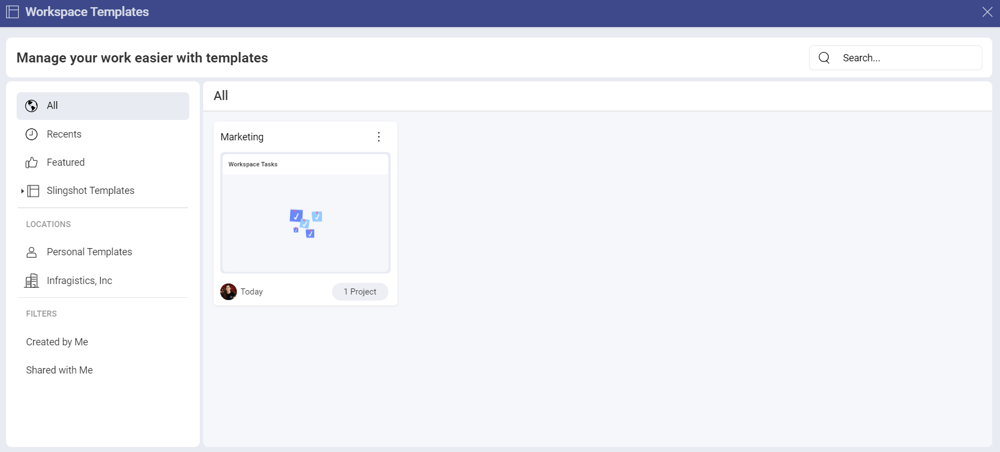
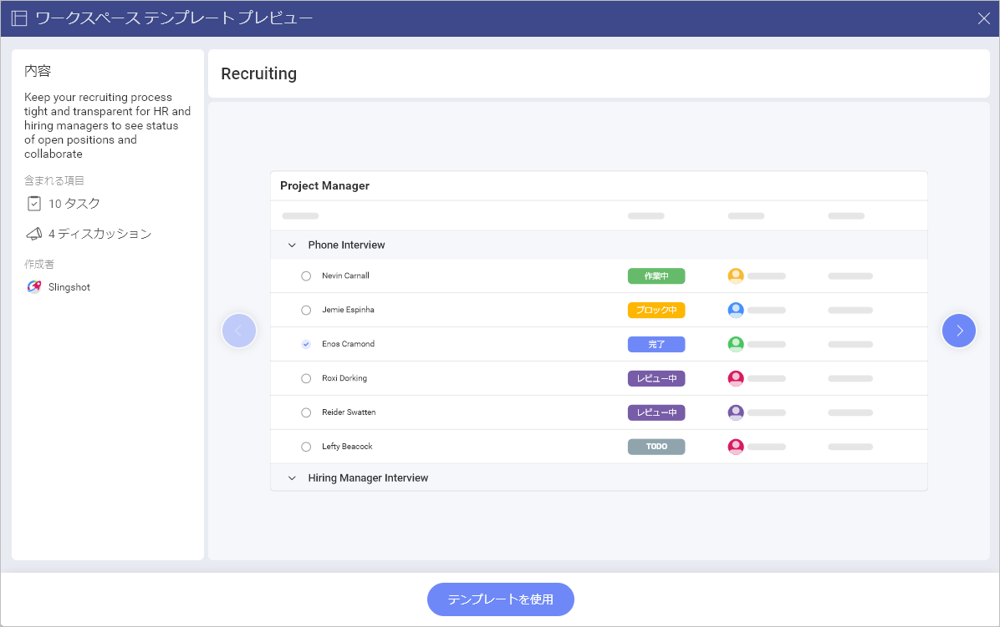
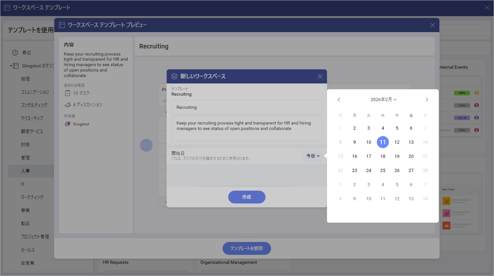
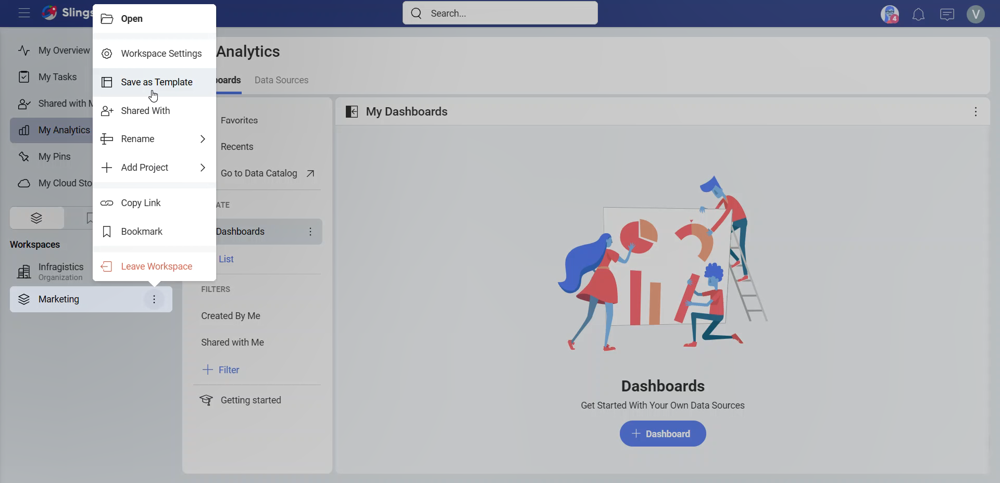
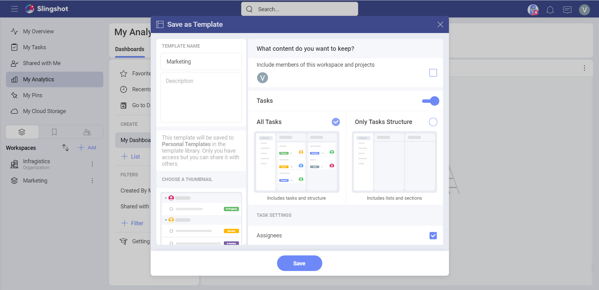
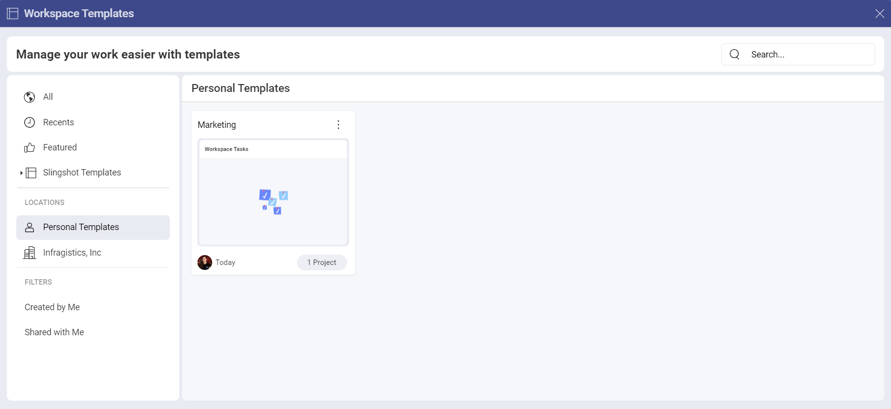

# ワークスペース テンプレート 

ワークスペース テンプレートを使用すると、数回クリックするだけで、チーム用のワークスペースをすばやく作成できます。 

## さまざまなワークスペース テンプレート リストにアクセスする方法

To access the out-of-the-box Slingshots templates, you can: 

1.	左側のパネルの **[ワークスペース]** の横にある **[+ 追加]** ボタンをクリックまたはタップします。

2.	**[すべてのテンプレートを見る]** をクリックまたはタップします。

3.	次のダイアログが開きます:

In the left panel, you can do the following:

- Check all of your templates.

- Check the templates that you have recently used.

- View all the featured templates.

- Use a template from the *Slingshot Templates*.

- Locate where you have stored your templates.

- Filter the templates by *Created by Me* or *Shared with Me*.

## How can I use an out-of-the-box Workspace Template?

Slingshot のテンプレートは、さまざまな業界/部署に基づいて編成されています。テンプレートを使用するには: 

1.	左側のパネルでリストの 1 つを開きます。

2.	要件に最適なテンプレートをクリック/タップします。 

3.	ワークスペースの外観のプレビューが表示されます。この場合、**Recruiting** テンプレートを選択しました。

4.	こちらには、テンプレートの内容と作成者についての簡単な説明が表示されます。左矢印/右矢印を使用して、各コンポーネント (この場合は**タスク**と**ディスカッション**) のサムネイルを表示することもできます。これにより、ワークスペースがどのように見えるかについてより適切な概要が得られます。準備ができたら、**[テンプレートを使用]** をクリックまたはタップします。

5.	ダイアログが表示され、各テキスト ボックスをクリック/タップしてプロジェクトのタイトルを変更したり、説明を変更したりできます。ドロップダウン メニューからワークスペースの開始日を設定することもできます。開始日はタスクの日付の構成にも使用されます。 

6.	準備ができたら、**[作成]** をクリックまたはタップします。

## How can I create a custom Workspace Template? 

In order to create a custom workspace template, you need to:

1.	Open the overflow menu next to the workspace you want to use as a template.

2.	Click/tap on **Save as Template**.

3.	The following dialog will open up. Here you can choose what to keep from the workspace in order to use it for the template. When you are ready, click/tap on **Save**.

4.	Once you have created the template, you can find it in the *Workspace Templates lists* when you click/tap on **See all Templates** (next to *Workspaces* in the left panel). The custom template will show up under **Personal Templates**. 

Besides this, you can also open the overflow menu on the right side of the workspace template, that you have created, and take the following actions:

-	Open the template.

-	Copy the link to the template.

-	Add the template to *Bookmarks* or remove it from there.

-	Share the template.

-   Delete the template.

ワークスペースの作成方法と使用方法の詳細については、[こちら](./workspaces.md)をご覧ください。

