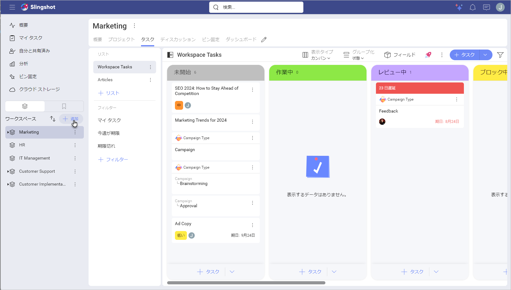
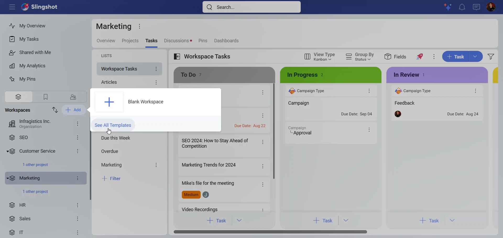
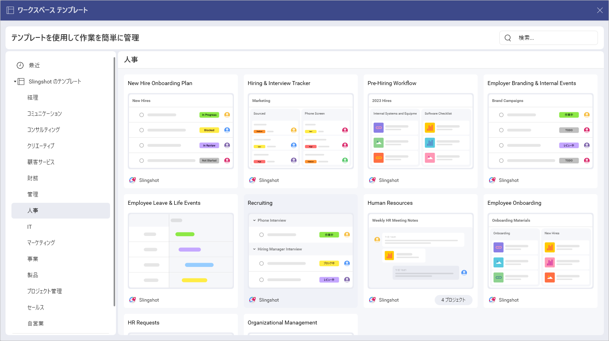
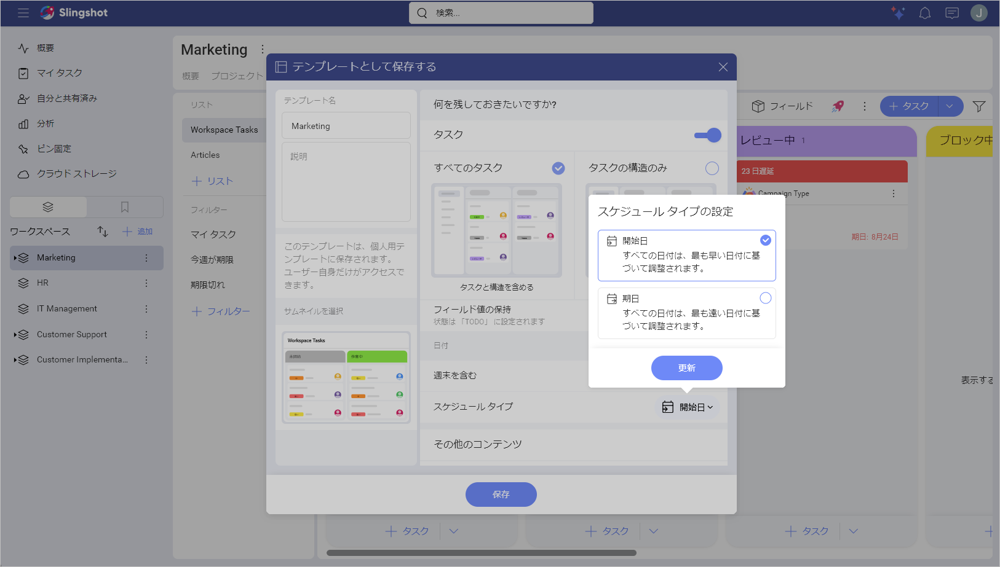
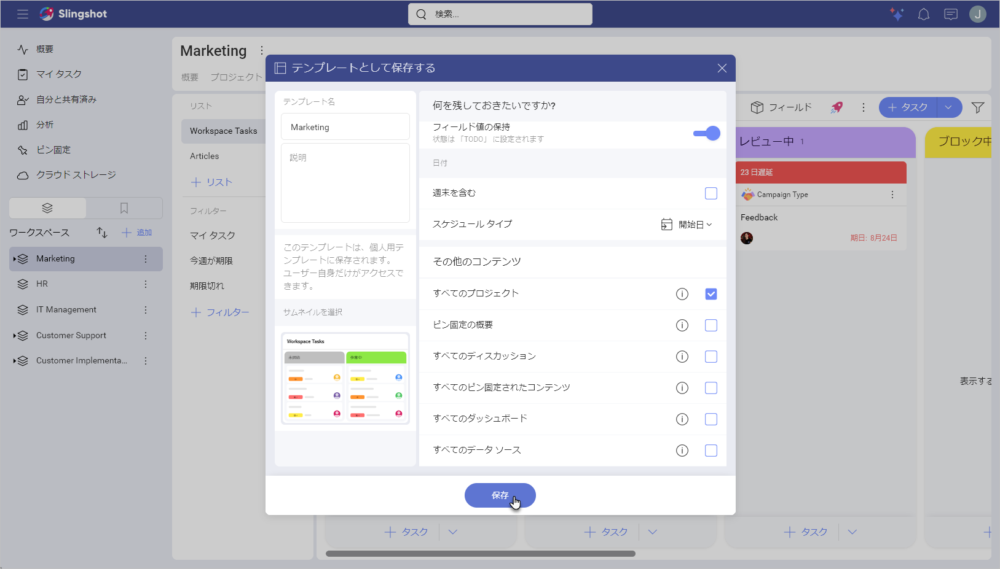
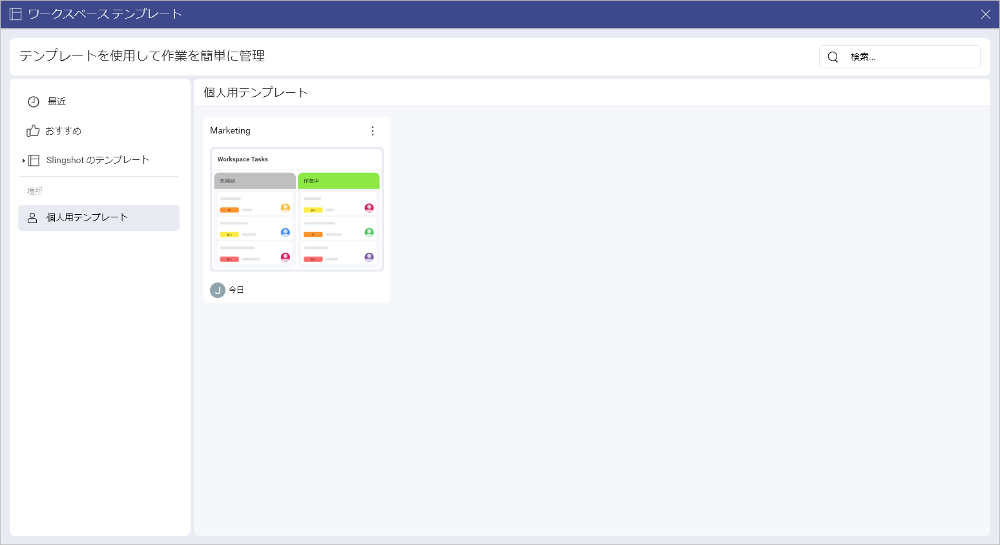
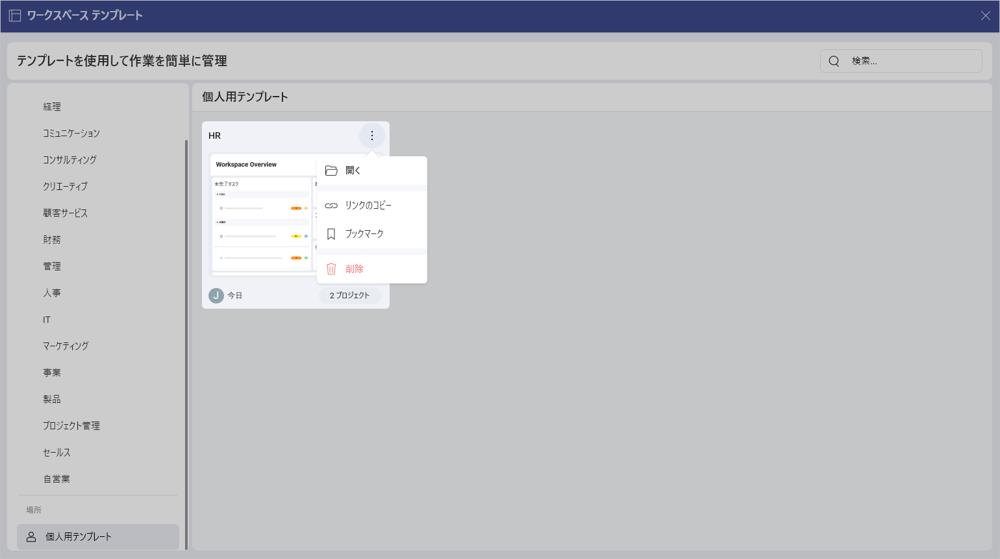

# ワークスペース テンプレート 

ワークスペース テンプレートを使用すると、数回クリックするだけで、チーム用のワークスペースをすばやく作成できます。 

## さまざまなワークスペース テンプレート リストにアクセスする方法

定義済みの Slingshot テンプレートにアクセスする手順は次の通りです:

1.	左側のパネルの **[ワークスペース]** の横にある **[+ 追加]** ボタンをクリックまたはタップします。

2.	**[すべてのテンプレートを見る]** をクリックまたはタップします。

<!--  -->

3.	次のダイアログが開きます:

左側のパネルでは、次の操作を行うことができます:

- 最近使用したテンプレートを確認。

- すべての注目のテンプレートを表示。

- Slingshot テンプレートからテンプレートを使用。

- テンプレートを保存した場所を見つける。

## すぐに使えるワークスペース テンプレートを使用する方法

Slingshot のテンプレートは、さまざまな業界/部署に基づいて編成されています。テンプレートを使用するには: 

1.	左側のパネルでリストの 1 つを開きます。

2.	要件に最適なテンプレートをクリックまたはタップします。この場合、**Recruiting** テンプレートを選択しました。

3.	ワークスペースの外観のプレビューが表示されます。こちらには、テンプレートの内容と作成者についての簡単な説明が表示されます。左矢印/右矢印を使用して、各コンポーネント (この場合は**タスク**と**ディスカッション**) のサムネイルを表示することもできます。これにより、ワークスペースがどのように見えるかについてより適切な概要が得られます。準備ができたら、**[テンプレートを使用]** をクリックまたはタップします。

4.	ダイアログが表示され、各テキスト ボックスをクリックまたはタップしてプロジェクトのタイトルを変更したり、説明を変更したりできます。ドロップダウン メニューからワークスペースの開始日を設定することもできます。開始日はタスクの日付の構成にも使用されます。準備ができたら、**[作成]** をクリックまたはタップします。

>[!Note] 組織に所属している場合は、ワークスペースを公開するか非公開にするかを選択するオプションも表示されます。

## カスタム ワークスペース テンプレートを作成する方法 

>[!Note] カスタム ワークスペース テンプレートを作成するオプションは、Slingshot および Slingshot Enterprise ユーザーが利用できます。

ワークスペースの管理者だけがカスタム ワークスペース テンプレートを作成できます。

カスタム ワークスペース テンプレートを作成するには、次のことを行う必要があります：

1.	テンプレートとして使用するワークスペースの横にあるオーバーフロー メニューを開きます。この場合、Marketing ワークスペース テンプレートを作成しました。

2.	**[テンプレートとして保存する]** をクリックまたはタップします。

3.	次のダイアログが開きます。実行できること:

- テンプレートのタイトルと説明を変更。
  
- ワークスペースとそのプロジェクトのメンバーを保持。

- サムネイルを選択。こうすることで、さまざまなテンプレートをすばやく参照し、特定のテンプレートに含まれる内容の概要を把握できます。

- すべてのタスクを保持するか、タスク構造のみを保持。タスクを保持することにした場合は、次のことができます:

    - [フィールド](custom-fields.md)の値を保存。

    - 週末も含める。

    - スケジュール タイプを設定。

タスクの構造のみを保持することにした場合、タスクとそのフィールドは表示されなくなります。

下にスクロールすると、ダッシュボード、ピン固定、ディスカッションなどの追加コンテンツから何を保持するかを選択することもできます。

テンプレートに使用するためにワークスペースから何を保持するかを選択できます。準備ができたら、**[保存]** をクリックまたはタップします。

4.	テンプレートを作成すると、**[場所]** の**ワークスペース テンプレート リスト**で見つけることができます。そこには、作成したすべてのテンプレートのリストが表示されます。組織に所属している場合は、組織内に保存されているテンプレートを参照することもできます。

これに加えて、作成したワークスペース テンプレートの右側にあるオーバーフロー メニューを開いて、次のアクションを実行することもできます:

- テンプレートを開く。

- テンプレートへのリンクをコピー。

- テンプレートを [ブックマーク] に追加するか、そこから削除。

- テンプレートを削除。

ワークスペースの作成方法と使用方法の詳細については、[こちら](./workspaces.md#ワークスペースの作成)をご覧ください。

