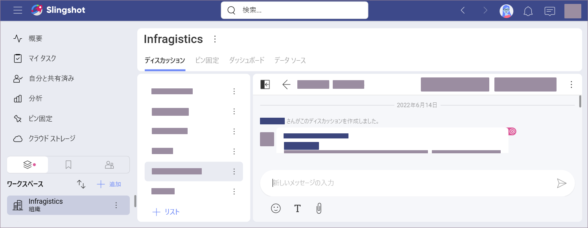
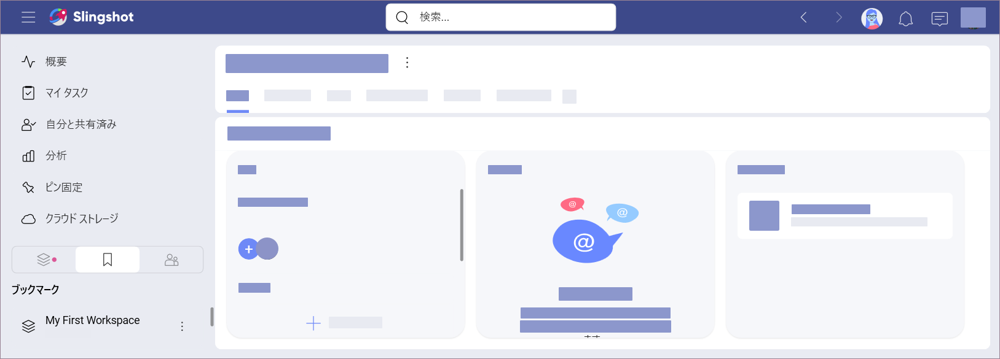
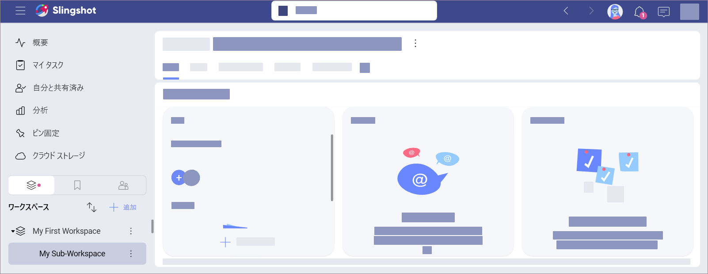
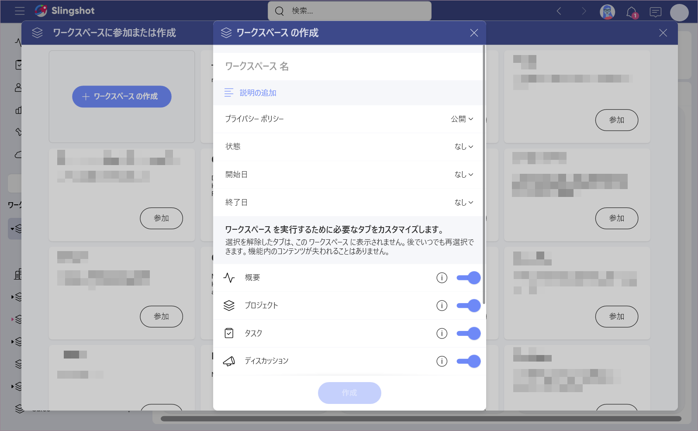
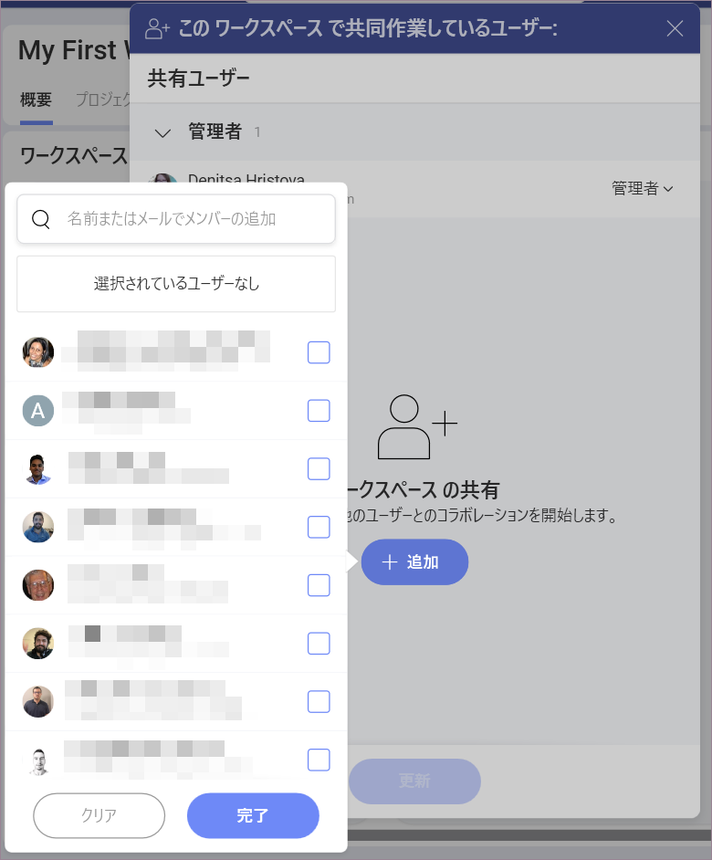
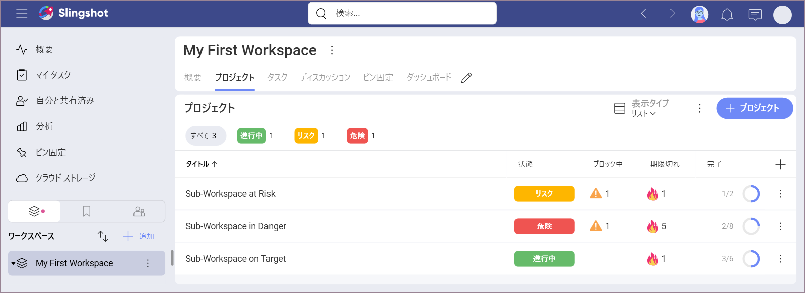
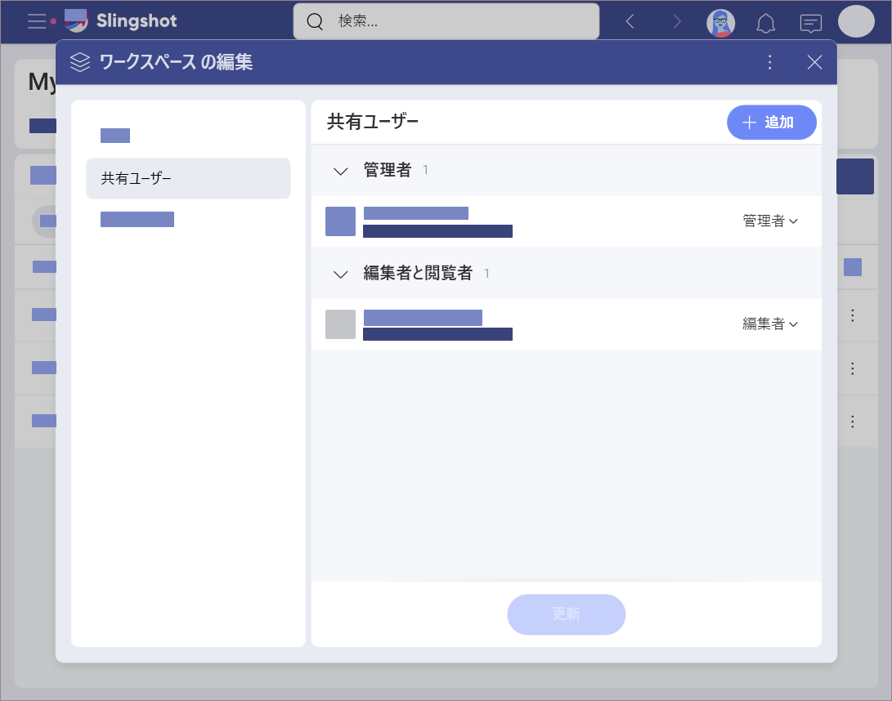
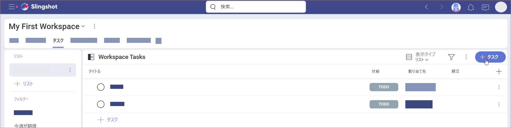

# ワークスペースの詳細

ようこそ! このトピックは、ワークスペースに関する詳細を紹介します。

## 組織とワークスペースとサブワークスペース

Slingshot では、ユーザーは組織に参加し、無制限のワークスペースとサブワークスペースに参加できます。
組織ワークスペースを持つことの目的は、会社のリーダーが、主要な目標、メトリック、ストラテジ、および重要な発表を、組織全体に伝達できるようになることです。   

**組織ワークスペース**は、組織にちなんで (たとえば、御社の名前) 名付けられています。メンバーは、組織のワークスペースに関連付けるために、組織のメール アドレスでログインする必要があります。組織内のチーム メンバーは、ディスカッション、コンテンツ、および分析を互いに共有できます。 

左側の [ワークスペース] の下に  組織ワークスペースがあります (以下を参照)。 

**ワークスペース**は、組織ワークスペースに関連付けることも、関連付けないこともできます。メイン組織の内外のメンバーを含めることができます。ワークスペースのメンバーは、コンテンツ、分析、ディスカッションだけでなく、タスクとサブワークスペースも共有します。

**サブワークスペース**はワークスペース内にあり、[親ワークスペース](workspaces.html#sub-workspaces)の [概要] と [タスク] の間の [ワークスペース] の下にあります。サブワークスペースは、親ワークスペースのメンバーに限定されません。他のワークスペースのユーザーをすべてのサブワークスペースに招待できます。サブワークスペースには、独自の [概要]、[タスク]、[ディスカッション]、[コンテンツ]、および [分析] が含まれます。サブワークスペース内のタスクを、サブワークスペースまたはその親ワークスペースのメンバーではないユーザーに割り当てることもできます。

上記のように、すべてのユーザーのタスクがサブワークスペースの [概要] タブの [タスクの状態] に表示されます。

## ワークスペースにアクセスする方法

画面の左端のワークスペース領域 (以下を参照)で、すべてのワークスペースにアクセスできます。

デフォルトでは、ワークスペース領域は左側のパネルに表示されます。[概要] の下のアイコンをクリックして、[ブックマーク] または [グループ] に切り替えます。

下にスクロールすると、すべてのワークスペースとそのサブワークスペースに移動できます。ワークスペースにすばやくアクセスするために、ブックマークを付けることができます。その後は、このワークスペースを [ブックマーク] タブからも見つけることができます。

ワークスペースを開くには、ワークスペースをクリック / タップするだけです。

## 他のワークスペースを見つけて参加する方法

ワークスペースのメンバーになるには、はじめに、ワークスペースを見つけるか、または新たなワークスペースを作成する必要があります。[ワークスペース] パネルの上部にある [+ 追加] ボタンを選択して、使用可能なワークスペースのダイアログを開きます。

このダイアログには、**組織の公開ワークスペースのみ**が表示されます。これらのワークスペースにはその場で参加でき、デフォルトでメンバーの役割を取得できます。

**プライベート ワークスペースまたは組織外のワークスペース**のメンバーになるには、管理者から招待される必要があります。

## サブワークスペースに参加する方法 

すでに述べたように、サブワークスペースは、親ワークスペースのユーザーと、そのメンバーではないユーザーとを混在させることができます。[個人アカウントのユーザー](roles-permissions-faq.html#what-about-users-with-no-organization)は、親ワークスペースのメンバーでなくてもサブワークスペースに参加できます。

ワークスペースに参加するには、親ワークスペースのメンバーでない場合、サブワークスペースまたはその親ワークスペースの管理者から**招待を受け取る**必要があります。 

サブワークスペースのメンバーに追加されると、プロジェクトとその状態に関する通知が届きます。プロジェクトが言及されたときに、*@ 記号* + プロジェクト名を使用して通知されます。

親ワークスペースのメンバーであるが、そのサブワークスペースの一部に参加していない場合は、その名前の下にある青いボタンをクリックできます。すると、利用可能なサブワークスペースが表示されるので、参加したいサブワークスペースの名前の横にある [参加] を選択できます (以下を参照)。 

>[!NOTE] サブワークスペースに参加しなくても、サブワークスペースのコンテンツを表示できます。ただし、参加するまで、通知の更新は届きません。

## 新しいワークスペースを作成する方法

Slingshot のすべてのユーザーはワークスペースを作成できます。  
[ワークスペース] パネルの上部にある [+ 追加] ボタンを選択してワークスペース作成メニューにアクセスし、[作成] をクリック / タップします。以下に、[ワークスペースの作成] ダイアログを示します。

このダイアログで、以下を構成します:
* **ワークスペース名** - ワークスペースに適切な名前を付けることを推奨します。
* (オプション) **説明** - 説明は役に立ち、あるとよいですが、Slingshot ではオプションです。
* **組織** - ワークスペースを組織のワークスペースにするか、個人のワークスペースにするかを選択します。
    選び方と違い 
    - **メイン組織の一部であるワークスペース**は、組織の内部ルールと原則に従います。これらのワークスペースは、組織のすべてのメンバーが[見つけて参加](#how-can-i-discover-and-join-other-workspaces)できます。

    - **個人組織** - このオプションを選択すると、より多くの自由が得られますが、見つけられる可能性が低くなります。他のユーザーは招待されなければチームを見つけることができません。これは、自身のワークスペースへのアクセスを制御する場合には最適です。
* **プライバシー** - この設定は、組織のワークスペースになることを選択した場合にのみ使用できます。
    - **公開**ワークスペースは、[ワークスペースに参加または作成] ダイアログで見つけて参加できます。
    - **プライベート** チームは見つけることはできず、メールで受け取った招待を介してのみ参加できます。
* **[状態]**、**[開始日]**、**[終了日]** - ワークスペースのこれらすべてのプロパティは、ワークスペースの [概要] ですべてのユーザーに表示されます。
* **[タブ]** - [ナビゲーション タブ](workspaces.html#customize-main-navigation-tabs-for-improved-productivity)の横にあるトグルを使用して、ワークスペースで不要なタブをオフにします。

**[作成]** をクリック / タップします。ワークスペースが作成され、ワークスペース パネルで見つけることができます。 

## ワークスペースにメンバーを追加する方法 

[このワークスペースで共同作業しているユーザー] ダイアログはワークスペースを作成した直後に表示されます。メンバーを招待するには、青い **[+ メンバー]** ボタンをクリック / タップします。ドロップダウンリスト (以下を参照) から組織メンバーを選択するか、上部のテキスト ボックスを使用して[個人アカウント ユーザー](roles-permissions-faq.html#what-about-users-with-no-organization)のメールを追加します。 

>[!NOTE]
>Slingshot によってメールが自動入力されないメンバーを追加する場合は、メール全体を入力し、Enter キーを押して、招待するユーザーのリストに追加します。

準備ができたら、**[完了]** を選択します。 

リスト内のすべてのユーザーには、デフォルトのメンバー ロールが割り当てられます。名前の横にあるドロップダウンから、ロールを管理者または閲覧者に変更できます。これらのロールのメンバーとの違い[ロールとアクセス許可 FAQ トピック](roles-permissions-faq.md)を参照してください。

## ワークスペース内にワークスペースを作成する方法

[親ワークスペース](workspaces.html#using-workspaces-within-the-workspace)内に無制限にワークスペースを作成できます。新しいサブワークスペース (ワークスペース内のワークスペース) を作成するには、以下の手順に従います。 

1. 左側のワークスペース パネルからワークスペースを選択します。 
2. 右側の [ワークスペース] タブに移動します。
3. 青い [+ 追加] ボタンを選択します。これが最初のサブワークスペースでない場合は、このボタンがサブワークスペースのリストの上部にあります。
4. サブワークスペースを作成するために必要な唯一のフィールドは、その名前です。[状態]、[開始日]、および [終了日] はオプションです。
5. [作成] を選択します。新しいサブワークスペースがワークスペース内のリストに表示されます。左側の[ワークスペース] の親ワークスペースの下にも表示されます。

## サブワークスペースを整理する方法

ワークスペースごとに無制限の数のサブワークスペースを作成できます。サブワークスペースの大きなリストを整理する方法を知っていると、ワークスペース領域内の生産性が向上します。 

まず、[ワークスペース] タブのリストの表示タイプまたはグリッドの表示タイプのいずれかを選択できます。どちらの場合でも、サブワークスペースに関する同じ情報が一目でわかります。

リストはグリッドよりもカスタマイズ可能であり、いくつかの並べ替えオプションを提供します。 リストの表示タイプで、右側の**プラス** ボタンをクリック / タップして、サブワークスペースに表示するフィールドを選択できます。  

以下のスクリーンショットは、デフォルトのフィールドが表示されている、サブワークスペースのリストを示しています。サブワークスペースの状態、ブロック済みタスクの数、期限切れのタスクの数、完了のタスクの数。

ワークスペースのタイトルまたは状態で、昇順または降順に**並べ替える**ことができます。たとえば、タイトルで並べ替えるには、[タイトル] をクリック / タップするだけです。タイトルの横に上向きまたは下向きの矢印が表示されます。これは、サブワークスペースがタイトルの辞書順に並べ替えられていることを意味します: それぞれ *A-Z* または *Z-A* です。

## ワークスペース メンバーを管理する方法

以下の作業を行うには、ワークスペースの管理者である必要があります: 

- 新しいメンバーを招待する
- メンバーを削除する
- メンバーのロールを変える

ワークスペース メンバー ダイアログにアクセスするには、ワークスペースのオーバーフロー メニューを選択してから、**[メンバー管理]** を選択します。 

新しいメンバーを招待するには、青い **[+ 追加]** ボタンを選択します。

各メンバーのロールをクリックして、各メンバーのロールを変更したり、ワークスペースからメンバーを削除したりできます。

同時に複数のメンバーのロールを削除または変更できます。そのためには次の手順を実行します。

1. 青い [+ 追加] ボタンの右側にあるチェックボックスを選択します。
2. 各メンバーのロールの右側にチェックボックスが表示されます。
3. 同時に変更したいメンバーのチェックボックスを選択します。
4. 画面中央下のメニューから**ゴミ箱アイコン**またはロールを選択し、すべてに適用します。

親ワークスペースのメンバーを管理するための同じルールが、そのすべてのサブワークスペースに適用されます。

>[!NOTE] 親ワークスペースの管理者は、自分が管理者ではないサブワークスペースのメンバーを管理できません。

## ワークスペースの外からユーザーにタスクを割り当てる方法

ワークスペース外のユーザーと一緒に特定のタスクやプロジェクトに取り組む必要がある場合があります。この場合、そのユーザーをメンバーとしてワークスペースに追加するのは理にかなっていません。

上部にあるワークスペースの **[タスク]** タブにアクセスしてタスクを作成することにより、ワークスペースの外部にいるユーザーにタスクを割り当てることができます。 

ユーザーは、割り当てられたタスクに関する通知を受け取ります。その場合、タスクは [概要] > [今後のタスク] に表示されます。同じことが、サブワークスペースのタスクの、外部ユーザーへの割り当てにも当てはまります。

サブワークスペースのフォローを解除すると、このサブワークスペース内で割り当てられたタスクについてのみ通知が届きます。

## ワークスペースのプライバシー、名前、または説明を変更する方法

ワークスペース (またはサブワークスペース) の管理者である場合は、その設定を変更できます。これを行うには、ワークスペース領域で、ワークスペースオーバーフロー メニューの> [ワークスペース設定] を選択します。

## ワークスペースの削除と離脱

ワークスペースをワークスペース パネルから非表示にするには、ワークスペースを削除するか、ワークスペースを抜けることができます。

管理者のみがワークスペースを削除できます。例外として。

ワークスペースを**削除する**には、その[設定](#how-can-i-change-the-workspace-privacy-name-or-description) > [メンバー管理] > 上部のオーバーフロー メニュー > [ワークスペースの削除] に移動します。

削除すると、すべてのメンバーのすべてのコンテンツを含めて、ワークスペースが削除されます。

ワークスペースと自分のコンテンツだけを削除するには、**抜ける**オプションを使用します。これを行うには、[[ワークスペース設定]](#how-can-i-change-the-workspace-privacy-name-or-description) に移動し、[メンバー管理] を選択し、ロールをクリック / タップして、[ワークスペースから抜ける] を選択します。ワークスペースの唯一の管理者である場合、別のメンバーを管理者として割り当てずにワークスペースを抜けることはできません。

