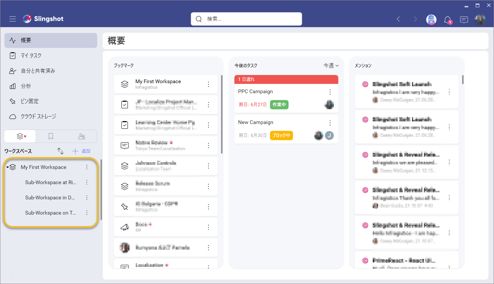
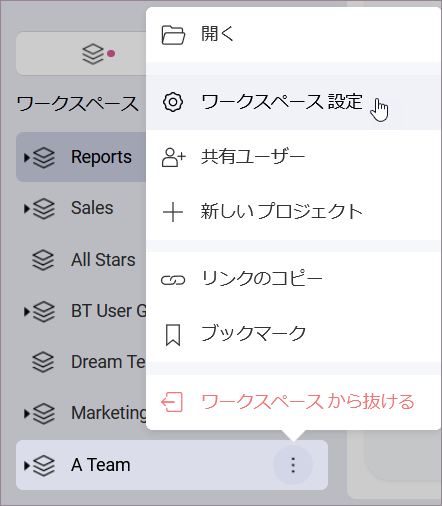
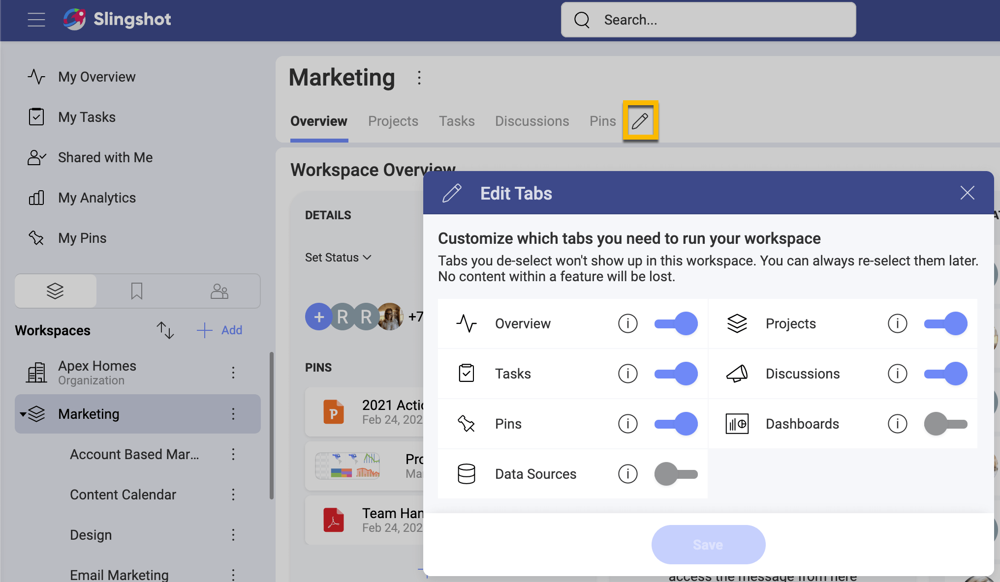

# ワークスペース

Slingshot のワークスペースは、組織内外の人々のグループが集まって共通の目的に取り組むデジタル ワークプレイスとして定義できます。ワークスペースを使用すると、コラボレーション、作業の優先順位付け、コンテンツと知識の共有、さらにはデータからのインサイトを透過的に引き出すことができます。

## ワークスペースには何がありますか?

パフォーマンスの高いチームを運営するには、シームレスなワークフローのためにすべてを 1 つのアプリにまとめる必要があります。以下は、Slingshot ワークスペース内にあるすべてのすばらしい機能です。

- **概要**: 各ワークスペースには、状態、日付、そこにピン固定されている主要なコンテンツなど、ワークスペースの詳細を含む概要があります。一目で、見逃したメンション、およびそのワークスペースとその中のすべてのプロジェクトのメンバーごとに分類されたすべてのタスクの状態を確認できます。概要は、そのプロジェクトまたはイニシアチブの現在の状態に関する高レベルのビューを提供するようにデザインされており、問題になる前に障害を特定しやすくなります。詳細については、[概要トピックをご覧ください](overviews.md)。 

- **プロジェクト**: プロジェクトを使用すると、人々のグループの主要なイニシアチブ、プロジェクト、およびプロセスをさらに細かく分類して整理できます。このタブから、すべてのプロジェクトとその状態を簡単に確認できます。これは、すべてが一度に起こっていることを確認しようとしているチーム リーダーにとって素晴らしいビューです。 

- **タスク**: タスクとは、全員が期限と目標に向かって調整され、動いていることを確認する方法です。各ワークスペースとプロジェクトでは、必要な数のタスクを作成できます。タスクは、セクションとリストにさらに整理できます。リスト、カンバン、タイムラインの表示タイプでタスクを表示することもできます。[タスク、リスト、セクション、表示タイプについて詳しくは、こちらをご覧ください](tasks.md)。  

- **ディスカッション**: ディスカッションにより、ワークスペースのメンバーとグループ間のコラボレーションが可視化され、透過的になります。すべてのユーザーはディスカッションに貢献し、ワークスペースまたはプロジェクト内で何が起こっているかを常に把握できます。ディスカッションをリストにまとめて、会話が無限のスレッドで失われるのを防ぐことができます。ここでメンバーとグループに言及して、ユーザーが何かを見逃さないようにするか、ディスカッションを作成するときにユーザーに通知することを選択できます。[ディスカッションの詳細については、ここに移動してください](discussions-faq.md)。

-	**ピン固定**: ピン固定エリアは、ファイルの共有と検索の混乱を取り、順序を復元します。クリックするだけで、OneDrive、GoogleDrive、SharePoint、DropBox、Box にアクセスして、ワークスペースとプロジェクトのコンテキストでファイルをピン固定できます。ローカル ファイルをアップロードして、魔法のように共有ファイルに変換します。すべてのユーザーがすばやくアクセスできるようにする必要がある重要な URL をピン固定します。ファイル、URL、ダッシュボード、タスクなどをコンテンツ リストにまとめて、各ワークスペースまたはプロジェクトに関連するリソースを保持します。[ピン固定の詳細については、ここをクリックしてください](content-boards.md)。

- **ダッシュボード**: 分析なしでデータ主導の意思決定を行うには、他にどのような方法がありますか? 各ワークスペースでは、すべてのメンバーに表示されるダッシュボードを作成または共有できます。複数のデータ ソースを 1 つのダッシュボードにまとめて、データ主導の意思決定を行うためのすべての情報を確実に入手できるようにします。

- **データ ソース**: 分析なしではデータ主導の意思決定を行うことはできません。組織内の全員がデータ サイエンティストになることができます! [ここでのオプションは無限であるため、分析のトピックをご覧ください](analytics/index.md)。

## ワークスペースの階層

ワークスペースとプロジェクト内のすべての可能性を理解したので、主要なイニシアチブを中心に編成する方法についてより良いアイデアが得られるはずです。ワークスペースは、単一のフラットスペースにすることも、さらに細かく分割してプロジェクトに編成するための階層を持つこともできます。組織は人によって異なることを理解しているため、Slingshot は完全な柔軟性を提供するようにデザインされています。データの整理に関するその他のアイデアについては、ソリューション ページをご覧ください。
ワークスペースを作成するときは、これらの各アプローチの長所とユースケースがあります。

### プロジェクトのあるワークスペース

ワークスペース内に階層が必要な場合の完璧な例は、マーケティング チームなど、いくつかの異なるプロジェクトで毎日一緒に作業する人々のグループである場合です。マーケティング ワークスペース内では、SEO、有料広告イニシアチブ、およびその他の多くのプロジェクトを一度に実行できます。これらのプロジェクトにはすべて、特定の時点で実行する必要のある独自のタスク、コンテンツ、データ、および会話があります。

プロジェクトを含むワークスペースの追加機能は次のとおりです:
- チームのすべてのプロジェクトとイニシアチブを整理して、誰もが直感的に情報を見つけられるようにすることができます。
- プロジェクト レベルで開始日と期日を設定できます。
- プロジェクトに状態を設定できます。
- すべてのプロジェクト タスクはワークスペースにしっかりと集められているため、チーム スクラムを簡単に実行できます。
- ワークスペース外のユーザーとプロジェクトを共有して、そのコンテンツにのみアクセスできるようにすることができます。

### プロジェクトのないワークスペース

単一のワークスペースは、単一の目的のために人々をまとめるのに最適です。プロジェクトを必要としないワークスペースの例は、販売促進のようなものです。ここでは、この特定の理由でアクセスできるように、組織内のさまざまな部門のさまざまな人々を含める必要があります。
ワークスペース内のタブのオンとオフを切り替える機能を使用すると、ユースケースに完全に適合するようにタブをカスタマイズできます。[ワークスペース タブのオンとオフの切り替えについて詳しくは、こちらをご覧ください](#turning-tabs-on-and-off)。

## ワークスペースとプロジェクトの設定とプロパティ

次のような各ワークスペースおよびプロジェクトの情報を設定できます:
- **説明**: ワークスペースに説明を追加して、新規および既存のメンバーでさえ目的が明確になるようにすることをお勧めします。
- **開始日と終了日**: 開始日と終了日を設定して、全員が期待どおりになるようにします。継続的なプロセスであるワークスペースがある場合、これらは必要ありません。
- **状態**: このワークスペースで作業しているすべての人に、進行中か、リスクにさらされているか、危険な状態にあるかを明確に示します。[状態] は必須フィールドではありません。
- **体系化**: ワークスペースが組織に属しているかどうか、およびどの組織に属しているかを通知します。
- **プライバシー**: ワークスペースを組織に対して公開するか非公開にするかを決定します。公開ワークスペースは、組織内の誰でも検出して参加できます。プライベート ワークスペースに参加するには、招待が必要です。

ワークスペース設定内からメンバーとその役割を管理することもできます。[ワークスペースのアクセス許可レベルについて詳しくは、こちらをご覧ください](#workspace-and-project-permissions)。

ワークスペースの設定へのアクセスは、ワークスペース名の横にあるオーバーフロー メニューから行うことができます。

## ワークスペースとプロジェクトの操作

ワークスペースまたはプロジェクトが共有されると、ナビゲーション サイドバーに自動的に表示されます。アラートをオフにしない限り、通知も届きます。

### ワークスペースの作成

Slingshot での新しいワークスペースの作成は、ほんの数手順で実行できます。

1.  新しいワークスペースを作成するには、ワークスペース リストの上部にある左側のナビゲーションの [+ 追加] ボタンをクリックします。
2.  [ワークスペースに参加または作成] ダイアログ ボックスから、組織内で参加できる公開ワークスペースが表示されます。新しいものを作成するには、 [+ ワークスペースの作成] ボタンをクリックします。
3.  次に、ワークスペースの情報を入力し、ワークスペースのユースケースに合わないタブをオフにしてから、[作成] ボタンをクリックします。
4.  次に、ワークスペースにメンバーを追加します。ダイアログ ボックスを閉じて、後でこれを行うこともできます。

以上です! これで、最初のワークスペースが正常に作成され、メンバーと共有してコラボレーションを開始できました。

### プロジェクトの作成
青い [+ プロジェクト] ボタンを使用して、プロジェクト タブからプロジェクトを追加できます。ここから、ワークスペースの作成と同じ手順に従います。

>[!NOTE] ワークスペースのすべてのメンバーがワークスペース内のプロジェクトにアクセスできることに注意してください。ただし、プロジェクトをワークスペースの外部の人や組織と共有することもできます。外部の人はそのプロジェクトにのみアクセスでき、ワークスペースにはアクセスできません。

### ワークスペースの検索と参加

組織内の公開ワークスペースに参加できます。
1.	ワークスペース リストの上部にある左側のナビゲーションの [+ 追加] ボタンをクリックします。
2.	ポップアップ表示される [ワークスペースに参加または作成] モーダル ダイアログで、参加するワークスペースを検索します。
3.  次に、選択した公開ワークスペースの [参加] ボタンをクリックします。
4.	ワークスペースに参加すると、[参加] ボタンの代わりに [参加しました。] 通知が表示されて緑色に変わります。
5.	これは公開ワークスペースであるため、ナビゲーション サイドバーに自動的に表示されます。ワークスペースの管理者は、ユーザーが参加したという通知を受け取り、そのワークスペースで共同作業できるようになります。

### ワークスペースから脱退

プロジェクトへの貢献が完了した後、または優先順位が変わった場合は、ワークスペースから簡単に退出することができます。

これは、ワークスペース名の横にあるオーバーフロー アイコンに移動し、[ワークスペースから抜ける] を選択することで実現できます。このワークスペースの通知は受信されなくなり、タスクやディスカッションなどのコンテンツにアクセスできなくなります。

### ワークスペースの削除

ワークスペースの目的が達成された場合、不要になった場合、または再編成している場合があります。これが発生した場合、ワークスペースを削除できます。ワークスペースを削除できるのは、管理者レベルの権限を持つメンバーのみです。

ワークスペース設定に移動し、右上のオーバーフローをクリックすると、ワークスペースを削除できます。そこで、ワークスペースを削除するオプションが表示されます。

### タブのオンとオフを切り替える

デフォルトでは、ワークスペースはすべてのタブで作成されますが、必要がない場合はタブのオンとオフを切り替えることができます。
Slingshot を使用すると、プロジェクトの要件に合わせてこれらのタブを柔軟にカスタマイズできます。

タブのオ / オフが必要な場合は、タブ メニューの鉛筆アイコンから簡単にオン / オフにすることができます。

>[!NOTE] タブを非表示にすると、タブが表示されなくなるだけで、それらのタブに関連付けられているデータは削除されません。それらが再び表示されると、そのデータが復元されます。

## ワークスペースとプロジェクトの権限

ワークスペースには、次の 3 種類の権限があります:
- **管理者** – デフォルトでは、ワークスペースまたはプロジェクトを作成した人が管理者として設定されます。ワークスペース / プロジェクト内のメンバーの権限を変更できるのは、管理者だけです。また、ワークスペースおよびプロジェクトからメンバーを削除することもできます。
- **編集者** – このレベルの権限があれば、ワークスペースまたはプロジェクトで何でも作成、編集、削除、共有できますが、新しいメンバーを追加したり、ワークスペース / プロジェクトを削除したりすることはできません。
- **閲覧者** – ワークスペースまたはプロジェクト内からのみ項目を表示および共有できます。 