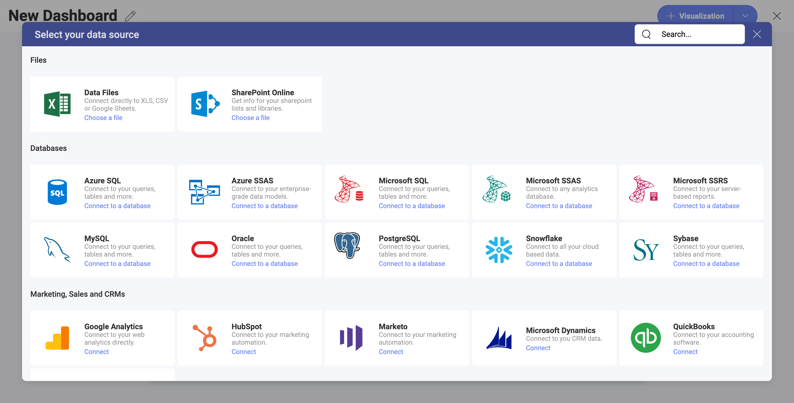
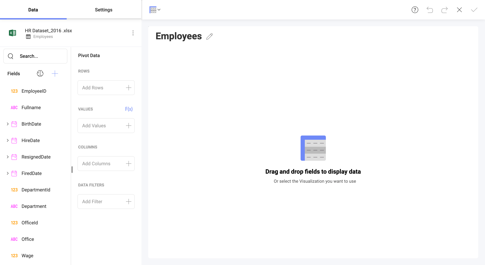
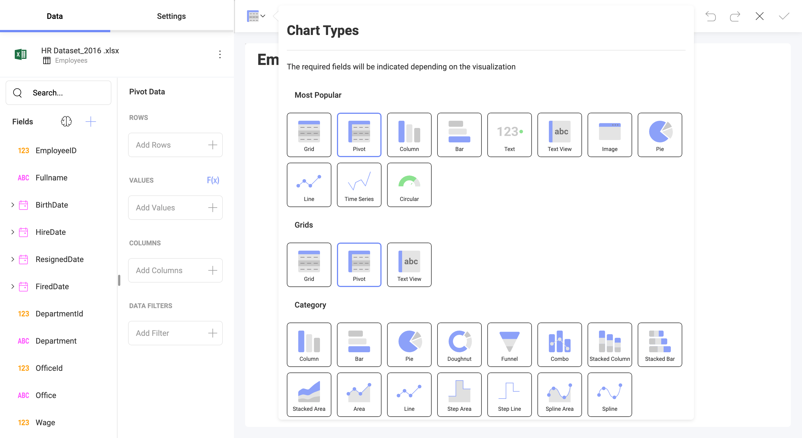
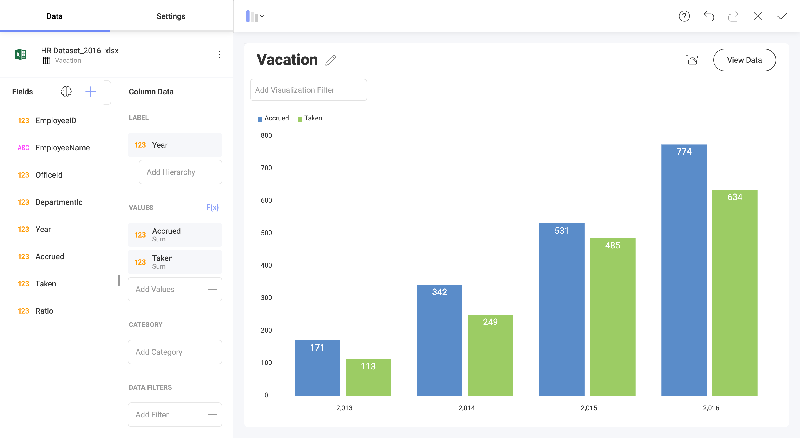
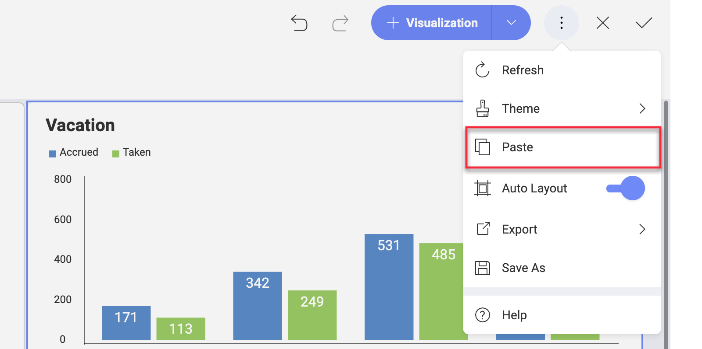
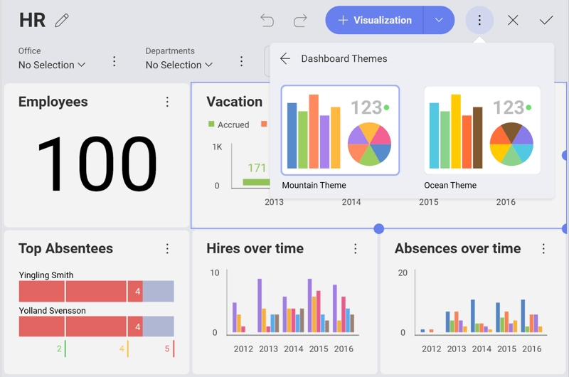
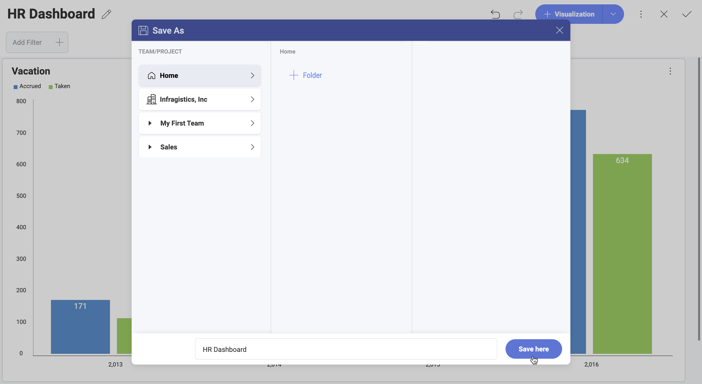

## Creating Dashboards

The dashboard creation experience in Reveal includes:

1.  [Accessing the Dashboard creation menu](#access-dashboard-creation-menu).

2.  [Adding a Data Source](#add-data-source).

3.  *Optional* [Changing the Visualization](#modify-visualization).

4.  [Saving the Dashboard](#save-dashboard).

### Access the Dashboard Creation Menu

To create a dashboard:

1. Go to the  *Dashboards* tab on the left.
2. Select the *+ Dashboard* blue button.
3. This will prompt the *Data Sources* dialog (see below). 

    
    If you are creating a dashboard for the first time, you will only see the *Sample Data* in this Data Sources list. All future data sources you connect or get access to will appear in this list. 
4. Now, you can proceed to create a visualization using a new data source.

### Add a Data Source

If your data source is not in the *Data Sources* list, select the **+ Data Source** button in the top right-hand corner. A new pop-up will display a catalog of data source providers.

Scroll down to explore all the categories. When ready, just click/tap the data source provider you want to connect.

You can find further details on how to connect and configure your data source by reading the topic for the data source provider you need in the [Data Sources section](~/en/datasources/overview.md).

### Changing your Visualization

Once your data source has been added, you will be taken to the Visualizations Editor. By default, the Pivot visualization will be selected.

*Analytics* provides several options to customize the way your information is visualized; you can access the options by selecting the **grid icon** in the top bar.

Add labels and values to your visualization and preview them in the
right-hand pane. If necessary, you can change your visualization's
settings or add filters to it.

Once you have modified the visualization, you will be taken back to the
**Dashboard Editor**. You will see **Undo**, **Redo**, and the **+Visualization** split button on the top right-hand corner. Next to these buttons you will also find the overflow menu of the dashboard where you can choose to change the dashboard theme, switch on/off **Auto Layout**, **export** or **save** the dashboard.

You can also use the overflow menu in the top right corner of the visualizations to rename, edit, **copy** or **duplicate** them.

>[!NOTE]
>The **difference between copying and duplicating** a visualization is that duplicating works only inside the same dashboard and the copy option allows you to put the visualization in the same or a different dashboard.

After copying a visualization, find the _Paste_ option inside the overflow menu of the dashboard you want to paste the visualization in.

#### Applying a Theme

Once you have continued to your dashboard, you can select the overflow
menu ⇒ *Theme* and switch between *Mountain Theme* and *Ocean Theme* as
shown below.

### Save the Dashboard

Once your dashboard is ready, save it by either selecting the **check mark** icon  in the top right-hand corner or by accessing the  **Save As**
option in the overflow  menu.

You can save your dashboard in your personal repository, or choose any
workspaces you have [joined or created](~/en/docs/workspaces/Creating-Joining-Teams.md).
Select a name for your dashboard, and, when ready, click/tap **Save here**.

To better organize your space you can **create folders** in the
Dashboard Viewer by clicking on the *+Folder* button at the top
right-hand corner, while in the *Save as* menu.
