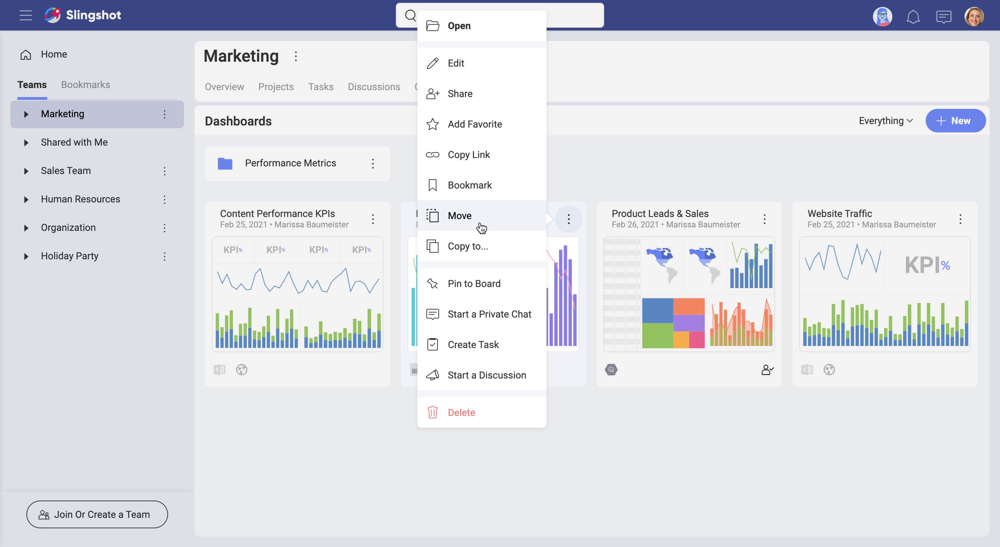
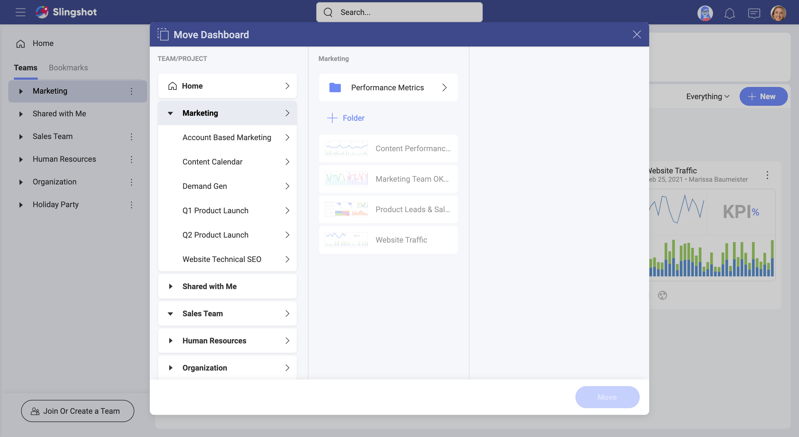

# Managing Your Dashboards

Whether you are trying to manage dashboards in your personal space or in
a Workspace, Analytics provides you with a variety of tools to do this. Continue reading to learn how to filter, organize, view, move or copy dashboards to any workspace. 

## Filtering Your Dashboards Lists

Over time you may gather a substantial number of dashboards in your or your workspace's  *Dashboards* section. To navigate easier and find quickly the dashboards you need, you can apply filters.  

To do this, select the  filter icon on the top right. Here you can choose to filter by: 

- **title** - you will be shown only the dashboards that contain it their title the word(s) you typed; 
- **creator** - you will see only dashboards created by the users you selected; 
- **modifier** - you will see only dashboards modified by the users you selected; 
- **modified date** - you will see only dashboards modified on the date or during the period you selected.

>[!NOTE] If the filter icon is colored black , this means a filter is already applied. If you want to see all your dashboards, click/tap the icon and select the *Clear* button to remove any filtering. 

## Organizing Your Dashboards

Analytics allows you to store and organize your dashboards in different
**sections** and **workspaces**. In order
to create your first folder, open the *overflow* menu (see below) and then choose **Folder**.

You will only need to name your folder and click/tap *+ Create* to start adding dashboards in your new folder.  

## Moving or Copying Dashboards

Open the dashboard’s overflow menu actions and choose to move or copy
the dashboard between **folders** and/or **workspaces**.

In the **Move Dashboard** and **Copy Dashboard To** screens, you can choose two types of destinations for your dashboards to move/copy to:
  - a workspace (on the left)
  - a folder (top center).

