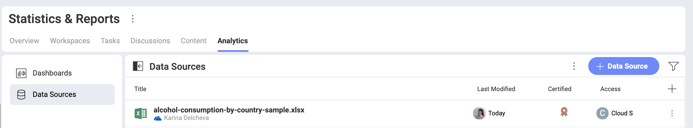
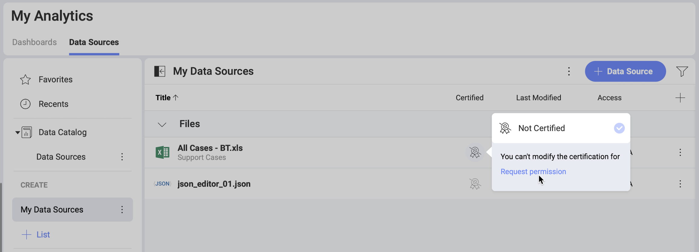

# Using Data Sources Certification

If you are part of an [Organization](~/docs/workspaces-faq.html#organization-vs-workspace-vs-sub-workspace) in Slingshot, you may find that some of the data sources in your lists are certified. Certification in *Analytics* helps the Organization owners guide their users which data sources are reliable and contain only verified information. 

Below, you will learn how to recognize certified data sources, what certification levels are available in Slingshot, who can certify and how. 

## Who Is This Topic for? 

Certification in *Analytics* is only available for users who have an   Organization in Slingshot. 

If you are a user with a [personal account](~/docs/roles-permissions-faq.html#what-about-users-with-no-organization), you will not be able to use certificates for your data sources. However, if you are invited in workspaces that are part of an Organization, you will be able to see certified data sources in these workspaces' *Analytics*. 

## Finding the Certified Data Sources

In the *Data Sources* of a workspace, you will find both certified and uncertified data sources. When a data source is certified, you will see a gold, silver or bronze colored badge next to it (see the screenshot below). 

If you don't see whether a data source is certified or not, select the plus icon  at the right top of the data sources list. Make sure the box for the _Certified_ column is checked.  

## Who Can Certify Data Sources?

Certification helps users find the data that is recommended and verified by their organization. That's why **certifiers** can be: 

*  Organization owners; 
* any user who is authorized by an Organization owner. 

To see who can certify data sources: 

1. Open the Organization workspace settings by selecting the three dots  next to it.
2. Select *Organization Settings*. 
3. Go to _Data Catalogs_. 

Here you will find the three certification levels, their names and the users that can certify.

If you are an *owner* in the Organization, you can: 

* assign yourself as a certifier to any certification level;
* add other users as certifiers - you can assign owners, members, viewers and even a user outside of your Organization;
* rename the certificates. By default, the certification levels are "*gold*", "*silver*" and "*bronze*". You can give them more descriptive names such as "Sales", "Marketing", "RND", etc.  

Users who are not owners, can request permission to become certifiers. To do this: 

1. Go to the Data Sources list in any workspace.
2. Select the badge in the _Certified_ column of any data source. 
3. Click/tap _Request Permission_ (see the screenshot below).

    

An email will be sent to all Organization owners notifying them that the users ask to be authorized to certify data sources. 

## Certifying Data Sources

Each data source can be certified individually in the workspace where it is added. To certify a data source:

1. Go to the  *workspace* where you can find the data source. 
2. Select the *Analytics* tab. 
3. Select  *Data Sources* on the left.
4. Click/tap the  crossed out *badge icon* for the data source you want to certify and choose a badge from the dropdown. 

The certificates are hierarchical. This means that certifiers who can certify data sources as  *gold* will also see the  *silver* and  *bronze* badges available in the dropdown. And *bronze* certifiers will only see the bronze badge available. 

>[!NOTE] Keep in mind that if two data source in two workspaces are named the same, the certifier has to certify them in each of the workspaces individually. The certificate is not transferred automatically because the certifier has to first make sure both data sources contain the same information.

## Moving and Copying Data Sources

When you move a certified data source from one workspace to another, the certificate will be kept in the destination workspace. 

When you copy a certified data source from one workspace to another, the certificate will be lost. This gives you the opportunity to modify the data source in the destination workspace. You can have it certified later if it still meets the certification criteria in your Organization.

## Defining the Certification Criteria

As the certification in *Analytics* is flexible, it is up to you to define your own certification criteria. You can decide what the gold, silver and bronze badge mean to your Organization and data sources. Just keep in mind they are hierarchical as their names suggest and the hierarchy goes this way: *gold* > *silver* > *bronze*. You can also set new names. 

>[!Tip] **Pro Tip!** Don't forget to write down the guidelines and distribute them among the users in your Organization! Pin the Guidelines document to your Organization *Content* for more visibility. 

