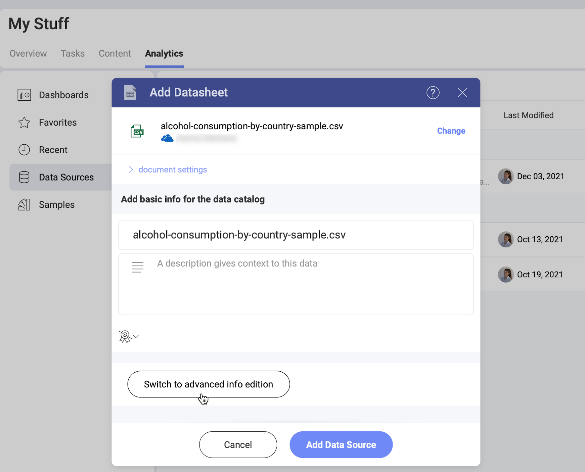
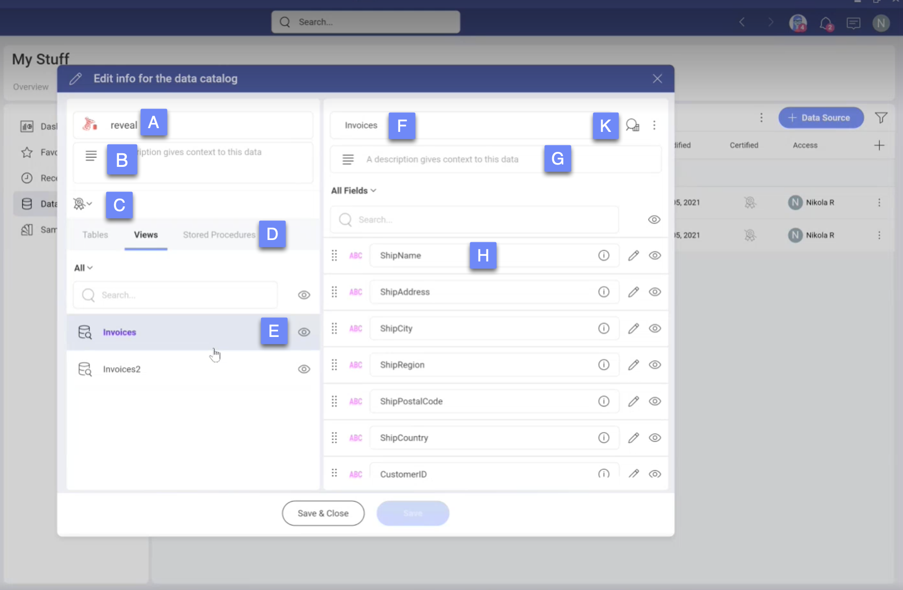
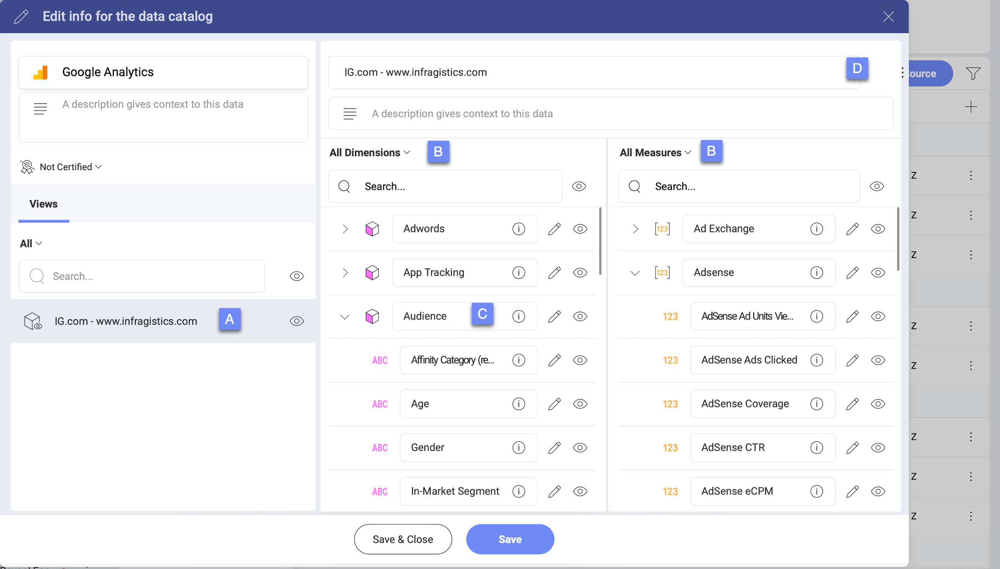
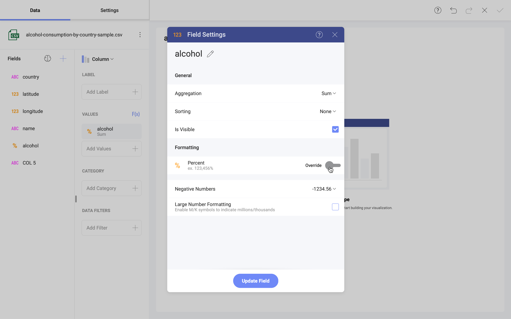

# Advanced Information Editing for Data Sources

The Advanced editor in Slingshot will improve how you and your teams work with large datasets. It allows you to modify the metadata of your data sources. *Metadata* is information about the data sources such as which datasets they contain, their data fields' types and descriptions, last modified date, etc. 

Using the Advanced Editor will help you organize your data sources so that you will be able to:

* quickly find the data you need for your visualizations by hiding irrelevant datasets; 

* make the data easy to understand by editing or adding descriptions for data fields; 

* automate repetitive actions or avoid confusion by changing the default type of a data field.

Continue reading to learn who can edit the data sources' metadata and how. 

>[!NOTE] You cannot edit some data sources due to  [limitations](#advanced-editing-limitations) related to their type or [certification](certification.md).

## Accessing the Advanced Editor for Data Sources

You can access the Advanced Editor for Data Sources: 

- before, or 
- after adding a new data source to a  Data Sources list.

Right before completing the process of adding a new data source, you can access the Advanced Editor by selecting the *Switch to advanced info edition* button (see below).

To open the Advanced Editor of data sources that are already added in the  *Data Sources* list, follow the steps below. 

1. Select the  overflow menu next to the data source.
2. Choose  *Edit info for the data catalog* from the dropdown. 

You may need to provide username and password for the selected dataset before you continue to the Advanced Editor. 

## Who Can Use the Advanced Editor?

Check the table below to find out who can use the Advanced Editor of the data sources in a workspace and in the Organization. 

|            | In the  Organization | In a  Workspace |
| :----------: | :----------------------------------------------------------------------------------------------------------------------: | :----------------------------------------------------------------------------------------------------------------------------: |
| **OWNER**  | :white_check_mark:                                                                                                     | :white_check_mark:                                                                                                           |
| **MEMBER** | :x:                                                                                                                    | :white_check_mark:                                                                                                           |
| **VIEWER** | :x:                                                                                                                    | :x:                                                                                                                          |

The table shows that the owners can use the Advanced Editor to modify data sources both in the Organization and in a workspace. The viewers have no permissions to modify data sources so they can't access the Advanced Editor. 

Need more information about user roles in Slingshot? Check the [Roles & Permissions](~/docs/roles-permissions-faq.md) topic.

### Who Can Use the Advanced Editor of a Certified Data Source?

The _Certified_ column on the right of your data sources shows if they are certified or not. For certified data sources you will see one of the three badges:  gold,  silver or  bronze. A crossed out badge  means the data source is not certified. 

**Only certifiers** can use the Advanced Editor and modify certified data sources. The hierarchy of the certification goes this way: gold > silver > bronze. This means that gold certifiers can modify all certified data sources, and bronze certifiers can modify only bronze certified data sources.

>[!NOTE] If you don't see the _Certified_ column on the right, select the plus icon  at the top of the data sources list. Make sure the box next to _Certified_ is checked.  

## Working with the Advanced Editor 

When you open the Advanced Editor, you will notice there are a lot of elements you can modify and information you can add, show or hide. The Advanced Editor is different for the table data sources and the cube (multidimensional) data sources. That's why we will look at each of them separately. 

### The Advanced Editor for Table Data Overview

Most of the data sources in Analytics contain table data.

Let's take a look at the screenshot showing the Advanced Editor of a Microsoft SQL data source. 

> this screenshot is just an example containing all the elements of the Advanced editor; it's better to use a data source that contains both text and numeric data fields. 

A. The data source's **icon** and **title**. You can rename the data source. 

B. A **description** box. If you add text here, it will appear right under the data source in the data sources list. 

C. **[Certification](certification.md)** status. The badge icon shows if the data source is certified or not. If you are a certifier, you can select the icon and change the certification status.

D. The **dataset types** in your data source. These could be, for example, sheets, views, stored procedures, databases, entities, etc. You can switch between the objects. 

E. A **list of datasets** you can edit. Select the dataset to see and modify the fields it contains. 

F. The dataset's **title**. You can rename the dataset. 

G. The dataset's **description**. The description will appear under the dataset's name in the data source details. It will help users decide which dataset to choose for their visualizations. 

H. All the available **data fields** in the selected dataset. By hovering over the   info icon, you will find out about a field's name, description, records in the first five rows, and original name and description. You can modify the information about each field - read below for more details. You can reorder the fields by dragging the dotted area next to each field. 

K. **Preview** of the data table. The preview shows the first 15 rows of the data table. There are two tabs in the preview: 
    
* *Catalog info* - shows a preview of the data table in its latest state;
* *Original* - shows the original data table before any changes made with the Advanced editor. 

### The Advanced Editor for Data Cubes

The data sources in Analytics, which contain data cubes are: 

- [Azure SSAS](supported-data-sources/microsoft-azure-analysis-services.md);
- Microsoft Analysis Services;
- [Google Ads](supported-data-sources/google-ads.md); 
- [Google Analytics](supported-data-sources/google-analytics.md).

Unlike table data sources, data cubes enable data to be modeled and viewed in multiple dimensions. This requires some differences in the organization of the advanced editor for data cubes. 

Let's take a look at a screenshot showing the advanced editor of a *Google Analytics* data source. 

> This screenshot is an example. If you want to use it as a final screenshot, make sure "Infragistics" is blurred or edited. 

A. A **list of data cubes** available . Select the dataset to see and modify the data it contains. 

B. Dimensions and Measures are separated in **two data columns** for easier navigation. 

C. All the available **data** in the selected data cube. You can see and modify the information of all dimensions, measures and of each element inside a dimension/measure. Hovering over the   info icon, will show you the "unique name of the element", and a description of the dimension/measure. You can modify this information. You can't reorder the elements.

>[!NOTE] **Google Analytics data sources specifics**. Hierarchies inside the dimensions are not shown, the elements are shown individually in the advanced editor. A "unique name of the element" is not available. The descriptions of the elements are the default descriptions from Google Analytics. 

D. **Data preview is not available** for cubes. 

All other elements you see in the screenshot above are common for the advanced editor for data cubes and table data sources.  

### Hiding Data with the Advanced Editor 

The hiding capability is really useful for teams that deal with huge amounts of data. If this data is spread over, let's say, hundreds of spreadsheets, but you usually use only two of them for your visualizations, why digging them up every time? Hiding all unnecessary sheets in the excel file will boost your team's productivity. 

The Advanced Editor allows you to hide: 

- entire data tables and data cubes; 
- individual data elements such as text and numeric fields, dimensions and measures. 

If you see the eye icon next to a data element, this means you can hide it by selecting the icon. If you see the closed eye, this means the element is already hidden. 

### Editing Data with the Advanced Editor

Select the  pencil icon next to a data field or a dimension or measure element. This will open the field settings on the right. 

> a screenshot showing the **Field settings** dialog for a text field

In the *Catalog info* tab, you will be able to change the name and the description of the data field. Switch to the *Original* tab to see the name and description of the field before any changes made with the Advanced Editor. 

>[!NOTE] You can search for a data field both by its original and current name. 

Data tables, cubes and fields that contain modified information are colored in <b>purple</b>. 

### Changing the Default Formatting of Numeric Data

Select the  pencil icon next to numeric data to quickly change the default format from *Number* to *Currency* or *Percent*. You can also modify *fraction digits* number and choose to apply the *1000 separator*.

After changing the formatting, the data table or data cube that contain the numeric data will be colored in <b>purple</b>. 

The icon in front of the numeric field will also change to a currency symbol or percent sign accordingly. This change will be visible in the Visualization editor as well (see below).

If necessary, you can once again change the default formatting of the field when using it in the *Visualizations editor*. To do this, drag the field to the *Values* placeholder and click/tap to open the *Field Settings* dialog (see below). 
> the screenshot is just a quick example

Select the *Override* toggle to be able to modify the formatting settings. 

>[!NOTE] If the data source is certified, only certifiers can change and override the default formatting of numeric data. 