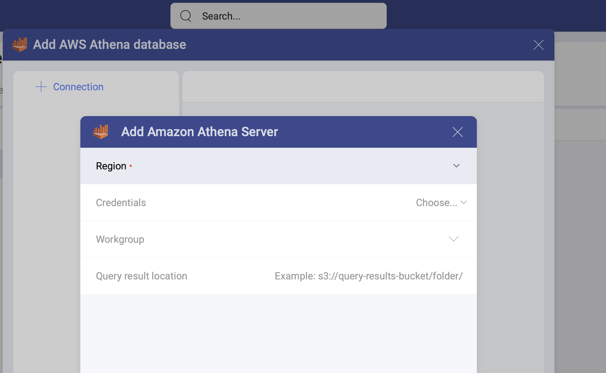
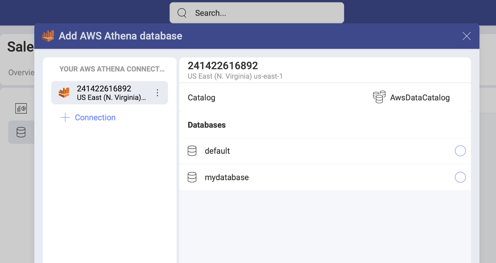
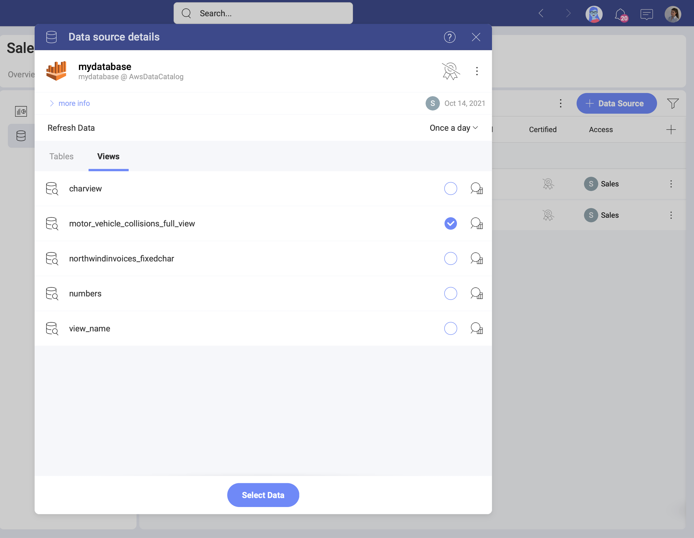

# Amazon Athena 

The Amazon Athena data source in Reveal allows you to access and query unstructured data stored in [Amazon S3](amazon-s3.md), and use it for your visualizations.  

## Adding a New Amazon Athena Data Source

If you have already added your Athena data source to the  *Data Sources* list, you can skip this part and continue with [Setting Up Your Data](#setting-up-your-data).

To add an Amazon Athena data source to your list, follow the steps described below.

1. Go to the  Data Sources tab > select the *+ Data Source* blue button > scroll down to *Big Data Storages* > select *Amazon Athena*. 

2. A new dialog will open (see the screenshot) where you will need to add the following data to connect to your Athena server:

    
   
    a. **Region**: Amazon regions are listed with their names and codes in the dropdown. Choose the one where the data you need is located. 

    b. **Credentials**: here you will be asked to provide the root or IAM user credentials: 
   
      * *Access Key*
      * *Secret Key* 

   Add your credentials and click/tap the _Create and Use_ blue button. Upon successful connection, you will be returned to the previous dialog where *Workgroup* and *Query result location* become available to configure too. 

   For more information about the AWS credentials, please take a look at this [Amazon article](https://docs.aws.amazon.com/general/latest/gr/aws-sec-cred-types.html).
   
   c. *(Optional)* **Workgroup**: choosing one of your workgroups from the dropdown is *optional*. If you don't specify a workgroup, then the *primary* workgroup (which is the default workgroup in your Athena account) will be automatically selected. 

   d. *(Optional)* **Query result location**: this is the directory in *Amazon S3* where the results of your query will be stored. You need to provide a valid *S3* path, e.g.: *s3://query-results-bucket/folder/*. If you don't explicitly specify the path in this dialog, the results will be stored in the output location specified in the selected/default workgroup. If there is no output location created in the workgroup, your Athena query will fail.

   >[!NOTE] If you have specified your Query result location (QRL) in Slingshot, but you can't find your output in this location, please check  your workgroup configuration in Athena for settings that prevent you from using custom QRLs. For more information, take a look at [Specifying a Query Result Location](https://docs.aws.amazon.com/athena/latest/ug/querying.html#query-results-specify-location) in Athena's documentation. 

3. Adding a database. After configuring your Athena Server, you will be prompted to choose a database, that will be added in your   Data Sources list. 

    
If you want to add another Amazon Athena server, you can quickly do this by clicking/tapping the  *+ Connection* button on the right (see above).

### Editing the data source information 

In the last dialog that opens, you can change the original database name and add a description. Both will be shown in the Data Sources list to help users choose the source of data they need for their visualization. 

If you are a certifier in your Organization, you can also certify the data source by selecting the  badge certificate dropdown. If you want to know more about the certification in Analytics, read the [Using Data Sources Certification](~/docs/analytics/datasources/certification.md) topic.

If you want to additionally edit what tables, views and data sets other users can see and work with, click/tap the _Switch to advanced info edition_ button. Find more information in the [Editing the information for a data source](edit-data-sources.md) topic.  

When ready, select _Add Data Source_.

## Setting Up Your Data

Now that you have added your Amazon Athena database, you will see it in the  Data Sources list. If you have more than one Amazon Athena database added, select the database you want to use. You will open the *Data Source details* dialog, which allows you to review and set up your data (look at the screenshot below). 

Here you will find the following information about the data source:

* type and name; 
* description; 
* [certification](../certification.md);
* who added the data source; 
* who modified it last and when; 
* who (users and workspaces) has access to it; 
* how often the data is auto-refreshed. 

Here, you need to choose from the *tables* and [*views*](https://docs.aws.amazon.com/athena/latest/ug/views.html). Click/tap _Select Data_ to continue to the Visualizations Editor. 

In the screenshot above, the **motor_vehicle_collisions_time** view contains a modified version of the data in the **motor_vehicle_collisions** table in Athena. 
In the screenshot below, the visualization on the left is built with the data in the table, and the one on the right uses the data contained in the view.  

