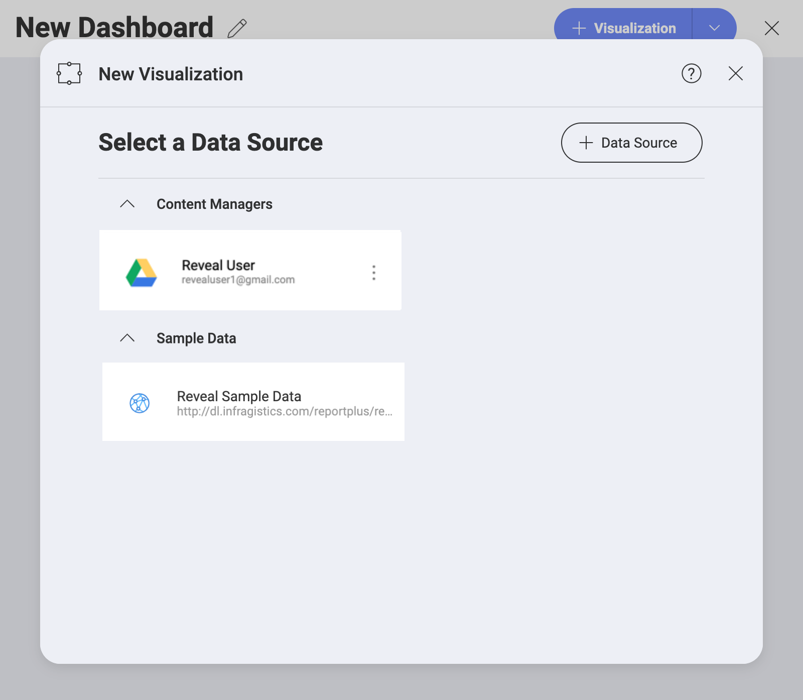

# Google Drive

If you are signed in with your Google account, you will have your Google
Drive automatically added to your data sources:

To use your Google Drive data, follow the steps below.

1.  After selecting your Google Drive (or a folder inside it), you will
    see the log in prompt. Enter your **login credentials** or choose a Google account (if available).

2. Authorization is always required the first time you connect. In the **authorization prompt**, select *Allow* to authorize Reveal to use (see, edit, create, and delete) your Google Drive files.

You can now use your Google Drive data to build your visualizations.

## Supported Files

When working within Reveal, you will be able to use a wide variety of
files:

  - **Spreadsheets & tabular data**: Excel (.xls, .xlsx), CSV, TSV, which you can use
    dynamically within Reveal.

  - **Other files** (including images or document files such as PDFs,
    texts, etc.), which will be displayed in a preview mode only.
