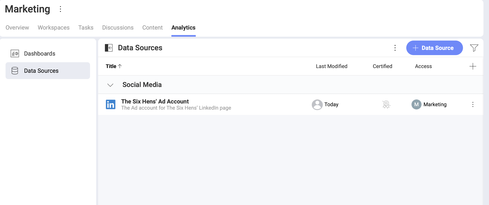

# LinkedIn

The *LinkedIn* data source connector in *Analytics* allows you to bring your LinkedIn marketing data to Slingshot. See below how to connect and configure the data from your *LinkedIn Ad account* data to use it for insightful dashboards on your social media performance.

## Prerequisites

To add a *LinkedIn* data source in Analytics, you need to have at least one active [LinkedIn Ad account](https://www.linkedin.com/help/linkedin/answer/a426102/create-an-ad-account?lang=en).
## Adding a New LinkedIn Data Source 

To add a *LinkedIn* data source to your  *Data Sources* list, follow the steps described below.

1. Go to the  Data Sources tab > select the *+ Data Source* blue button > scroll to *Social Media* > select  *LinkedIn*. 
2. You will be prompted to log in with your *LinkedIn* profile and you might be asked to re-enter your LinkedIn password.
3. Slingshot will get access to the relevant details in your account.
4. In the next dialog, you need to choose a  *LinkedIn* Ad account. that is connected with the LinkedIn page you want to analyze.
5. Click/tap _Select and Continue_. 
6. In the last dialog that opens, you can change the original Account name and add an appropriate description as shown below. Adding appropriate descriptions helps all users navigate through long lists and find the data sources they are searching for. 
7. Select _Add Data Source_. 

You will find your new LinkedIn connection at the bottom of your Data Sources list.

