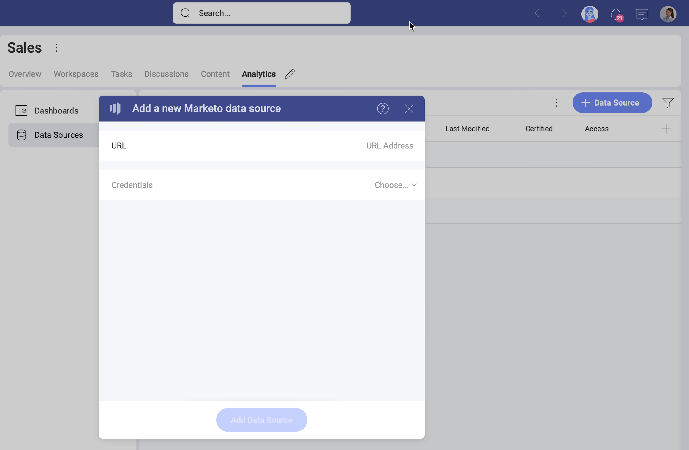
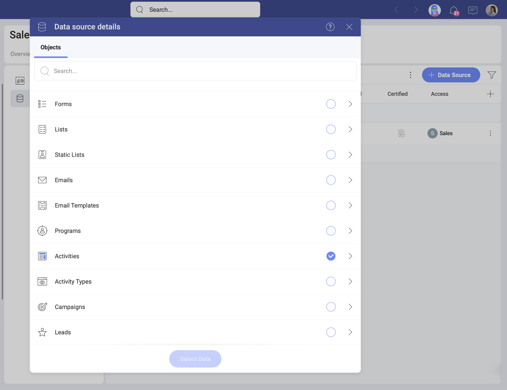

# Marketo 

The *Marketo* data source connector in *Analytics* allows you to bring your marketing data from Marketo to Slingshot. Use your *Marketo* account data to create insightful dashboards and measure your business' marketing performance.

## Adding a New Marketo Data Source Account

If you have already added your Marketo data source to the  *Data Sources* list, you can skip this part and continue with [Setting Up Your Data](#setting-up-your-data).

To add a *Marketo* data source to your list, follow the steps described below.

1. Go to the  Data Sources tab > select the *+ Data Source* blue button > scroll down to *Marketing, Sales and CRMs* > select *Marketo*. 

2. A new dialog will open (see the screenshot) where you will need to add the following data to connect to Marketo:

    

    Marketo’s REST APIs are authenticated with 2-legged OAuth 2.0, so you need to complete the following information to configure your connection:

      a. **URL** - paste here the *Identity URL* you will find in your Marketo Admin panel. 

      b. **Client ID** 

      c. **Client Secret**

    Your *Admin* panel in Marketo contains the authentication elements listed above. For more information on how to find them, check the article about [Authentication](https://developers.marketo.com/rest-api/authentication/) in Marketo's documentation. 

    >[!NOTE]If you need details about how to create the OAuth credentials you need from Marketo to connect, see the article about [Custom Services](https://developers.marketo.com/rest-api/custom-services/?_fsi=oP2ZRHsM) in Marketo's docs. 

3. Click/tap _Add Data Source_ when ready. 

### Editing the data source information 

The dialog that opens after you add your Marketo connection allows you to change the original name and add a description to your connection. Both will be shown in the Data Sources list (your Data Catalog) to help users choose the source of data they need for their visualization. 

If you are a certifier in your Organization, you can also certify the data source by selecting the  badge certificate dropdown. If you want to know more about the certification in Analytics, read the [Using Data Sources Certification](~/docs/analytics/datasources/certification.md) topic.

If you want to additionally edit what *Marketo* objects other users can see and work with, click/tap the _Switch to advanced info edition_ button. Find more information about this in the [Editing the information for a data source](edit-data-sources.md) topic.  

When ready, select _Save and Close_. Selecting _Save_ will allow you to set up your data.

## Setting Up Your Data

Now that you have added your Marketo data source, you will see it in the  Data Sources list. By selecting your Marketo connection, you will open the *Data Source details* dialog, which allows you to review and set up your data (look at the screenshot below). 

Here you will find the following information about the data source:

* type, name, description; 
* [certification](../certification.md);
* who added, modified and has access to the data source
* how often the data is auto-refreshed. 

To configure your Marketo data, you need to 
select from the *Objects* list in this dialog. 

Click/tap _Select Data_ to continue to the Visualizations Editor.

*Activities* and *Leads* objects require you to set two parameters before you can continue - *from* and *to* (dates) to query the data. The date range must be no more than 31 days, incl. the first and the last day. To set the parameters, click the arrow on the right of the chosen object.

When you are ready, the _Select Data_ button at the bottom will become available to click.

> [!NOTE]
> Please, note that you may need to wait up to several minutes until your data from the *Activities* and *Leads* objects is loaded in the *Visualization Editor*.  
