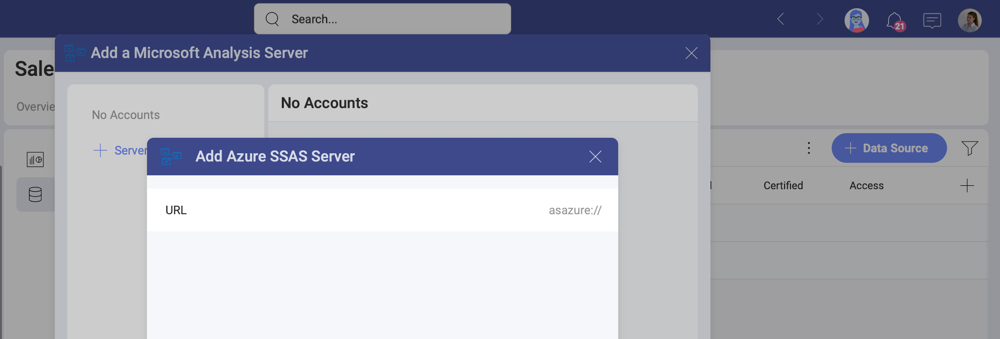
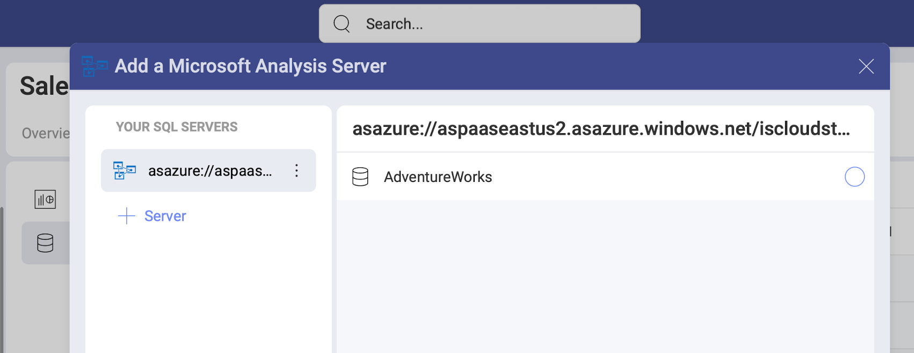
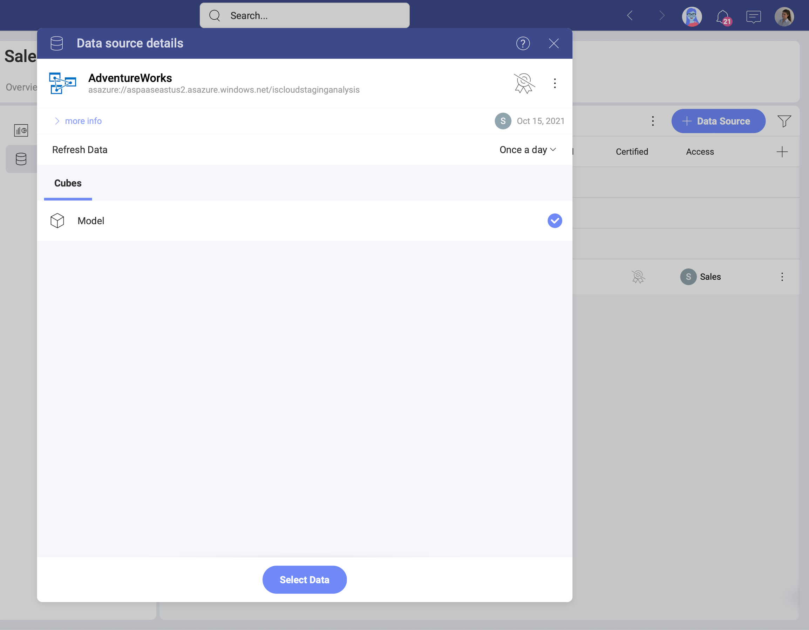

# Azure SSAS

Azure SSAS (also known as Microsoft Azure Analysis Services) is a fully managed platform as a service (PaaS) that provides enterprise-grade data models in the cloud. Now, you can use the Azure Analysis data models in Analytics to create dashboards and perform data analysis.

## Before You Start

Unlike other databases used in Slingshot's Analytics (Microsoft Analysis Services, MySQL, Oracle, etc.), MS Azure Analysis Services can be used in Reveal Web.

>[!NOTE]
>**Limitations in Web when first connecting to your Azure Analysis Services.**
>Due to security restrictions, the process of initial configuration and authentication of your Azure Analysis Services cannot be done in Slingshot Web. You can initially connect to this data source in the iOS, Android, or Desktop app. After the initial connection, you can create or edit dashboards using data from this Azure Analysis Services with no further limitations.

## Adding a New Azure SSAS Data Source

If you have already added your Azure SSAS data source to the  *Data Sources* list, you can skip this part and continue with [Setting Up Your Data](#setting-up-your-data).

To add an Azure SSAS data source to your list, follow the steps described below.

To configure your Azure Analysis Services data source, you will need to perform the steps below.

1. Go to the  Data Sources tab > select the *+ Data Source* blue button > scroll down to *Databases* > select *Azure SSAS*. 

2. In the new dialog, select the *+ Account* blue button.

    a. You will see Microsoft's log in screen. Enter your log in credentials to continue. 

    b. Provide a _URL_ to your server in the _Add Azure SSAS Server_ dialog:

    

    The _URL_ requested is the full name of the server, which contains the database with the data models you want to connect. You can *copy the server name* from the Azure Portal. To do this, go to:

    *Azure portal* > selected server > *Overview* > *Server name*

    c. Go back to Analytics and paste the server name in _URL_. Click the _Add Server_ button, which is now enabled.  

3. Adding a database. After configuring your Azure Server, you will be prompted to choose a database, that will be added in your   Data Sources list. 

    
    
If you want to add another Azure server, you can quickly do this by clicking/tapping the  *+ Connection* button on the right (see above).

After choosing a database, click/tap _Select and Continue_.

### Editing the data source information 

In the last dialog that opens, you can change the original database name and add a description. Both will be shown in the Data Sources list to help users choose the source of data they need for their visualization. 

If you are a certifier in your Organization, you can also certify the data source by selecting the  badge certificate dropdown. If you want to know more about the certification in Analytics, read the [Using Data Sources Certification](~/docs/analytics/datasources/certification.md) topic.

When ready, select _Add Data Source_.

## Setting Up Your Data

Now that you have added your Amazon Athena database, you will see it in the  Data Sources list. If you have more than one Amazon Athena database added, select the database you want to use. You will open the *Data Source details* dialog, which allows you to review and set up your data (look at the screenshot below). 

Here you will find the following information about the data source:

* type, name, description; 
* [certification](../certification.md);
* who added, modified and has access to the data source
* how often the data is auto-refreshed. 

In the list of *Cubes* you will find ll available semantic models in your database. Select a cube and click/tap _Select Data_ to continue to the Visualizations Editor. 

The _Visualization editor_ will open. Here you will see the data from your model presented in two categories: _Dimensions_, and _Measures_.

*Dimensions* contain qualitative data ("Country", "Name", "Product", etc). *Measures* consist of numeric data.
