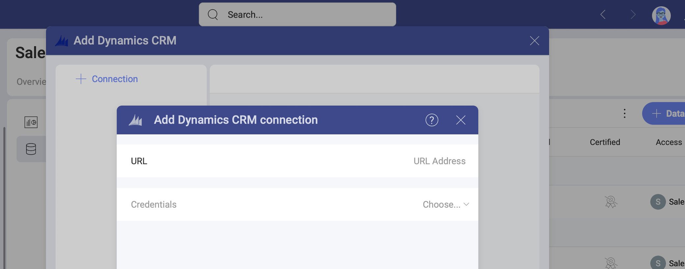
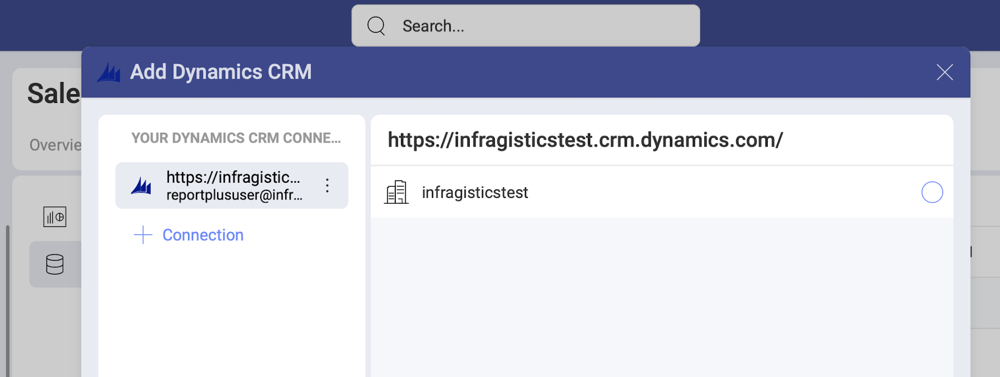
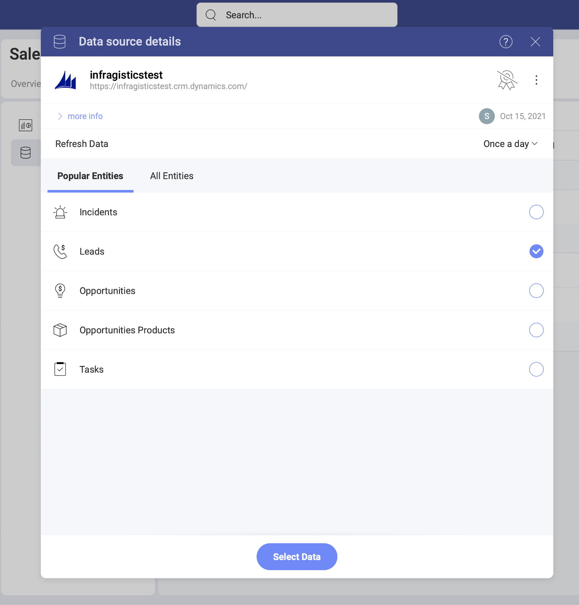

# Microsoft Dynamics CRM

The *Microsoft Dynamics CRM* data source connector in *Analytics* allows you to bring your customer relationship data to Slingshot. 

## Adding a New Microsoft Dynamics CRM Data Source Account

If you have already added your Microsoft Dynamics CRM data source to the  *Data Sources* list, you can skip this part and continue with [Setting Up Your Data](#setting-up-your-data).

To add a *Microsoft Dynamics CRM* data source to your list, follow the steps described below.

1. Go to the  Data Sources tab > select the *+ Data Source* blue button > scroll down to *Marketing, Sales and CRMs* > select *Microsoft Dynamics*. 

2. A new dialog will open (see the screenshot) where you will need to add the following data to connect to MS Dynamics:

    

    a. **URL** the URL for the Dynamics CRM site (for example, <http://crm.YourCompany.local>).

    b.  **Credentials**: after selecting *Credentials*, you will be able to
    enter the credentials for your Microsoft Dynamics CRM site or select
    existing ones if applicable.

      - **Name**: the name for your data source account. It will be
        displayed in the list of accounts in the previous dialog.

      - *(Optional)* **Domain**: the name of the domain, if applicable.

      - **Username**: the user account for the Dynamics CRM website.

      - **Password**: the password for the Dynamics CRM website.

3. Adding an account. After configuring your MS Dynamics CRM connection, you will be prompted to choose an account on the right, that will be added in your   Data Sources list. 

    
    
If you want to add another CRM connection, you can quickly do this by clicking/tapping the  *+ Connection* button on the right (see above).

After choosing a database, click/tap _Select and Continue_.

### Editing the data source information 

In the last dialog that opens, you can change the original database name and add a description. Both will be shown in the Data Sources list to help users choose the source of data they need for their visualization. 

If you are a certifier in your Organization, you can also certify the data source by selecting the  badge certificate dropdown. If you want to know more about the certification in Analytics, read the [Using Data Sources Certification](~/docs/analytics/datasources/certification.md) topic.

If you want to additionally edit which CRM entities other users can see and work with, click/tap the _Switch to advanced info edition_ button. Find more information in the [Editing the information for a data source](edit-data-sources.md) topic.  

When ready, select _Add Data Source_.

## Setting Up Your Data

Now that you have added your Microsoft Dynamics CRM account, you will see it in the  Data Sources list. If you have more than one CRM accounts added, select the account you want to use. You will open the *Data Source details* dialog, which allows you to review and set up your data (look at the screenshot below). 

Here you will find the following information about the data source:

* type, name, description; 
* [certification](../certification.md);
* who added, modified and has access to the data source
* how often the data is auto-refreshed. 

Here, you need to choose from the *Entities* list. Click/tap _Select Data_ to continue to the Visualizations Editor. 