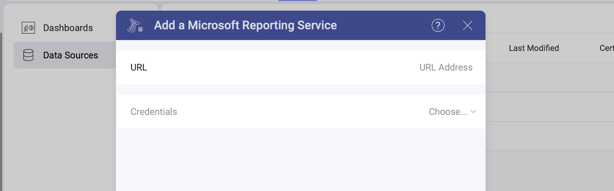
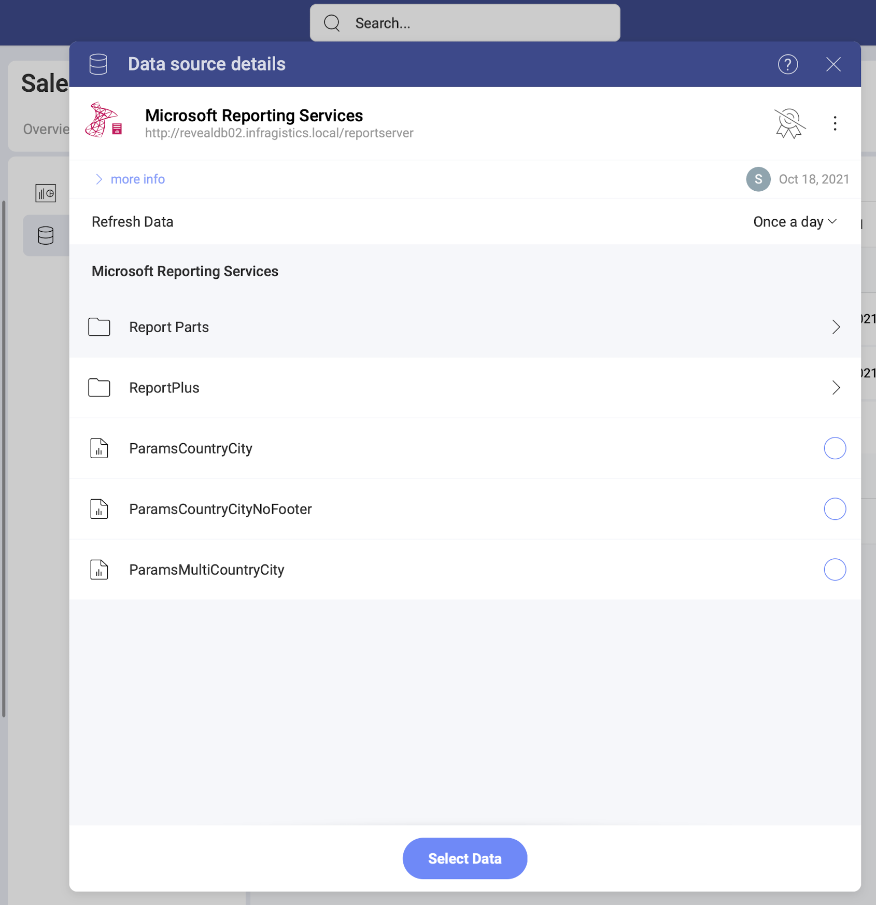

# Microsoft SSRS 

You can use your existing Microsoft SSRS (also known as *Microsoft Reporting Services*) reports in Analytics by embedding them as PDF files in your dashboards or by getting the data from the reports to create a visualization. In this topic, you will find how to use your reports' data directly in Analytics.

## Adding a New Microsoft SSRS Data Source Account

If you have already added your Microsoft SSRS data source to the  *Data Sources* list, you can skip this part and continue with [Setting Up Your Data](#setting-up-your-data).

To add a *Microsoft SSRS* data source to your list, follow the steps described below.

1. Go to the  Data Sources tab > select the *+ Data Source* blue button > scroll down to *Databases* > select  *Microsoft SSRS*.
2. A new dialog will open (see the screenshot) where you will need to add the following data to connect to SSRS:

    

    a. **URL**: the URL to the server.

    b. **Credentials**:  click/tap the *Choose* dropdown. To add new credentials select the *+Credential* button. A new dialog will open. There you will need to enter your *username*, *password* and (optionally) an *alias*. The alias will serve as a label for saved credentials when you have more than one reporting service added. 

3. Select _Continue_.

### Editing the data source information 

In the last dialog that opens, you can change the original Reporting service's name and add a description. Both will be shown in the Data Sources list to help users choose the source of data they need for their visualization. 

If you are a certifier in your Organization, you can also certify the data source by selecting the  badge certificate dropdown. If you want to know more about the certification in Analytics, read the [Using Data Sources Certification](~/docs/analytics/datasources/certification.md) topic.

When ready, select _Add Data Source_.

## Setting Up Your Data

Now that you have added your Microsoft SSRS account, you will see it in the  Data Sources list. If you have more than one SSRS account added, select the account you want to use. This will open the *Data Source details* dialog, which allows you to review and set up your data (look at the screenshot below). 

Here you will find the following information about the data source:

* type, name, description; 
* [certification](../certification.md);
* who added, modified and has access to the data source
* how often the data is auto-refreshed. 

You will notice that the order of reports and folders closely resembles the one in your
Microsoft Reporting Services account.

Depending on your data, you can configure specific **parameters** for your reports by selecting them from a list.

After selecting the parameters for your report, you can choose the format in which the report will load in the *Visualization editor*:

  - *Use it as a PDF* - If you check this box, you will have your report embedded as a PDF document in the visualization editor. You will be able to scroll, zoom, download or print the pdf inside the Visualization editor.

  - *Select Data* - If you select the blue button, your report data will be loaded in the standard format for *Analytics*, providing you with fields to build your visualization.