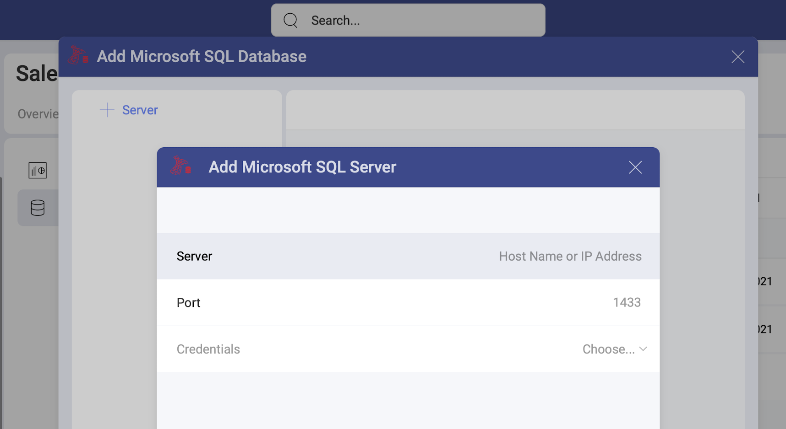
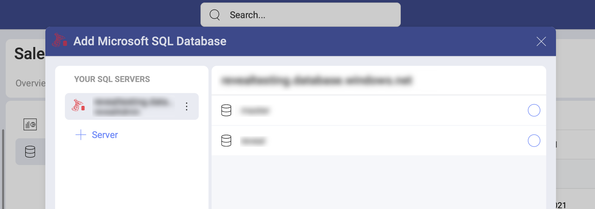
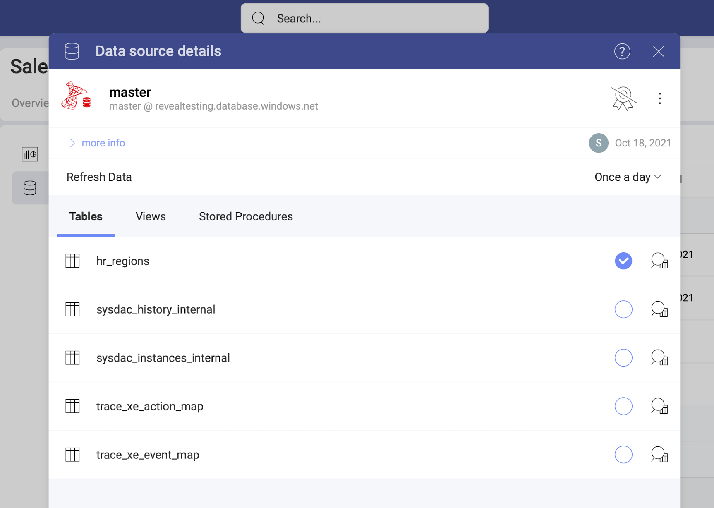

# Microsoft SQL Server

>[!NOTE] **Limitations in Web**. In the *Slingshot Web* app, you can connect only to publicly accessible Microsoft SQL addresses. If your MS SQL address is restricted for the general public (private or hosted in the company's intranet, for example), you can use *Slingshot Desktop*, *iOS* or *Android* to connect to it. The device where you're running the application needs to have access to the SQL Server address. 

## Adding a New MS SQL Data Source

If you have already added your MS SQL server to the  *Data Sources* list, you can skip this part and continue with [Setting Up Your Data](#setting-up-your-data).

To add an MS SQL server to your list, follow the steps described below.

1. Go to the  Data Sources tab > select the *+ Data Source* blue button > scroll down to *Databases* > select  *Microsoft SQL*. 

2. A new dialog will open (see the screenshot) where you will need to add the following data to connect to your SQL server:

    

    a. [**Server**](how-to-find-server.md): the computer name or IP address
    assigned to the computer on which the server is running.

    b. **Port**: if applicable, the server port details. If no information is entered, Slingshot will connect to the port in the hint text (1433) by default.

    c. **Credentials**:  click/tap the *Choose* dropdown. To add new credentials select the *+Credential* button. A new dialog will open. There you will need to enter your *username*, *password* and (optionally) an *alias*, which will serve as a label for saved credentials when you have more than one reporting service added.

3. Select *Add Server*.

4. Adding a database. After configuring your SQL Server, you will be prompted to choose a database, that will be added in your   Data Sources list. 

    

    If you want to add another Microsoft SQL server, you can quickly do this by clicking/tapping the  *+ Server* button on the left (see above).

    After choosing a database, click/tap _Select and Continue_.

### Editing the data source information 

In the last dialog that opens, you can change the original database name and add a description. Both will be shown in the Data Sources list to help users choose the source of data they need for their visualization. 

If you are a certifier in your Organization, you can also certify the data source by selecting the  badge certificate dropdown. If you want to know more about the certification in Analytics, read the [Using Data Sources Certification](~/docs/analytics/datasources/certification.md) topic.

If you want to additionally edit what tables, views and data sets other users can see and work with, click/tap the _Switch to advanced info edition_ button. Find more information in the [Editing the information for a data source](data-sources-advanced-editing.md) topic.  

When ready, select _Add Data Source_.

## Setting Up Your Data

Now that you have added your MS SQL database, you will see it in the  Data Sources list. If you have more than one MS SQL database added, select the database you want to use. You will open the *Data Source details* dialog, which allows you to review and set up your data (look at the screenshot below). 

Here you will find the following information about the data source:

* type, name, description; 
* [certification](../certification.md);
* who added, modified and has access to the data source
* how often the data is auto-refreshed. 

You can choose between the *tables*, [*views*](https://docs.aws.amazon.com/athena/latest/ug/views.html) and Stored Procedures. Click/tap _Select Data_ to continue to the Visualizations Editor. 

### Working with Views

With Analytics, you can retrieve SQL Server data from entire tables, but
you can also select a particular
[view](https://docs.microsoft.com/en-us/sql/relational-databases/views/views?view=sql-server-2017)
that returns a subset of data from a table or a set of tables instead. 

For more information on views and MS SQL Server, visit [this documentation website](https://docs.microsoft.com/en-us/sql/relational-databases/views/views?view=sql-server-2017).

### Working with Stored Procedures

In MS SQL, stored procedures allow users to run a set of query
statements in a relational database with specific parameters. The
following examples are just a set of sample stored procedures running in a test
server with
[Northwind](https://docs.microsoft.com/en-us/dotnet/framework/data/adonet/sql/linq/downloading-sample-databases)
data.

A stored procedure, in the Northwind example, returns the products in the
**Products** table ordered by their **Unit Price**. In this case, the stored procedure requires users to configure the start and end date to display the **Sales by Year** information.

For more information on Stored Procedures and MS SQL Server, visit [this documentation website](https://docs.microsoft.com/en-us/sql/relational-databases/stored-procedures/stored-procedures-database-engine?view=sql-server-2017).

### Limitations for Stored Procedures in Slingshot

  - For stored procedures that return more than one result set, Analytics displays only the first one.

  - [Output parameters](https://docs.microsoft.com/en-us/sql/connect/jdbc/using-a-stored-procedure-with-output-parameters?view=sql-server-2017)
    in stored procedures are ignored.

  - Stored procedures that return no result sets will be listed in the Data Sources list but will fail.
