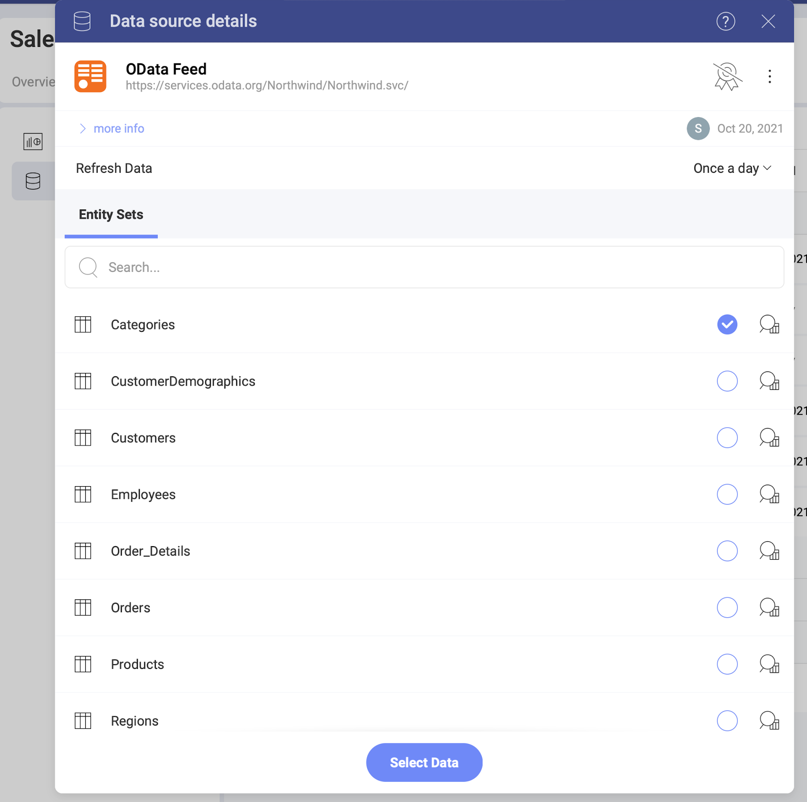
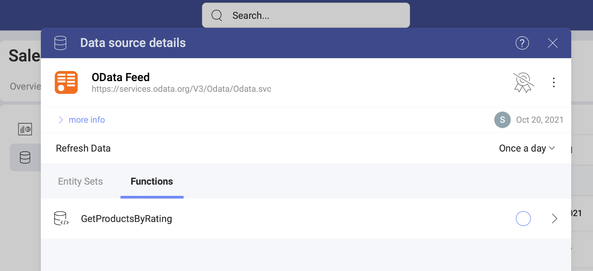
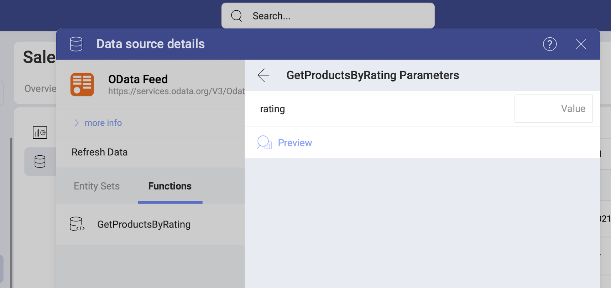

# OData Feed

The *Odata Feed* data source in *Analytics* allows you to connect to an Odata URL and use the underlying data to create insightful dashboards.

## Adding a New OData Feed

To connect to an *Odata Feed*, select the  Data Sources tab > *+ Data Source* blue button > scroll down to *From the web* > select *Odata Feed*. 

In the dialog that opens, you will need to enter the following information:

  a.  **URL**: the URL where the service is located (for example, <http://services.odata.org/Northwind/Northwind.svc> for the Northwind OData Test Service).

  b. *(optional)* **Credentials**: after selecting *Credentials*, you will be able to enter the credentials for your OData Service or choose existing ones if applicable. You can also provide [OAuth 2 / OIDC account credentials](~/en/datasources/OAuth-2-OIDC-User-Authentication.md).

Once ready, select *Add Data Source*.

### Editing the data source information 

The dialog that opens after you add your *Odata Feed* connection allows you to change the original name and add a description to your connection. Both will be shown in the Data Sources list (your Data Catalog) to help users choose the source of data they need for their visualization. 

If you are a certifier in your Organization, you can also certify the data source by selecting the  badge certificate dropdown. If you want to know more about the certification in Analytics, read the [Using Data Sources Certification](~/docs/analytics/datasources/certification.md) topic.

If you want to additionally edit what *Odata Feed* Entity sets other users can see and work with, click/tap the _Switch to advanced info edition_ button. Find more information about this in the [Editing the information for a data source](data-sources-advanced-editing.md) topic.  

When ready, select _Save and Close_. Selecting _Save_ will allow you to continue to setting up your data.

## Open Type Columns

Analytics supports OData feeds with dynamic [*open type*](https://docs.microsoft.com/en-us/aspnet/web-api/overview/odata-support-in-aspnet-web-api/odata-v4/use-open-types-in-odata-v4)
columns. After any changes to the dynamic OData feed, you only need to refresh the dashboard, and the new data will be picked up. After the refresh, the dashboard will display the new records.

For more information on Open Types in OData, refer to [this article](https://docs.microsoft.com/en-us/aspnet/web-api/overview/odata-support-in-aspnet-web-api/odata-v4/use-open-types-in-odata-v4).

## Setting Up Your Data 

Now that you have added your Odata feed, you will see it in the  Data Sources list. By selecting your Odata connection, you will open the *Data Source details* dialog, which allows you to review and set up your data (look at the screenshot below). 

Here you will find the following information about the data source:

* type, name, description; 
* [certification](../certification.md);
* who added, modified and has access to the data source
* how often the data is auto-refreshed. 

### Working with Functions 

Not only *Entity Sets*, but any functions you have configured to be exposed by an OData service will
appear under the **Functions** tab next to the *Entity Sets*.

Depending on your function, you might need to enter one or more values
to get your data. The V3 OData sample includes the following sample function, where you have to enter a **rating** value to get results. Select the arrow on the right of the function, to open the *parameters* dialog shown below:

In this dialog, you can also *preview* the data for the new parameter value. 
Once ready, the Visualizations Editor will load the fields in the data source, which meet the function condition.

For more information on *OData* functions, please refer to [this article](https://docs.microsoft.com/en-us/aspnet/web-api/overview/odata-support-in-aspnet-web-api/odata-v4/odata-actions-and-functions).
