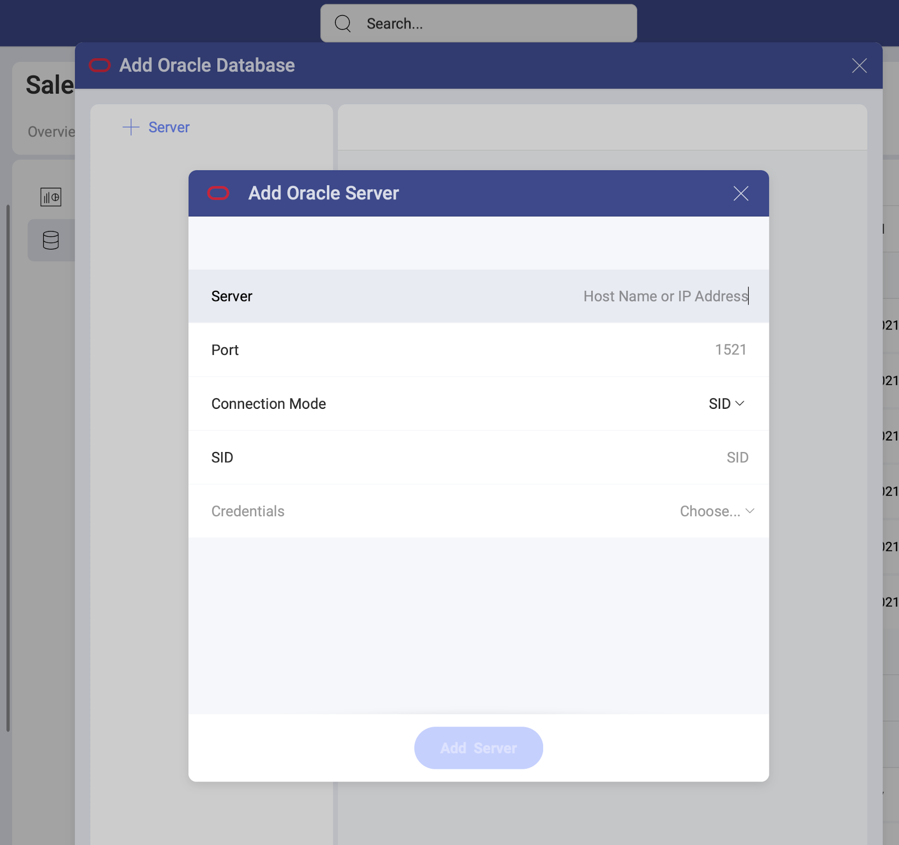

# Oracle

>[!NOTE] **Limitations in Web**. In the *Slingshot Web* app, you can connect only to publicly accessible Oracle addresses. If your Oracle address is restricted for the general public (private or hosted in the company's intranet, for example), you can use *Slingshot Desktop*, *iOS* or *Android* to connect to it. The device where you're running Slingshot needs to have access to this Oracle address. 

There are two modes you can use to connect to Oracle depending on your
database's settings:

  - [**Using SID**](#using-sid): the unique name of your Oracle database
    instance.

  - [**Using Service**](#using-service): the alias used when connecting
    to the database instance.

## Adding a New Oracle Data Source

If you have already added your Oracle data source to the  *Data Sources* list, you can skip this part and continue with [Setting Up Your Data](#setting-up-your-data).

To add an Oracle data source to your list, follow the steps described below.

1. Go to the  Data Sources tab > select the *+ Data Source* blue button > scroll down to *Databases* > select *Oracle*. 

2. A new dialog will open (see the screenshot) where you will need to add the following data to connect to your Oracle server:

    

## Connecting to Oracle Using SID

To configure Oracle using SID, you will need to enter the following
information:

1. 1.  **Default name** of the data source: Your data source name will be displayed in the list of accounts in the previous dialog. By default, Slingshot names it *Oracle*. You can change it to your preference.

1.  [**Server**](#how-to-find-server): the computer name or IP address
    assigned to the computer on which the server is running.

2.  **Port**: if applicable, the server port details. If no information
    is entered, Slingshot will connect to the port in the hint text (1521)
    by default.

3.  **Connection Mode**: SID.

4.  **SID**: the unique name of your Oracle database instance. By
    default, the SID for Oracle is orcl. To find your SID, log into
    Server Manager and type select instance from v$thread. This will
    return your ORACLE\_SID.

5.  **Credentials**: after selecting *Credentials*, you will be able to
    enter the credentials for your Oracle server or select existing ones
    if applicable.

     - **Name**: the name for your data source account (default: _Oracle_). It will be
        displayed in the list of accounts in the previous dialog.

      - *(Optional)* **Domain**: the name of the domain, if applicable.

      - **Username**: the user account for the Oracle server.

      - **Password**: the password to access the Oracle server.

    Once ready, select **Create Account**. You can verify whether the
    account is reaching the data source or not by selecting **Test
    Connection**.

## Connecting to Oracle Using Service

To configure Oracle using Service, you will need to enter the following
information:

1.  **Data Source Name**: this field will be displayed in the Data
    Sources list.

2.  [**Server**](how-to-find-server.md): the computer name or IP address
    assigned to the computer on which the server is running.

3.  **Port**: if applicable, the server port details. If no information
    is entered, Slingshot will connect to the port in the hint text (1521)
    by default.

4.  **Connection Mode**: Service.

5.  **Service Name**: the alias used when connecting to the database
    instance. To find your Service, log into Server Manager and run
    select sys\_context('userenv', 'service\_name') from dual;. This
    will return your Service\_name.

6.  **Credentials**: after selecting *Credentials*, you will be able to
    enter the credentials for your Oracle server or select existing ones
    if applicable.

      - **Name**: the name for your data source account (default: _Oracle_). It will be
        displayed in the list of accounts in the previous dialog.

      - *(Optional)* **Domain**: the name of the domain, if applicable.

      - **Username**: the user account for the Oracle server.

      - **Password**: the password to access the Oracle server.

    Once ready, select **Create and Use**.

## Setting Up Your Data

With Slingshot, you can retrieve Oracle data from entire tables. Still, you
can select a particular
[view](https://docs.oracle.com/cd/B19306_01/server.102/b14220/objects.htm#i440066)
that returns a subset of data from a table or a set of tables instead.

The **invoices** view, for example, contains information on sales
projections taken from one of the tables in the database.

For more information on views and Oracle, visit [this documentation website](https://docs.oracle.com/cd/B19306_01/server.102/b14220/objects.htm#i440066).
