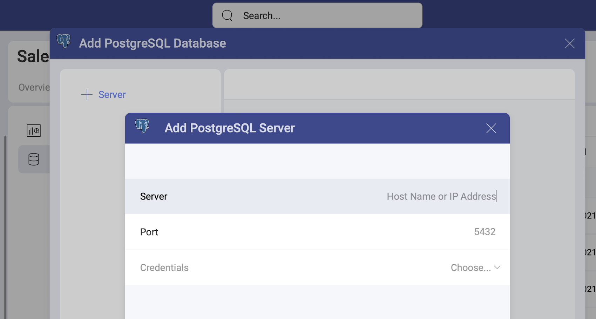
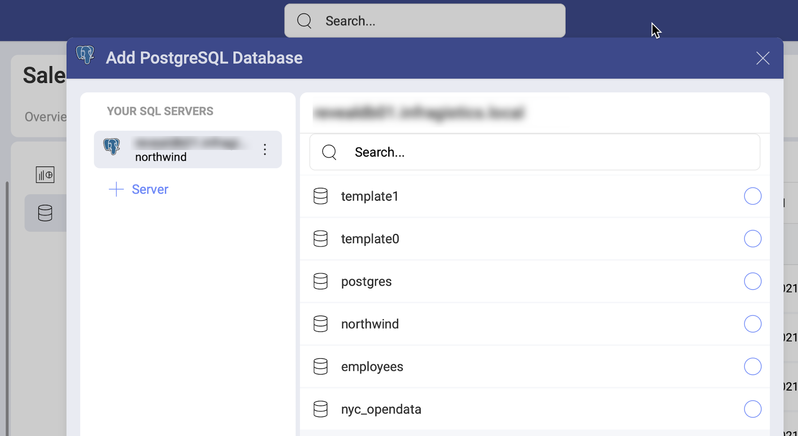

# PostgreSQL

>[!NOTE] **Limitations in Web**. In the *Slingshot Web* app, you can connect only to publicly accessible PostgreSQL addresses. If your PostgreSQL address is restricted for the general public (private or hosted in the company's intranet, for example), you can use *Slingshot Desktop*, *iOS* or *Android* to connect to it. The device where you're running Slingshot needs to have access to this PostgreSQL address.

## Adding a New PostgreSQL Data Source

If you have already added your PostreSQL data source to the  *Data Sources* list, you can skip this part and continue with [Setting Up Your Data](#setting-up-your-data).

To add a PostgreSQL data source to your list, follow the steps described below.

1. Go to the  Data Sources tab > select the *+ Data Source* blue button > scroll down to *Databases* > select *PostgreSQL*. 

2. A new dialog will open (see the screenshot) where you will need to add the following data to connect to your Postgre server:

    
   
    a. [**Server**](how-to-find-server.md): the computer name or IP address
    assigned to the computer on which the server is running. 

    b.  **Port**: if applicable, the server port details. If no information
    is entered, Slingshot will connect to the port in the hint text (5432)
    by default.

    c. **Credentials**:  click/tap the *Choose* dropdown to select existing credentials if applicable. To add new credentials select the *+Credential* button. A new dialog will open. There you will need to enter your *username*, *password* and (optionally) an *alias*. The alias will serve as a label for saved credentials when you have more than one reporting service added. 

3. Adding a database. After configuring your Postgre Server, you will be prompted to choose a database, that will be added in your   Data Sources list. 

    

If you want to add another Postgre server, you can quickly do this by clicking/tapping the  *+ Connection* button on the left (see above).

After choosing a database, click/tap _Select and Continue_.

### Editing the data source information 

In the last dialog that opens, you can change the original database name and add a description. Both will be shown in the Data Sources list to help users choose the source of data they need for their visualization. 

If you are a certifier in your Organization, you can also certify the data source by selecting the  badge certificate dropdown. If you want to know more about the certification in Analytics, read the [Using Data Sources Certification](~/docs/analytics/datasources/certification.md) topic.

If you want to additionally edit what tables, views and data sets other users can see and work with, click/tap the _Switch to advanced info edition_ button. Find more information in the [Editing the information for a data source](data-sources-advanced-editing.md) topic.  

When ready, select _Add Data Source_.

## Setting Up Your Data

Now that you have added your PostgreSQL database, you will see it in the  Data Sources list. If you have more than one PostgreSQL database added, select the database you want to use. You will open the *Data Source details* dialog, which allows you to review and set up your data. 

Here you will find the following information about the data source:

* type, name, description; 
* [certification](../certification.md);
* who added, modified and has access to the data source
* how often the data is auto-refreshed. 

Here, you can choose to use data from the *tables*, [*views*](https://www.postgresqltutorial.com/postgresql-views/) and [functions](https://www.postgresql.org/docs/9.0/sql-createfunction.html). 

**Views** contain modified versions of the data in the tables on the PostgreSQL server. 

PostgreSQL **functions** allow you to carry out operations that would normally take several queries and round trips in a single function within the database. Some Postgre functions require you to set up additional parameters. You will recognize these functions by the  arrow icon on their right.

Click/tap _Select Data_ to continue to the Visualizations Editor. 

### Limitations for Functions in Slingshot

* Output parameters in functions are ignored.
* Functions that return no result sets will be listed in the Data Sources list, but will fail.
