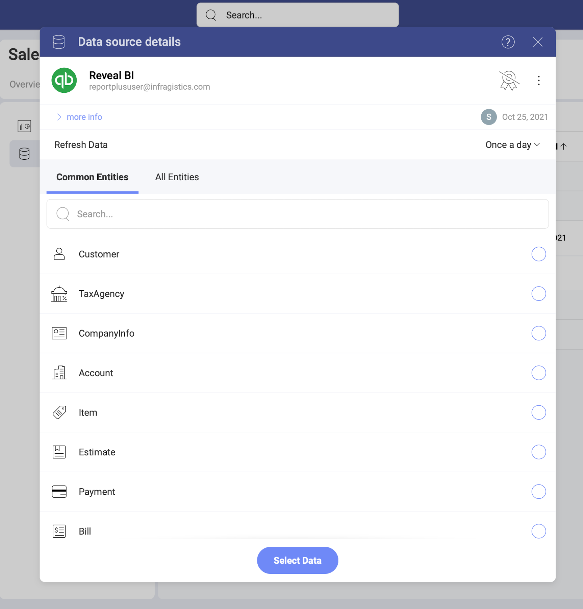

# Quickbooks

The *Quickbooks* data source connector in *Analytics* allows you to bring your business accounting data from Quickbooks to Slingshot. Use your *Quickbooks* account data to create insightful dashboards to show your business growth.

## Adding a New Quickbooks Data Source Account

If you have already added your Quickbooks data source to the  *Data Sources* list, you can skip this part and continue with [Setting Up Your Data](#setting-up-your-data).

To add a *Quickbooks* data source to your list, follow the steps described below.

1. Go to the  Data Sources tab > select the *+ Data Source* blue button > scroll down to *Marketing, Sales and CRMs* > select *Quickbooks*. 

2. You will be redirected to the *Quickbooks* login page. Enter your username and password or use your Google account to sign in. If you have Identity Confirmation activations enabled, you will see a prompt to enter the *verification code* sent to you. 

When ready, you will be asked to be returned to Slingshot. Accept and proceed to editing your data source before adding it to the Data Sources list. 

### Editing the data source information 

The dialog that opens after you add your Quickbooks connection allows you to change the original name and add a description to your connection. Both will be shown in the Data Sources list (your Data Catalog) to help users choose the source of data they need for their visualization. 

If you are a certifier in your Organization, you can also certify the data source by selecting the  badge certificate dropdown. If you want to know more about the certification in Analytics, read the [Using Data Sources Certification](~/docs/analytics/datasources/certification.md) topic.

If you want to additionally edit what *Quickbooks* objects other users can see and work with, click/tap the _Switch to advanced info edition_ button. Find more information about this in the [Editing the information for a data source](data-sources-advanced-editing.md) topic.  

When ready, select _Save and Close_. Selecting _Save_ will allow you to set up your data.

## Setting Up Your Data

Now that you have added your Quickbooks data source, you will see it in the  Data Sources list. By selecting your Quickbooks connection, you will open the *Data Source details* dialog, which allows you to review and set up your data (look at the screenshot below). 

Here you will find the following information about the data source:

* type, name, description; 
* [certification](../certification.md);
* who added, modified and has access to the data source
* how often the data is auto-refreshed. 

To configure your Quickbooks data, you need to 
select from the *Entities* list in this dialog. 

- _Common Entities_ - this category allows quick selection between the  most used entities among our users;
- _All Entities_ - this category displays the full list of entities contained in your Quickbooks account.

Click/tap _Select Data_ to continue to the Visualizations Editor.
