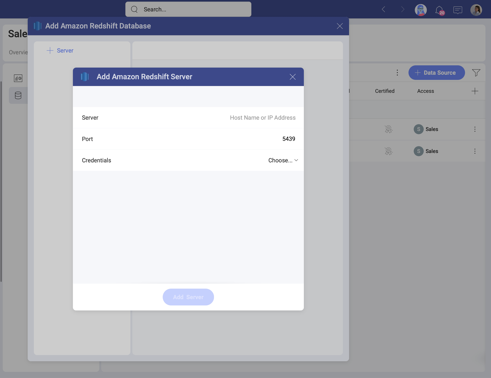
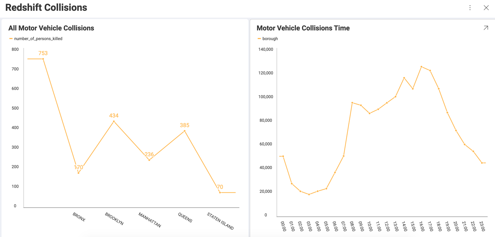

# Amazon Redshift

The *Redshift* data source connector in *Analytics* allows you to bring your Redshift data to Slingshot.

## Adding a New Amazon Redshift Data Source

If you have already added your Redshift data source to the  *Data Sources* list, you can skip this part and continue with [Setting Up Your Data](#setting-up-your-data).

To add an *Amazon Redshift* data source to your list, follow the steps described below.

1. Go to the  Data Sources tab > select the *+ Data Source* blue button > scroll down to *Big Data Storages* > select *Amazon Redshift*. 

2. A new dialog will open (see the screenshot) where you will need to add the following data to connect to your *Redshift* server:

    
    
    a.  [**Server**](how-to-find-server.md): the computer name or IP address assigned to the computer on which the server is running.

    b. **Port**: if applicable, the server port details. If no information is entered, Reveal will connect to the port in the hint text (5432) by default.

    c. **Credentials**: after selecting *Credentials*, you will be able to
    enter the credentials for your *Redshift* server or select existing
    ones if applicable.

### Editing the data source information 

In the last dialog that opens, you can change the original database name and add a description. Both will be shown in the Data Sources list to help users choose the source of data they need for their visualization. 

If you are a certifier in your Organization, you can also certify the data source by selecting the  badge certificate dropdown. If you want to know more about the certification in Analytics, read the [Using Data Sources Certification](~/docs/analytics/datasources/certification.md) topic.

If you want to additionally edit what tables, views and data sets other users can see and work with, click/tap the _Switch to advanced info edition_ button. Find more information in the [Editing the information for a data source](edit-data-sources.md) topic.  

When ready, select _Add Data Source_.

## Setting Up Your Data

Now that you have added your Amazon Athena database, you will see it in the  Data Sources list. If you have more than one Amazon Redshift database added, select the database you want to use. You will open the *Data Source details* dialog, where you can find additional information about the data source and its access. 

With Slingshot, you can retrieve *Redshift* data from entire tables, but you can also select a particular
[view](https://docs.aws.amazon.com/redshift/latest/dg/r_CREATE_VIEW.html) that returns a subset of data from a table or a set of tables instead. 

For example, if the **motor_vehicle_collisions** table in Redshift contains data about all motor vehicle collisions, then the **motor_vehicle_collisions_time** view contains a modified version of this data. 
 
In the screenshot below, the visualization on the left is built with the data in the table, and the the one on the right uses the data contained in the view.  

