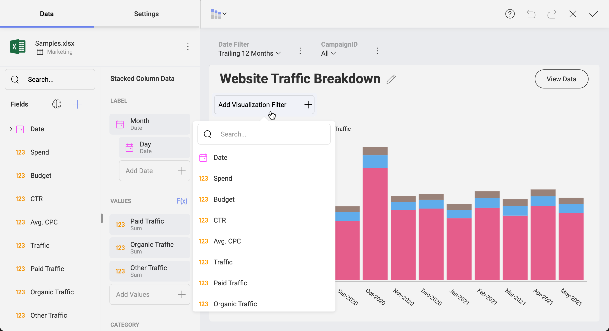

# My Analytics

With the My Analytics section of Slingshot, you bring the power of BI (business intelligence) into your daily workflow and help your team make faster, data-driven decisions.
## What's in My Analytics
In order to make data-driven decisions, Slingshot is on your side with the following features:
- **Dashboards** – Create or share dashboards so your team can utilize data and improve productivity. Bring multiple data sources into one dashboard to ensure you have all the information to make data-driven decisions
- **Data Sources** - Connect directly to whenever your data comes from, including content managers, cloud services, CRMs, databases, spreadsheets, and more.
- **Data Catalog** - Find the most trustful information about your company, accessing data that is categorized and certified. Only available for Enterprise users.

Data Sources make up visualizations and visualizations make up dashboards. In other words, your data comes from a data source, a visualization connects to that data source and display the information, and finally dashboards include a collection of visualizations that have different pieces of related information.

## Dashboards
With an intuitive drag and drop interface, Slingshot makes it simple to create dashboards within minutes. Choose from more than 20 different visualizations to present your data and tell your story the best way.

### Customize
You can sort, filter and aggregate your data as you wish. Each chart type provides you with different settings to design your visualizations the way you want.

### Interact
Once your dashboard is created, interact with your visualizations with drill-down support, or even the ability to change visualization on the fly. Create and share annotated images of your visualizations for deeper insights.

 

### Share
Share your dashboards with others and collaborate over them. Different levels of permission types allow you to choose how to share and how limited the access can be.

[Read more about dashboards here!](#/analytics/dashboards/overview).

## Data Sources
Connect to the most popular data sources without setting anything up on the server. Get real-time insights by connecting directly to SharePoint Online, Google Drive, OneDrive, Microsoft Analysis Services, Microsoft SQL Server, CRM, and many more. [Click here for a full list of connectors!](#/analytics/datasources/overview).

### Connect
1. To connect right to your data source and build your visualizations, youcan follow these steps: Click/tap the “+ Data Source” blue button.
2. Select the data source you want to connect.
3. Configure the connection. This might include selecting the file’s location (spreadsheet or JSON file) or enter credentials (data storages, web resources, social media connectors, databases).

[Read more about data sources here!](#/analytics/datasources/overview).

## Data Catalog
Your organization’s data catalog makes it easier for users to be data-driven and quickly find the insights they are searching for. With this feature, Enterprise users can access an extensive catalog of dashboards and data sources. Slingshot wants to turn everyone into a data analyst, as you don’t need to create dashboards to get insights from them.

Certifications are an important part of the data catalog, as they assist you to find the most trusted data within the organization. This is an excellent way to know which dashboards or data sources are reliable and contain verified information. When a dashboard or data source is certified, you will see a gold, silver or bronze colored badge next to it.

[Read more about data catalog here!](#data-catalog).