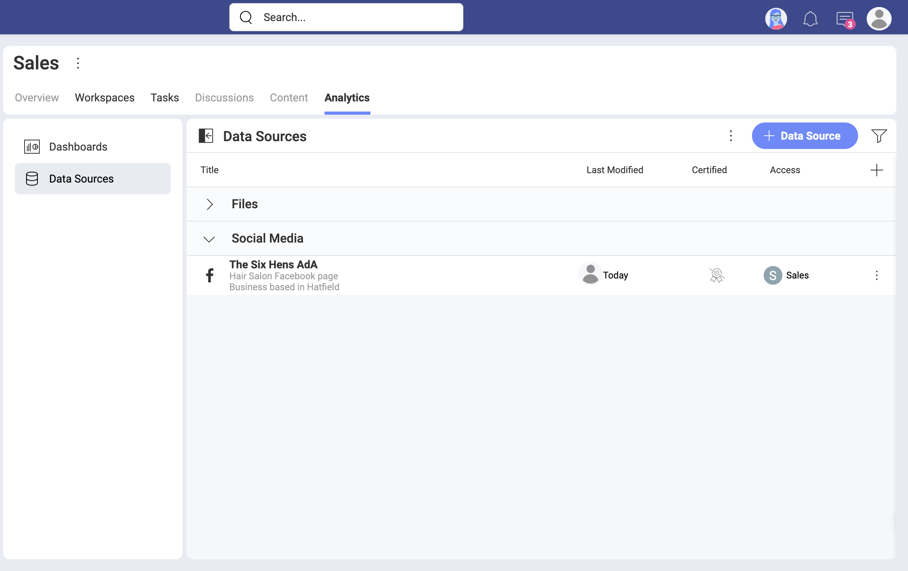
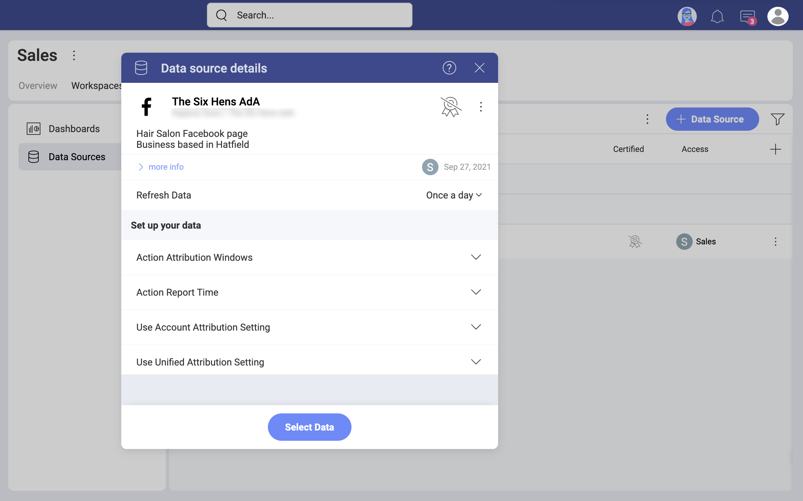

# Facebook 

[分析] の *Facebook* データ ソース コネクターを使用すると、Facebook のマーケティング データを Slingshot に取り込むことができます。*広告アカウント*のデータを使用して、インサイトに満ちたダッシュボードを作成し、ビジネスのソーシャル メディアのパフォーマンスを測定します。

## 前提条件

Facebook データ ソース コネクターは、Facebook *広告アカウント* データに接続します。[分析] で Facebook データ ソースを使用する前に、次のことを確認してください:

* [Meta for Business](https://ja-jp.facebook.com/business/help/) アカウントを使用すること。
* [*広告マネージャ*](https://ja-jp.facebook.com/business/help/200000840044554?id=802745156580214)で、接続するプロファイルまたは Facebook ページの[*広告アカウント*を追加、要求、または作成](https://ja-jp.facebook.com/business/help/910137316041095?id=420299598837059)したこと。
* 接続するプロファイル / ページの*広告アカウント*は無効化されていないこと。よくわからない場合は、この [Meta ヘルプ記事](https://ja-jp.facebook.com/business/help/1798922733589154)を使用して、必要に応じて広告アカウントを確認して再度アクティブにしてください。  

## 新しい Facebook データ ソース アカウントの追加

Facebook データ ソースを*データ ソース* リストにすでに追加している場合は、この部分をスキップして、[データの設定](#setting-up-your-data)に進むことができます。

*Facebook* データ ソースをリストに追加するには、以下の手順に従ってください:

1. [データ ソース] タブに移動し、**[+ データ ソース]** の青いボタンを選択し、**[ソーシャル メディア]** までスクロールして **[Facebook]** を選択します。 
2. *Facebook* プロファイルでログインするように求められます。 

    >[!NOTE] *分析*で接続しようとしている Facebook プロファイルに関連付けられた*広告アカウント*が少なくとも 1 つ必要です。この [Meta ヘルプ記事](https://www.facebook.com/business/help/910137316041095?id=420299598837059)を読んで、Meta Business Manager で*広告アカウント*を追加、要求、および作成する方法を確認してください。
3. Slingshot は、アカウントの関連する詳細にアクセスします。 
4. 次のダイアログでは、選択できる 1 つ以上の  Facebook 広告アカウントが表示されます。分析したいアカウントを選択します。
5. [選択して続行] をクリック / タップします。 
6. 開いた最後のダイアログで、以下に示すように、広告アカウント名を変更し、適切な説明を追加できます。適切な説明を追加すると、すべてのユーザーが長いリストをナビゲートし、検索しているデータ ソースを見つけるのに役立ちます。 
7. [データ ソースの追加] を選択します。

以下に示すように、データ ソース リストの下部に新しい Facebook 広告アカウント接続が追加されます。

## データの設定

[データ ソース] リストから、接続する Facebook 広告アカウントを選択します。[データ ソースの詳細] ダイアログが表示され、データを確認して設定できます (下のスクリーンショットを参照)。

ここに、次のデータ ソースの詳細があります: 

* タイプと名前。 
* 説明。 
* [認証](../certification.md)。
* データ ソースを追加したユーザー。 
* 最後に変更したユーザーとその日付。 
* アクセスできるユーザーとワークスペース。 
* データの更新頻度。変更するには、右側のドロップダウンを選択します。p

**[データの設定]** は、表示形式エディターに読み込むデータを選択するのに役立ちます。

* [*アトリビューション ウィンドウ*](https://ja-jp.facebook.com/business/help/2198119873776795?id=768381033531365) - ドロップダウン リストから特定の期間のデータを表示するように選択できます。
* *アクション レポート時間* - データをレポートする方法を選択できます。
* [アカウント アトリビューション設定](https://ja-jp.facebook.com/business/help/460276478298895?id=561906377587030)を使用するかどうか。
* 統合アトリビューション設定を使用するかどうか。

準備ができたら、[データを選択] をクリック / タップして、*表示形式エディター*に進みます

