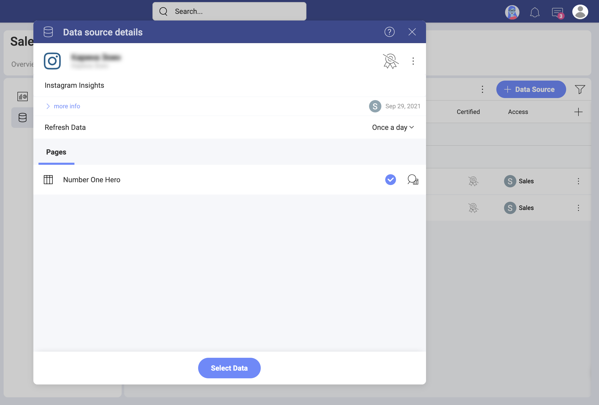

# LinkedIn

**[分析]** の *LinkedIn* データ ソース コネクターを使用すると、LinkedIn のマーケティング データを Slingshot に取り込むことができます。**LinkedIn 広告アカウント**のデータを使用して、インサイトに満ちたダッシュボードを作成し、ビジネスのソーシャル メディアのパフォーマンスを測定します。

## 前提条件

[分析] に *LinkedIn* データ ソースを追加するには、少なくとも 1 つのアクティブな [LinkedIn 広告アカウント](https://www.linkedin.com/help/linkedin/answer/a426102/create-an-ad-account?lang=ja)が必要です。
## 新しい LinkedIn データ ソースの追加 

LinkedIn データ ソースをデータ ソース リストにすでに追加している場合は、この部分をスキップして、[データの設定](#setting-up-your-data)に進むことができます。

*LinkedIn* データ ソースをリストに追加するには、以下の手順に従ってください:

1. [データ ソース] タブに移動し、**[+ データ ソース]** の青いボタンを選択し、**[ソーシャル メディア]** までスクロールして **[LinkedIn]** を選択します。 
2. LinkedIn プロファイルでログインするように求められ、LinkedIn パスワードの再入力を求められる場合があります。
3. Slingshot は、アカウントの関連する詳細にアクセスします。
4. 次のダイアログで、分析する LinkedIn ページに関連付けられている  *LinkedIn* アカウントを選択する必要があります。
5. **[選択して続行]** をクリック / タップします。 
6. 開いた最後のダイアログで、以下に示すように、アカウント名を変更し、適切な説明を追加できます。適切な説明を追加すると、すべてのユーザーが長いリストをナビゲートし、検索しているデータ ソースを見つけるのに役立ちます。 
7. **[データソースの追加]** を選択します。

新しい LinkedIn 接続は、データ ソース リストの下部にあります。

## データの設定

[データ ソース] リストから、接続する  LinkedIn アカウントを選択します。**[データ ソースの詳細]** ダイアログが表示され、データを確認して設定できます (下のスクリーンショットを参照)。

ここに、次のデータ ソースの詳細があります: 

* タイプと名前。 
* 説明。 
* [認証](../certification.md)。
* データ ソースを追加したユーザー。 
* 最後に変更したユーザーとその日付。 
* アクセスできるユーザーとワークスペース。 
* データが更新される頻度と、右側のドロップダウンから変更する機能。 

**[ページ]** の下に、この LinkedIn アカウントに関連付けられている LinkedIn ページが表示されます。分析したいページを選択します。**[データを選択]** 青いボタンをクリック / タップして、表示形式エディターに進みます。 

