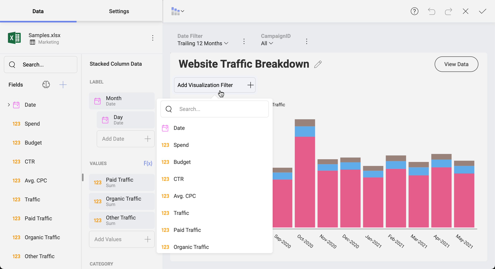
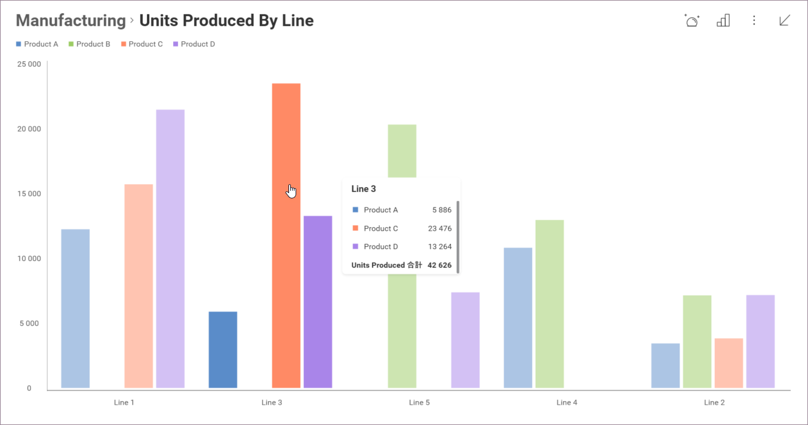
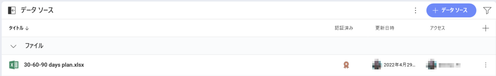

# 分析

Slingshot の [分析] セクションを使用すると、BI (ビジネス インテリジェンス) の力を日常のワークフローに取り入れ、チームがデータに基づいたより迅速な意思決定を行えるようになります。
## 分析の内容
データ主導の意思決定を行うために、Slingshot は次の機能を備えています:
- **ダッシュボード** – ダッシュボードを作成または共有して、チームがデータを活用し、生産性を向上できるようにします。複数のデータ ソースを 1 つのダッシュボードにまとめて、データ主導の意思決定を行うためのすべての情報を確実に入手できるようにします。
- **データソース** - コンテンツ マネージャー、クラウド サービス、CRM、データベース、スプレッドシートなど、データの送信元に直接接続します。
- **データ カタログ** - 分類および認定されたデータにアクセスして、会社に関する最も信頼できる情報を見つけます。エンタープライズ ユーザーのみが利用できます。

データ ソースは表示形式を構成し、表示形式はダッシュボードを構成します。つまり、データはデータ ソースから取得され、表示形式はそのデータ ソースに接続して情報を表示し、最後にダッシュボードにはさまざまな関連情報を持つ表示形式のコレクションが含まれます。

## ダッシュボード
直感的なドラッグ＆ドロップ インターフェイスを備えた Slingshot は、数分でダッシュボードを簡単に作成できます。20 以上の異なる表示形式から選択して、データを提示し、ストーリーを最良の方法で伝えます。

### カスタマイズ
データの並べ替え、フィルター、集計も思い通りにできます! チャートの種類ごとにさまざまな設定が用意されており、表示形式を希望どおりにデザインできます。

### インタラクション
ダッシュボードが作成されたら、ドリルダウン サポートを使用して表示形式を操作するか、表示形式をオンザフライで変更することもできます。より深いインサイトを得るために、表示形式の注釈付き画像を作成して共有します。

 

### 共有
ダッシュボードを他の人と共有し、それらを介して共同作業します。さまざまなレベルのアクセス許可タイプを使用すると、共有方法とアクセスの制限方法を選択できます。

ダッシュボードについて詳しくは、[こちら](dashboards/overview)をご覧ください。

## データ ソース
人気のあるデータ ソースへ、特別なサーバー設定なしで接続できます。SharePoint オンライン、Googleドライブ、OneDrive、Microsoft Analysis Services、Microsoft SQL Server、CRM などに直接接続して、リアルタイムなインサイトを取得します。[データ ソースの完全なリストについては、ここをクリックしてください](datasources/overview)。

### 接続
1. データ ソースに直接接続して表示形式を構築するには、次の手順に従います: [+ データ ソース] の青いボタンをクリック / タップします。
2. 接続するデータ ソースを選択します。
3. 接続を構成します。これには、ファイルの場所 (スプレッドシートまたは JSON ファイル) の選択や、資格情報 (データ ストレージ、Web リソース、ソーシャル メディア コネクター、データベース) の入力が含まれる場合があります。

[データ ソースの詳細については、こちらをご覧ください](datasources/overview)。

## データ カタログ
組織のデータ カタログを使用すると、ユーザーはデータ主導型になり、探しているインサイトをすばやく見つけることができます。この機能により、エンタープライズ ユーザーはダッシュボードとデータ ソースの広範なカタログにアクセスできます。Slingshot は、ダッシュボードを作成してそこからインサイトを得る必要がないため、誰でもデータ アナリストに変えることができます。

認証は、組織内で最も信頼できるデータを見つけるのに役立つため、データ カタログの重要な部分です。これは、どのダッシュボードまたはデータ ソースが信頼でき、検証済みの情報が含まれているかを知るための優れた方法です。ダッシュボードまたはデータ ソースが認証されると、その横に金、銀、または銅のバッジが表示されます。

[データ カタログの詳細については、こちらをご覧ください](../data-catalog.md)。

## リスト
ダッシュボードとデータ ソースの複数のリストを管理できます。これらのリストは、これらのリソースを整理、管理、および共有するようにデザインされています。
[ダッシュボード] タブと [データ ソース] タブには、セクションごとに整理できるリストがあります。管理者でない組織ユーザーは、セクションは、コンテンツを分割してより良くレイアウトする場合に便利です。

### 定義済みのリスト
デフォルトでは、[ダッシュボード] と [データソース] から始めますが、リスト、セクション、ダッシュボード、またはデータ ソースをドラッグするだけで、さらにリストを作成し、簡単に再編成および移動できます。

## フィルター
フィルターを使用すると、特定の条件を満たすダッシュボードまたはデータ ソースのセットを表示できます。定義済みのフィルターがあるほかり、フィルターを保存して後で使用することもできます。

### 定義済みのフィルター
Slingshot には、特定のダッシュボードまたはデータ ソースをすばやく見つけるのに非常に役立ついくつかの事前定義されたフィルターが含まれています。

編集または削除できないこれらの定義済みフィルターは次のとおりです:
- **作成済み** – Slingshot 内で自分が作成した各ダッシュボードまたはデータ ソース。

- **自分と共有済み** – 別の Slingshot ユーザーによって共有された各ダッシュボードまたはデータ ソース。

### フィルターの作成
フィルター エディターにアクセスするには、フィルター セクションの [+ フィルター] アイコンをクリック / タップするだけです。

ダッシュボードまたはデータ ソースのフィルタリングを停止するには、フィルター アイコンをクリック / タップして、[フィルター] ダイアログを開きます。次に、下の [クリア] ボタンを選択して現在のフィルターを削除し、[適用] をクリックして変更を保存します。

### フィルターの保存
フィルターを保存しておいて、後で再び使用したい場合があります。Slingshot を使用すると、特定のフィルターを保存し、必要に応じて後で編集できます。これは、既にフィルター処理されている関連するダッシュボードまたはデータ ソースのリストを手元に置いておくと非常に便利です。